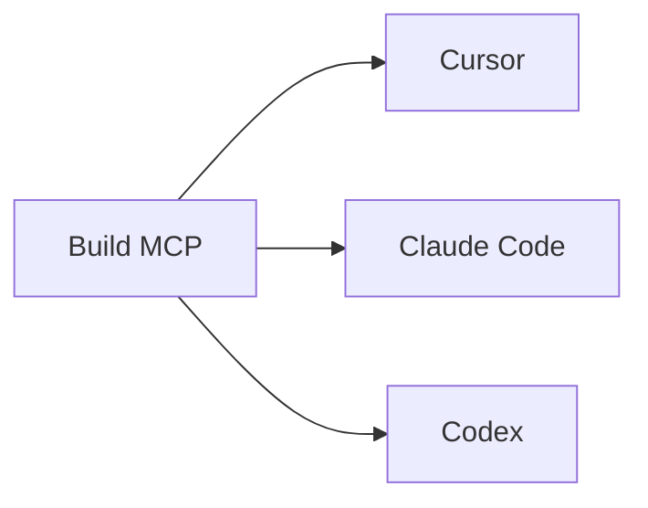

# Client Setup Recipes

## Purpose

This guide gives exact copy-paste setup recipes for the main local AI clients used with this framework.

> **Shortcut (spec 032):** `npx @juanklagos/sdd-mcp@latest connect` does all of this for you — it detects your clients, writes the configuration into each one's own file (merging, never clobbering yours) and installs the `/sdd-serve` skill. It also covers Windsurf, VS Code, Gemini CLI and opencode, which this guide does not. See guide 51. The recipes below are the manual reference and the path for people developing the template itself (they use `node …/dist/index.js` instead of `npx @juanklagos/sdd-mcp@latest`).

## Client setup map



## Shared rule

- Open this repository as the workspace root.
- Build first:

```bash
npm install
npm run build
```

## Cursor

Config file:
- `~/.cursor/mcp.json`

Example:

```json
{
  "mcpServers": {
    "sdd": {
      "type": "stdio",
      "command": "node",
      "args": [
        "/ABSOLUTE/PATH/TO/spec-driven-development-template/packages/sdd-mcp/dist/index.js"
      ]
    }
  }
}
```

Validation:
- restart Cursor
- confirm the `sdd` server is listed
- ask the agent to read `sdd://policy/current`

## Claude Code

Project-scoped config:
- `.mcp.json`

User-scoped config:
- `~/.claude.json`

Project example:

```json
{
  "mcpServers": {
    "sdd": {
      "command": "node",
      "args": [
        "/ABSOLUTE/PATH/TO/spec-driven-development-template/packages/sdd-mcp/dist/index.js"
      ],
      "env": {}
    }
  }
}
```

Validation:
- open the repository
- confirm Claude can access the `sdd` server
- ask it to list tools and read the quickstart resource

## Codex

Config file:
- `~/.codex/config.toml`

Example:

```toml
[mcp_servers.sdd]
command = "node"
args = ["/ABSOLUTE/PATH/TO/spec-driven-development-template/packages/sdd-mcp/dist/index.js"]
```

Validation:
- restart Codex
- confirm the server is available
- ask it to use `sdd_validate` or read `sdd://docs/quickstart`

## Recommended first prompt

```text
Use the connected sdd MCP server for this repository.
Create the SDD base first.
Prefer ./www/<project-name> as the recommended default workspace; external target paths are also supported.
Read the policy and quickstart resources before making changes.
Do not implement code before approved spec and consistent plan.
```
