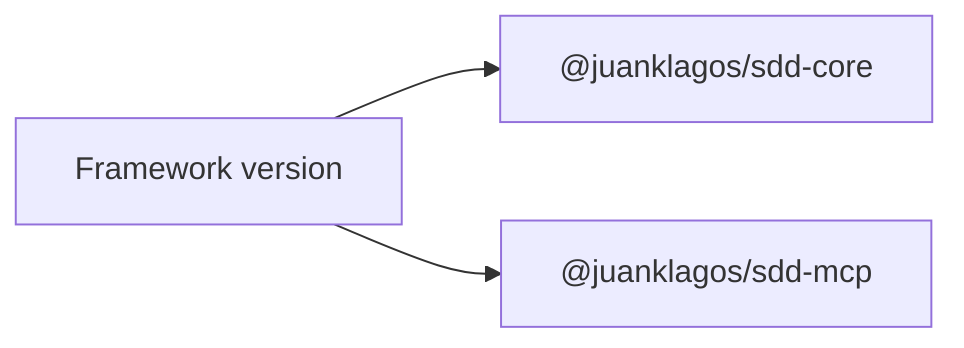

# Versioning Strategy

## Purpose

This document defines how versioning should work across the framework and its internal packages.

## Version alignment map

## Current rule

- repository release version is the canonical public version
- `@juanklagos/sdd-core` and `@juanklagos/sdd-mcp` should stay aligned with the repository minor release

Current alignment:
- framework: `1.7.0`
- `@juanklagos/sdd-core`: `1.7.0`
- `@juanklagos/sdd-mcp`: `1.7.0`

## Practical release policy

### Patch

Use patch releases for:
- documentation fixes
- CI fixes
- non-breaking script fixes
- non-breaking MCP compatibility fixes

### Minor

Use minor releases for:
- new tools
- new resource templates
- new onboarding flows
- new examples
- new guides that materially improve adoption

### Major

Use major releases for:
- breaking workflow changes
- breaking policy/gate behavior
- breaking MCP tool contracts
- breaking package structure changes

## Package rule

- the packages are published on npm: `@juanklagos/sdd-core`, `@juanklagos/sdd-mcp` and `@juanklagos/create-sdd-project`
- their versions track the framework release (one number for the whole repository), so `npx @juanklagos/create-sdd-project` always matches the documented workflow
- keep semver and record every package-visible change in the repository `CHANGELOG.md`
