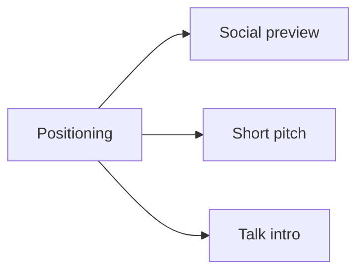

# Media Kit

## Purpose

This page centralizes reusable public-facing assets for social posts, repository previews, talks, and product positioning.

## Media structure



## Social preview

Suggested asset:
- `docs/assets/social-preview.svg`

Recommended GitHub social preview size:
- `1280 x 640`

## Positioning line

Use this as the short descriptor:

```text
Operational SDD framework with AI guidance, easy MCP onboarding, and MCP support.
```

## Short pitch

```text
Spec-Driven Development Template helps users move from idea to implementation with less friction.
It combines a starter framework, multi-agent rules, guided documentation, an easy MCP onboarding layer, and a local MCP layer for operational workflows.
```

## Conference/session intro

```text
This project is not just a documentation template. It is an operational framework for Spec-Driven Development.
It guides both technical and non-technical users, defaults runnable work cleanly to ./www/<project-name> when it lives inside the template, still supports external target paths, and gives AI assistants a consistent flow through policy, specs, logbook discipline, and MCP tooling.
```

## Visual checklist

- Use the social preview asset as the repository preview image
- Pair it with one screenshot or gif of the MCP flow
- Keep the message centered on reduced friction and consistent AI-assisted execution

## Suggested next media asset

- 30-45 second terminal demo:
  - build MCP
  - connect client
  - create workspace
  - create spec
  - validate and gate
