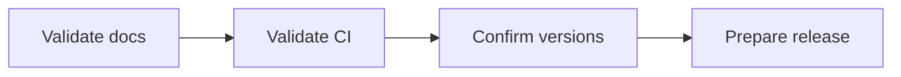

# v1.2.0 Preparation

## Purpose

This page tracks the minimum bar for the next minor release.

## Release preparation flow

## Proposed release theme

Adoption maturity.

## Minimum scope

- MCP CI stays green
- integration test stays green
- README keeps the MCP path visible
- social preview asset is configured in GitHub
- one real demo artifact exists outside the repo text docs

## Release checklist

- confirm changelog entries
- confirm package versions remain aligned
- confirm examples still match the documented workflow
- confirm client setup recipes are still accurate
- confirm release notes mention SDD + MCP together, not separately
