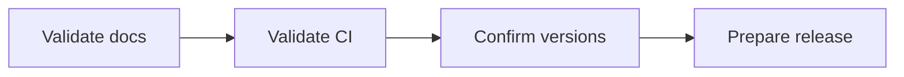

# v1.2.0 Preparation

<!-- sdd:doc-type:start -->

<strong>Project</strong> Repository material: roadmap, releases and audits. Not product documentation.

<!-- sdd:doc-type:end -->

## Purpose

**Historical record. This is not the list to follow.**

This was the minimum bar for `v1.2.0`, which shipped long ago: the project is
on 2.5.0. It is kept so the criteria behind that release can still be read.

The live list, the one followed before publishing any version, is
[guide 09](./09-release-checklist.md).

## Release preparation flow

```mermaid
flowchart LR
  A["Validate docs"] --> B["Validate CI"]
  B --> C["Confirm versions"]
  C --> D["Prepare release"]
```

## Proposed release theme

Adoption maturity.

## Minimum scope

- MCP CI stays green
- integration test stays green
- README keeps the MCP path visible
- social preview asset is configured in GitHub
- one real demo artifact exists outside the repo text docs

## Release checklist

- confirm changelog entries
- confirm package versions remain aligned
- confirm examples still match the documented workflow
- confirm client setup recipes are still accurate
- confirm release notes mention SDD + MCP together, not separately
