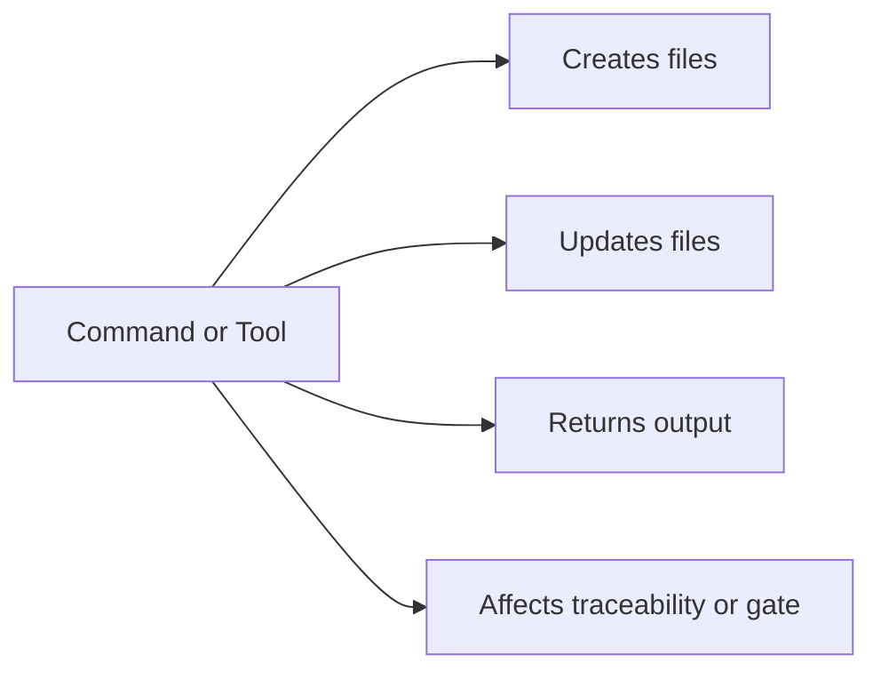

# Command Results Reference

## Purpose

This guide documents what each core script and MCP tool creates, modifies, and returns.

If you want the beginner-friendly command view first, start here:
- [Easy MCP Guide](./43-easy-mcp-guide.md)

For the complete MCP overview, tool intent, resources, and prompts, start here:
- [Complete MCP Reference](./41-complete-mcp-reference.md)

## Result model

## Workspace and bootstrap scripts

### `./scripts/create-www-project.sh <project-name> <assistant> [flags]`

Use when:
- you want the recommended default workspace inside this template

Creates:
- `./www/<project-name>/`
- the SDD base structure inside that folder
- optional Spec Kit setup, if available

Modifies:
- nothing outside the new workspace folder

Success result:
- prints the absolute workspace path
- prints the selected profile
- prints the next commands to run

### `./scripts/init-project.sh /absolute/path/to/project --profile=recommended`

Use when:
- the user wants the runnable project outside this template

Creates:
- the full SDD base at the target path
- `idea/`, `specs/`, `bitacora/`, `.sdd/`, and helper files

Rules:
- rejects the template root itself
- if the target path is inside this template, it must live under `./www/`

Success result:
- prints the initialized path
- prints the selected profile
- prints the next commands to continue

### `./scripts/init-project-with-spec-kit.sh /absolute/path/to/project codex --profile=recommended`

Use when:
- you want the external target path plus GitHub Spec Kit initialization

Creates:
- everything from `init-project.sh`
- Spec Kit configuration for the chosen assistant

Success result:
- prints the initialized path
- prints the suggested Spec Kit flow

### `./scripts/install-spec-sidecar.sh /absolute/path/to/project --profile=recommended`

Use when:
- this is the recommended entry point for a **real existing project**: the app code stays in the project root and the whole SDD operating system lives inside `./spec/`

Creates:
- `./spec/` with `idea/`, `specs/`, `bitacora/`, `scripts/`, `templates/`, `template-context/`, `.sdd/`, `sdd.policy.yaml`, and the agent rule files
- agent entry files at the project root (`AGENTS.md`, `CLAUDE.md`, `AI_START_HERE.md`, `INSTRUCTIONS.md`, `GEMINI.md`, `AIDER.md`, `ROO.md`, `WINDSURF.md`, `.cursorrules`, `.clauderules`, `.github/copilot-instructions.md`) so every assistant finds the rules

Rules:
- the framework repository is **not** copied into the project — only the compact sidecar
- rejects the template root itself

Success result:
- prints `✅ Compact SDD sidecar installed at: <path>/spec` with the template version and profile
- prints the next commands, which in a sidecar live under `./spec/scripts/` (`new-spec.sh`, `validate-sdd.sh`, `check-sdd-policy.sh`, `check-sdd-gate.sh`)
- prints the optional GitHub Spec Kit init command

## Spec and traceability scripts

### `./scripts/new-spec.sh "feature-name" "Owner"`

Creates:
- `specs/NNN-feature-name/`
- `spec.md`
- `plan.md`
- `tasks.md`
- `research.md`
- `history.md`
- `contracts/README.md`

Modifies:
- appends one row to `specs/INDEX.md`

Success result:
- prints `Created: specs/NNN-feature-name`
- prints `Added row to specs/INDEX.md`

### `./scripts/confirm-user-consent.sh "User approved scope X"`

Creates or updates:
- `.sdd/user-consent.log`

Success result:
- prints the log file path used for the appended consent entry

### `./scripts/generate-status.sh`

Creates or replaces:
- `STATUS.md`

Reads:
- `specs/INDEX.md`
- all `tasks.md`
- `bitacora/global/PROJECT_LOG.md` when present

Success result:
- prints `Generated STATUS.md`

### `./scripts/generate-roadmap.sh`

Creates or replaces:
- `docs/roadmap.mmd`
- `docs/roadmap.md`

Reads:
- `specs/INDEX.md`

Success result:
- prints the generated roadmap file paths

### `./scripts/score-spec.sh specs/NNN-name` (or `--all`)

Use when:
- you want a quick quality read on a spec bundle before asking for approval

Reads:
- the bundle files (`spec.md`, `plan.md`, `tasks.md`, `research.md`, `history.md`)

Writes:
- nothing — it is read-only

Success result:
- prints `Spec:`, `Score: NN/100 (Grade X)` and a `Notes:` list of what is weak
- with `--all`, prints one block per numbered spec
- the argument is the bundle **folder**, not `spec.md`; pointing it at a single file reports `missing required files`

Affects gate:
- no — the score is advisory, never a blocker

## Documentation and maintenance scripts

### `./scripts/generate-llms-txt.sh`

Creates or replaces:
- `llms.txt` at the repository root

Reads:
- `docs/en/` and `docs/es/`, taking each file's first H1 as its title

Success result:
- prints `Generated <path>/llms.txt (N lines)`

When to run:
- after adding, renaming or retitling any guide, so coding agents index the real docs

### `./scripts/legacy-discovery.sh [target] [out-dir]`

Use when:
- you are adopting SDD on an existing codebase and need a starting point for reverse engineering

Creates (default `analysis/legacy-discovery/`):
- `routes-signals.txt` — route/endpoint matches
- `flow-signals.txt` — user-flow matches (login, checkout, profile…)
- `legacy-discovery-report.md` — signal counts, suggested first specs, and a suggested prompt

Requires:
- `rg` (ripgrep) on the PATH

Success result:
- prints `Generated <out-dir>/legacy-discovery-report.md` and the next step

Affects gate:
- no — the report is input for writing specs, not a spec

### `./scripts/reset-template.sh [--confirm]`

Use when:
- you cloned this template and want a clean slate for your own project

Without `--confirm`:
- prints exactly what it would erase and exits without touching anything

With `--confirm` it clears:
- `idea/IDEA_GENERAL.md`, `bitacora/global/PROJECT_LOG.md`, `specs/INDEX.md`, `STATUS.md` (structure kept, content removed)
- every numbered spec folder in `specs/` and the `analysis/` output

Never touches:
- `examples/`, `docs/`, `scripts/`

> [!WARNING]
> `--confirm` is destructive and has no undo. Commit or back up first.

## Validation scripts

### `./scripts/validate-sdd.sh . --strict`

Checks:
- required folders and files
- template bundle completeness
- numbered spec directories
- optional strict history discipline when Git is available

Success result:
- prints `[OK]`, `[WARN]`, and `[FAIL]` lines
- ends with `Summary: X error(s), Y warning(s).`
- exits non-zero if any error exists

### `./scripts/check-sdd-policy.sh .`

Checks:
- `sdd.policy.yaml`
- required rule files
- canonical-source references
- hard-stop phrasing
- recommended default workspace phrasing

Success result:
- prints `[OK]`, `[WARN]`, and `[FAIL]` lines
- ends with `SDD Policy summary: X error(s), Y warning(s).`
- exits non-zero if any error exists

### `./scripts/check-sdd-gate.sh .`

Checks:
- approved spec status
- plan consistency signals
- tasks presence
- consent log requirement when approved specs exist

Success result:
- prints gate status and validation messages
- exits non-zero if the implementation gate should remain closed

## MCP tools

Friendly aliases often used in chat:
- `/start-project` -> `sdd_create_workspace` or guided start prompt
- `/create-spec <name>` -> `sdd_create_spec`
- `/validate-project` -> `sdd_validate` + `sdd_check_gate`
- `/close-session` -> close prompt + validation summary

### `sdd_create_workspace`

Scope:
- managed workspace only
- creates `./www/<project-name>/` inside this template

Structured output:
- `projectRoot`
- `profile`
- `assistant`
- `usedSpecKit`

### `sdd_create_spec`

Scope:
- any target project path is allowed
- if the target lives inside this template, it must be under `./www/`

Structured output:
- `specId`
- `specDir`
- `indexUpdated`

### `sdd_validate`

Structured output:
- `ok`
- `errors`
- `warnings`
- `messages[]`

### `sdd_check_gate`

Structured output:
- `ok`
- `errors`
- `warnings`
- `approvedSpecs`
- `totalSpecs`
- `messages[]`

### `sdd_record_user_consent`

Structured output:
- `logFile`
- `summary`
- `timestamp`

### `sdd_list_specs`

Structured output:
- `specs[]`
  - `id`
  - `dir`
  - `status`

### `sdd_generate_status`

Structured output:
- `path`
- `content`

Side effect:
- creates or replaces `STATUS.md`

### `sdd_generate_roadmap`

Structured output:
- `mermaidPath`
- `markdownPath`
- `mermaid`
- `markdown`

Side effects:
- creates or replaces `docs/roadmap.mmd`
- creates or replaces `docs/roadmap.md`

### `sdd_append_project_log`

Structured output:
- `path`
- `content`

Side effect:
- appends content to `bitacora/global/PROJECT_LOG.md`

### `sdd_write_daily_log`

Structured output:
- `path`
- `content`

Rules:
- `date` must use `YYYY-MM-DD`

Side effect:
- creates or replaces `bitacora/diaria/YYYY-MM-DD.md`

### `sdd_write_handoff`

Structured output:
- `path`
- `content`

Rules:
- `fileName` must be a simple markdown file name such as `2026-03-18-handoff.md`

Side effect:
- creates or replaces `bitacora/handoffs/<fileName>`

### `sdd_write_decision`

Structured output:
- `path`
- `content`

Rules:
- `fileName` must be a simple markdown file name such as `2026-03-18-decision.md`

Side effect:
- creates or replaces `bitacora/decisiones/<fileName>`

## Practical rule

- Use `./www/<project-name>/` as the clean default when the runnable project should live inside this template.
- Use `init-project.sh` or `init-project-with-spec-kit.sh` with an absolute path when the user wants the runnable project elsewhere.
- Never initialize the runnable project in the template root.
