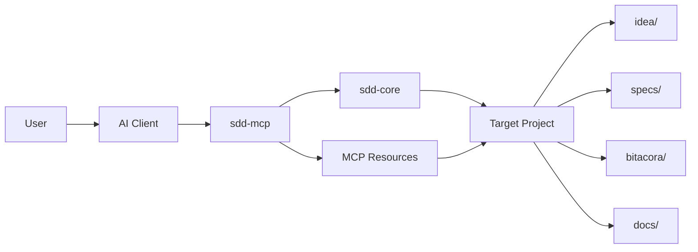

# Complete MCP Reference

## Purpose

This is the dedicated user-facing reference for the local `sdd-mcp` server.

Use this page when you need to know:
- what the MCP server is for
- which tools, resources, and prompts it exposes
- what each operation does
- what side effects it produces
- what output the user should expect

Keep [33-mcp-server-guide.md](./33-mcp-server-guide.md) for setup and connectivity.
Keep [40-command-results-reference.md](./40-command-results-reference.md) for script-by-script output details.

## What `sdd-mcp` is

`sdd-mcp` is the operational MCP layer of this framework.

It gives AI clients a structured way to:
- create or bootstrap SDD workspaces
- create and inspect specs
- validate the SDD state of a project
- enforce the implementation gate
- write traceability artifacts
- read key project context through MCP resources

It is not just documentation access. It is the runnable interface to the framework.

## Visual architecture

Reading path:
- the AI client reads MCP resources and prompts
- `sdd-mcp` exposes the operational contract
- `sdd-core` performs the actual project mutations
- the target project stores the resulting SDD artifacts

## What the user can expect

When an AI client is connected to `sdd-mcp`, the user can expect:
- structured outputs instead of vague free text
- deterministic file writes for status, roadmap, logbook, and traceability
- explicit gate checks before implementation
- the option to use the clean default workspace under `./www/<project-name>/`
- support for external target project paths on `projectRoot`-based tools

## Scope rules

- Recommended default workspace inside this template: `./www/<project-name>/`
- External target project paths are also supported on tools that receive `projectRoot`
- The runnable project must never be initialized in the template root
- If a target project lives inside this template, it must live under `./www/`

## Transports

Supported transports:
- `stdio`
- `Streamable HTTP`

Entrypoints:
- stdio: `packages/sdd-mcp/dist/index.js`
- HTTP: `http://127.0.0.1:3334/mcp`

## Tool reference

### `sdd_create_workspace`

Purpose:
- create a managed runnable workspace under `./www/<project-name>/`

When to use:
- when the user wants the recommended default workspace inside this template

Input:
- `projectName`
- `assistant`
- `profile`
- `useSpecKit`

What it does:
- creates the SDD base workspace
- optionally initializes Spec Kit

What the user should expect:
- a clean runnable project folder under `./www/`
- no changes outside that managed workspace

Structured output:
- `projectRoot`
- `profile`
- `assistant`
- `usedSpecKit`

### `sdd_create_spec`

Purpose:
- create the next numbered spec folder from the template bundle

When to use:
- when the target project already has the SDD base and needs a new feature spec

Input:
- `projectRoot`
- `featureName`
- `owner`

What it does:
- creates `spec.md`, `plan.md`, `tasks.md`, `research.md`, `history.md`
- creates `contracts/README.md`
- appends a row to `specs/INDEX.md`

What the user should expect:
- one new numbered spec directory
- the project index updated automatically

Structured output:
- `specId`
- `specDir`
- `indexUpdated`

### `sdd_validate`

Purpose:
- validate the SDD structure and required files of a target project

When to use:
- before closing a session
- before trusting a migrated or initialized project

Input:
- `projectRoot`

What it does:
- checks required folders
- checks required files
- checks numbered spec bundles

What the user should expect:
- a structured validation summary
- explicit errors and warnings

Structured output:
- `ok`
- `errors`
- `warnings`
- `messages[]`

### `sdd_check_gate`

Purpose:
- decide whether implementation is allowed under SDD rules

When to use:
- immediately before implementation

Input:
- `projectRoot`

What it does:
- checks approval status
- checks plan consistency signals
- checks tasks presence
- checks consent log requirement when approved specs exist

What the user should expect:
- a clear yes/no style gate result
- explicit reasons if implementation must remain blocked

Structured output:
- `ok`
- `errors`
- `warnings`
- `approvedSpecs`
- `totalSpecs`
- `messages[]`

### `sdd_record_user_consent`

Purpose:
- record explicit user approval before implementation starts

When to use:
- only when implementation is actually about to begin

Input:
- `projectRoot`
- `summary`

What it does:
- appends a timestamped line to `.sdd/user-consent.log`

What the user should expect:
- durable approval trace

Structured output:
- `logFile`
- `summary`
- `timestamp`

### `sdd_list_specs`

Purpose:
- list numbered specs and their status

When to use:
- to pick the active spec for a session

Input:
- `projectRoot`

What it does:
- reads numbered specs
- extracts approval status from `spec.md`

What the user should expect:
- a compact list of current specs and states

Structured output:
- `specs[]`
  - `id`
  - `dir`
  - `status`

### `sdd_generate_status`

Purpose:
- build a project status dashboard

When to use:
- at session close
- before handoff

Input:
- `projectRoot`

What it does:
- creates or replaces `STATUS.md`
- summarizes active specs
- summarizes task progress
- includes recent project log excerpt

What the user should expect:
- one status document ready to review or share

Structured output:
- `path`
- `content`

### `sdd_generate_roadmap`

Purpose:
- generate a roadmap from `specs/INDEX.md`

When to use:
- when the user wants a visual and markdown roadmap

Input:
- `projectRoot`

What it does:
- creates or replaces `docs/roadmap.mmd`
- creates or replaces `docs/roadmap.md`

What the user should expect:
- one Mermaid diagram source
- one markdown roadmap document

Structured output:
- `mermaidPath`
- `markdownPath`
- `mermaid`
- `markdown`

### `sdd_append_project_log`

Purpose:
- append a global project log entry

When to use:
- to record high-level session changes

Input:
- `projectRoot`
- `entry`

What it does:
- appends content to `bitacora/global/PROJECT_LOG.md`

What the user should expect:
- one updated project log file

Structured output:
- `path`
- `content`

### `sdd_write_daily_log`

Purpose:
- create or replace one daily log file

When to use:
- to store the session note for a date

Input:
- `projectRoot`
- `date`
- `content`

Rules:
- `date` must use `YYYY-MM-DD`

What it does:
- creates or replaces `bitacora/diaria/YYYY-MM-DD.md`

What the user should expect:
- one date-scoped log document

Structured output:
- `path`
- `content`

### `sdd_write_handoff`

Purpose:
- create or replace a handoff file

When to use:
- when one session leaves a clear next step for another operator or agent

Input:
- `projectRoot`
- `fileName`
- `content`

Rules:
- `fileName` must be a simple markdown file name

What it does:
- creates or replaces `bitacora/handoffs/<fileName>`

What the user should expect:
- one durable handoff document

Structured output:
- `path`
- `content`

### `sdd_write_decision`

Purpose:
- create or replace a decision record

When to use:
- when the session makes an important project decision

Input:
- `projectRoot`
- `fileName`
- `content`

Rules:
- `fileName` must be a simple markdown file name

What it does:
- creates or replaces `bitacora/decisiones/<fileName>`

What the user should expect:
- one durable decision record

Structured output:
- `path`
- `content`

## Resource reference

### Static resources

#### `sdd-policy`
- reads the current framework policy
- use when the AI needs the hard rules first

#### `sdd-ai-start`
- reads the fast AI onboarding guide
- use when the operator is starting from zero

#### `sdd-quickstart`
- reads the short quickstart guide
- use when the operator needs the shortest possible route

#### `sdd-spec-template`
- reads the base `spec.md` template
- use when the AI needs to understand the expected structure of a feature spec

### Managed-workspace resource templates

These resource templates are for managed projects under `./www/<project-name>/`.

#### `sdd-project-index`
- returns `specs/INDEX.md`
- expect the top-level snapshot of project specs

#### `sdd-project-log`
- returns `bitacora/global/PROJECT_LOG.md`
- expect the global project log

#### `sdd-project-latest-handoff`
- returns the latest file in `bitacora/handoffs/`
- expect the most recent handoff, if any

#### `sdd-project-idea`
- returns `idea/IDEA_GENERAL.md`
- expect the project intent and scope

#### `sdd-spec-document`
- returns a specific spec document by id and file name
- supported documents:
  - `spec.md`
  - `plan.md`
  - `tasks.md`
  - `research.md`
  - `history.md`

## Prompt reference

### `start_new_sdd_project`
- use when the user wants to start a new project from this framework
- expects the AI to create the SDD base first and defer implementation until the gate is met

### `adapt_existing_project_to_sdd`
- use when the user already has a project and wants to add SDD structure
- expects the AI to preserve current behavior and add traceability

### `close_sdd_session`
- use when ending a session
- expects a summary with objective, changes, validation, risks, and next step

## Recommended user flow

1. Connect the MCP server.
2. Read `sdd-policy` and `sdd-quickstart`.
3. Create the SDD base with `sdd_create_workspace` or external bootstrap scripts.
4. Create the first spec with `sdd_create_spec`.
5. Validate with `sdd_validate`.
6. Before implementation, run `sdd_check_gate`.
7. If approved, record consent with `sdd_record_user_consent`.
8. Close the session with status, logs, and handoff tools as needed.

## User expectation summary

The user should expect this MCP to:
- guide SDD work with structure, not guesswork
- create predictable files
- block implementation when documentation is not ready
- preserve traceability across sessions
- make AI clients behave more consistently across the same project
