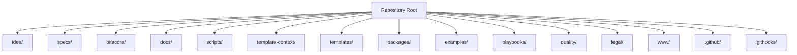

# Project Organization Map

## Purpose

This document explains how the repository is organized at the folder level.

It is not a code map.
It is an operating map for humans and AI agents so they know:
- what belongs in each folder
- what is framework-only
- what is project-runtime material
- what should be edited often
- what should remain stable

## Reading rule

There are two levels to understand:

1. **Framework root**
   This repository itself. It contains the reusable SDD framework, MCP server, guides, scripts, and templates.

2. **Target project**
   The runnable or adapted project that uses the framework. Inside this repository, the clean default is `./www/<project-name>/`. Outside this repository, the target project can live in another path chosen by the user.

## Organizational map

## Folder-by-folder explanation

### `idea/`

Role:
- global project intent

What belongs here:
- the main project definition
- the problem, goal, scope, audience, risks, and completion criteria

Main file:
- `idea/IDEA_GENERAL.md`

When to update:
- when the overall project direction changes

### `specs/`

Role:
- feature-level planning and execution backbone

What belongs here:
- the spec index
- the reusable spec template bundle
- one numbered folder per feature or workstream

Important contents:
- `specs/INDEX.md`
- `specs/README.md`
- `specs/_template/`
- `specs/001-.../`
- `specs/002-.../`

When to update:
- every time a new feature is defined
- every time scope, plan, tasks, or history change

### `bitacora/`

Role:
- traceability and session memory

What belongs here:
- global project log
- daily logs
- handoffs
- decision records
- reusable logging templates

Subfolders:
- `bitacora/global/`
- `bitacora/diaria/`
- `bitacora/handoffs/`
- `bitacora/decisiones/`
- `bitacora/templates/`

When to update:
- at session close
- when an important decision is made
- when another agent or operator must continue the work

### `docs/`

Role:
- user documentation and framework guidance

What belongs here:
- onboarding docs
- guides by level
- MCP docs
- roadmap, launch, versioning, legal references, and support material

Important subfolders:
- `docs/en/`
- `docs/es/`
- `docs/assets/`

When to update:
- when the framework behavior changes
- when user-facing instructions become outdated

### `scripts/`

Role:
- executable automation for the framework

What belongs here:
- initialization scripts
- validation scripts
- status and roadmap generators
- MCP smoke and integration tests

Examples:
- `create-www-project.sh`
- `init-project.sh`
- `validate-sdd.sh`
- `check-sdd-policy.sh`
- `check-sdd-gate.sh`

When to update:
- when the operational workflow changes
- when automation needs to become safer or more consistent

### `template-context/`

Role:
- core operating instructions for AI agents

What belongs here:
- cross-agent rules
- anti-misuse guidance
- execution gate guidance
- handoff expectations
- prompt accelerators

Important subfolders:
- `template-context/core-instructions/`
- `template-context/prompts/`

When to update:
- when AI behavior expectations change
- when new agent rules must be standardized

### `templates/`

Role:
- reusable writing templates for SDD artifacts

What belongs here:
- idea templates
- spec templates
- bitacora templates

Subfolders:
- `templates/idea/`
- `templates/spec/`
- `templates/bitacora/`

When to update:
- when the standard wording or structure of reusable artifacts changes

### `packages/`

Role:
- productized implementation layer

What belongs here:
- typed reusable code
- MCP server package

Subfolders:
- `packages/sdd-core/`
- `packages/sdd-mcp/`

Meaning:
- `sdd-core` contains reusable logic
- `sdd-mcp` exposes that logic to AI clients through MCP

When to update:
- when framework behavior changes in code
- when MCP tools, resources, prompts, or transports evolve

### `examples/`

Role:
- worked examples for adoption

What belongs here:
- example projects
- example adaptations
- end-to-end example flows

When to update:
- when you need clearer teaching material
- when a new usage pattern should be demonstrated

### `playbooks/`

Role:
- accelerators by project type

What belongs here:
- domain-specific guidance for SaaS, e-commerce, mobile, backend API, and similar contexts

When to update:
- when a project category needs more direct operating help

### `quality/`

Role:
- quality evidence and verification support

What belongs here:
- evidence templates
- quality-oriented support material

Important path:
- `quality/evidence/`

When to update:
- when the framework needs stronger verification standards

### `legal/`

Role:
- licensing and legal framing

What belongs here:
- legal materials and license-related references

When to update:
- when the legal posture of the framework changes

### `www/`

Role:
- managed runtime space for target projects inside this repository

What belongs here:
- runnable projects created with the framework’s default workspace convention

Example:
- `www/my-project/`

Meaning:
- this is not framework source
- this is where target project work should live if it stays inside this repository

When to update:
- whenever a new managed target project is created

### `.github/`

Role:
- repository automation and collaboration config

What belongs here:
- workflows
- issue templates
- GitHub-specific instructions

Important subfolders:
- `.github/workflows/`
- `.github/ISSUE_TEMPLATE/`

When to update:
- when CI, issue intake, or GitHub behavior changes

### `.githooks/`

Role:
- local Git hook automation

What belongs here:
- hook scripts used to enforce validation before commits

When to update:
- when local guardrails need to change

## What should usually remain stable

These areas are framework structure and should not change casually:
- `template-context/`
- `templates/`
- `packages/`
- `scripts/`
- `docs/`
- `.github/`

## What changes frequently during real project work

These areas move most during normal usage:
- `idea/`
- `specs/`
- `bitacora/`
- `www/<project-name>/`

## Practical interpretation for AI agents

- If the task is about improving the framework itself, work in the repository root structure.
- If the task is about a user project, work in the target project path.
- If that target project lives inside this repository, use `www/<project-name>/` as the clean default.
- Never mix runnable project implementation into the framework root.

## Short summary

- `idea/` explains the project.
- `specs/` defines the work.
- `bitacora/` preserves the trace.
- `docs/` teaches the system.
- `scripts/` automate the system.
- `template-context/` instructs AI behavior.
- `templates/` standardize reusable artifacts.
- `packages/` implement the productized core and MCP.
- `www/` hosts managed runnable projects inside this repo.
