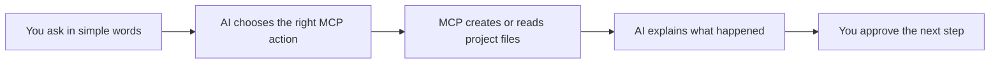
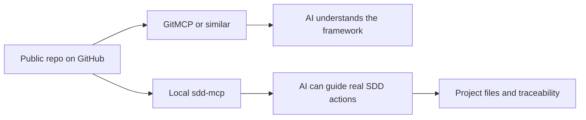
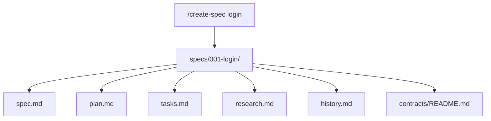
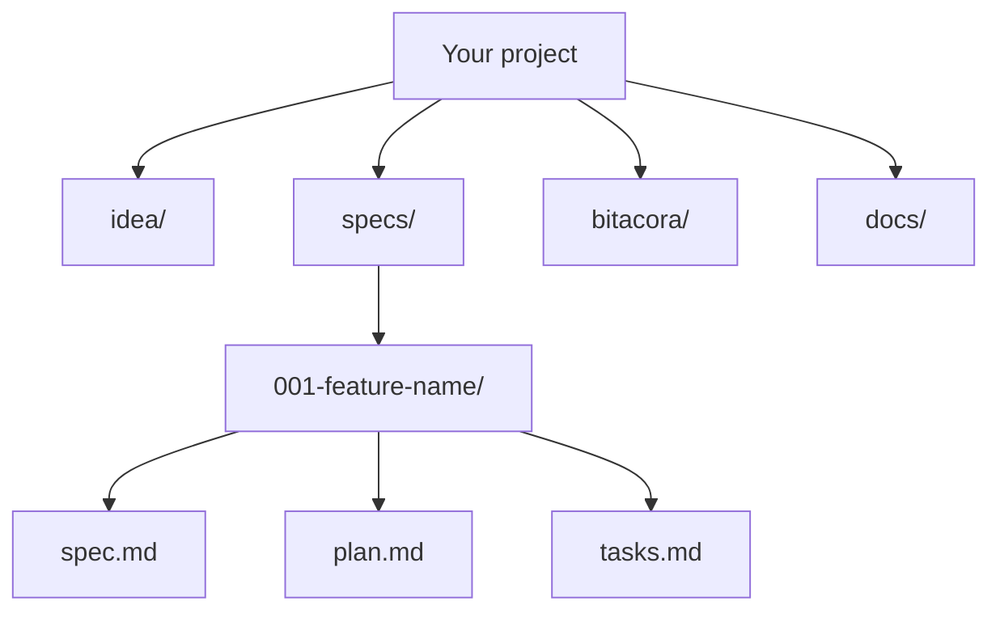
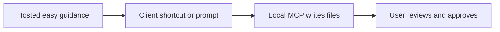

# Easy MCP Guide for Non-Technical Users

## Purpose

This guide explains how to use `sdd-mcp` in the easiest possible way.

Use it when:
- you do not want to think about technical setup details
- you want to talk to the AI in plain language
- you want commands such as `/create-spec payments` explained like a simple remote control
- you want to know exactly what the AI will create, change, and return

Keep [41-complete-mcp-reference.md](./41-complete-mcp-reference.md) for the full technical reference.
Keep [42-project-organization-map.md](./42-project-organization-map.md) for the full folder-by-folder map.
Keep [47-free-external-mcp-options.md](./47-free-external-mcp-options.md) for the dedicated free external MCP comparison.

## The simple idea

Think of `sdd-mcp` like this:
- the AI is the helper
- MCP is the toolbox
- your project is the box where work is stored
- each action creates or updates very specific files



## The easiest way to use it

You have 3 friendly ways to use the MCP.

### 1. Plain language

Example:

```text
Help me start my project with SDD.
My project is a school store app.
Create the base first and guide me step by step.
```

### 2. Easy command style

Example:

```text
/create-spec login
```

This means:
- create a new numbered spec called `login`
- explain which files were created
- tell me what I should review next

### 3. Prompt picker inside the client

Some MCP clients show prompts as buttons, commands, or quick actions.

This repository now includes easy prompts that map to common actions:
- `easy_start_project`
- `easy_create_spec`
- `easy_show_structure`
- `easy_validate_project`
- `easy_show_next_step`
- `easy_close_session`

Important:
- not every MCP client shows prompts the same way
- some clients may look like slash commands
- others may show them as prompt templates or actions
- if your client does not show them, write the request in plain language instead

## External MCP, explained simply

There are 2 very different things that may look similar:

1. an external repo-context MCP such as `GitMCP`
2. this framework's own operational MCP, `sdd-mcp`

Think of them like this:
- `GitMCP` is like a public librarian for your repository
- `sdd-mcp` is like the project operator that can guide and organize work

### What `GitMCP` is good for

Use `GitMCP` when you want:
- a free and immediate external MCP
- AI to read your public repository
- AI to understand your README, docs, templates, and structure
- easier diffusion and discovery

What the user gets:
- quick remote context
- no server hosting work from your side
- a simple URL form based on the GitHub repository

### What `GitMCP` does not replace

`GitMCP` does not replace your own MCP product layer.

It does not give you:
- your custom tools
- your custom prompts as a controlled product surface
- your own project rules as an owned service
- real local file writes in the user's project

So the right mental model is:
- `GitMCP` = remote reading and understanding
- `sdd-mcp` = guided SDD operations and framework behavior

## The recommended combination

For this framework, the easiest professional setup is:



This means:
- use `GitMCP` if you want free external understanding of the repo
- use `sdd-mcp` if you want the real framework workflow
- combine both if you want the easiest operator experience

## What to tell a user in plain language

```text
There are two MCP layers.
One layer helps the AI read and understand the public repository.
The other layer helps the AI guide the real SDD workflow.
If you only use a repo-context MCP like GitMCP, the AI can understand the template better, but it does not replace the framework's own MCP behavior.
```

## What the user should expect every time

For beginner-friendly use, the AI should answer in this order:

1. What I am going to do
2. Which files I will create or update
3. What you will have at the end
4. What the next step is

Example response:

```text
What I am going to do:
- create a new spec called login

Files I will create or update:
- specs/001-login/spec.md
- specs/001-login/plan.md
- specs/001-login/tasks.md
- specs/001-login/research.md
- specs/001-login/history.md
- specs/001-login/contracts/README.md
- specs/INDEX.md

What you will have at the end:
- a complete first spec package ready for review

Next step:
- review the spec and confirm if it should move to approved status
```

## Easy command catalog

## `/start-project`

Use it when:
- you want to start from zero
- you want the SDD base created for you

What the AI should do:
- ask for the project name and simple description if missing
- create the project base
- explain the folder structure
- tell you which file to read first

Main MCP path:
- `sdd_create_workspace` when using the recommended workspace inside `./www/`
- `easy_start_project` prompt for the guided message

What gets created:
- `idea/`
- `specs/`
- `bitacora/`
- `.sdd/`
- helper files and templates

What you get back:
- the project path
- the structure created
- the next step, usually the first spec

## `/create-spec <name>`

Use it when:
- you already have the project base
- you want a new feature or idea turned into a spec package

What the AI should do:
- create the next numbered spec folder
- tell you the exact files created
- explain that no code should be written yet

Main MCP path:
- `sdd_create_spec`
- `easy_create_spec` prompt for the beginner-friendly explanation

What gets created:
- `spec.md`
- `plan.md`
- `tasks.md`
- `research.md`
- `history.md`
- `contracts/README.md`

What you get back:
- the new spec id
- the folder path
- confirmation that `specs/INDEX.md` was updated

Mini map:



## `/show-structure`

Use it when:
- you feel lost
- you want to understand where everything lives

What the AI should do:
- explain the project like a simple house map
- show what each main folder is for
- tell you which folders are edited most often

Main MCP path:
- `easy_show_structure` prompt
- [42-project-organization-map.md](./42-project-organization-map.md)

What you get back:
- a visual organization map
- a folder-by-folder explanation
- clarity before continuing work

## `/validate-project`

Use it when:
- you want to know if the project is organized correctly
- you want to know if implementation is blocked or allowed

What the AI should do:
- run project validation
- run the SDD gate check
- explain errors and warnings in simple language

Main MCP path:
- `sdd_validate`
- `sdd_check_gate`
- `easy_validate_project` prompt

What you get back:
- whether the project structure is OK
- whether the implementation gate is open or closed
- a simple next action

## `/show-next-step`

Use it when:
- you do not know what to do next
- you want the AI to pick the next safe SDD step

What the AI should do:
- inspect idea, specs, status, and gate state
- choose the next smallest correct step
- explain it without jargon

Main MCP path:
- `sdd_list_specs`
- `sdd_check_gate`
- `easy_show_next_step` prompt

What you get back:
- one clear next step
- the reason that step comes next

## `/close-session`

Use it when:
- you want to end work cleanly
- you want traceability and a handoff

What the AI should do:
- summarize what was done
- validate the project
- explain risks and what remains
- leave a clear next step

Main MCP path:
- `close_sdd_session` prompt
- `easy_close_session` prompt
- optional `sdd_generate_status`, `sdd_generate_roadmap`, and logbook tools

What you get back:
- a clean summary
- validation status
- next step for the next session

## Project organization explained simply

Think of the project like 4 boxes:



- `idea/`: what the project is and why it exists
- `specs/`: one folder per feature or change
- `bitacora/`: what happened during work sessions
- `docs/`: helpful guides and generated reports

## Recommended rollout for the easiest product experience

If you want this to feel even easier in the future, the best product path is:

1. hosted MCP for onboarding, docs, prompts, and visual guides
2. local MCP or bridge for real file creation in the user project
3. client shortcuts that map friendly commands such as `/create-spec` to MCP prompts or tools



Why this matters:
- hosted guidance reduces installation friction
- local execution keeps real file access in the user project
- the user keeps a simple mental model while the framework stays rigorous

## Copy-paste message for non-technical users

```text
Use the SDD MCP in easy mode.
Talk to me like I am new to this.
Before each action, tell me:
1. what you will do
2. which files you will create or update
3. what I will have at the end
4. what the next step is
Use commands like /start-project, /create-spec, /show-structure, /validate-project, /show-next-step, and /close-session as friendly aliases.
If the client does not support slash commands, treat them as plain language requests.
```
