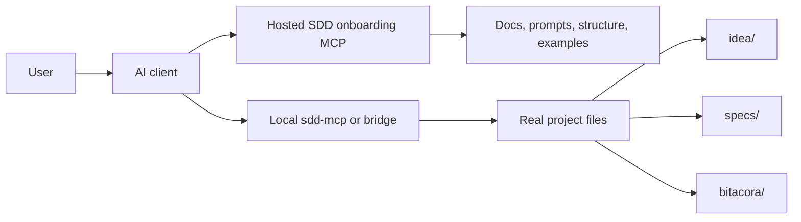
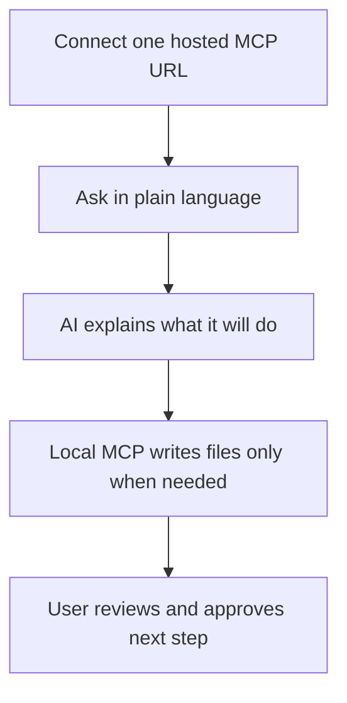

# Hosted MCP Onboarding Model

## Purpose

A product model for making this framework easier to adopt without softening it: a hosted MCP that handles onboarding, docs, prompts and visual help, plus a local MCP (or a thin local bridge) that does the actual writing in the user's project.

Read this page when someone asks how the framework gets simpler without losing its teeth.

Related reference:
- [47-free-external-mcp-options.md](./47-free-external-mcp-options.md)

## The product split



## Why split it in two

Neither half works alone. A fully local MCP can write real files but still asks the user to install something, which is where most people quit. A fully hosted MCP connects in seconds and then cannot safely touch anything on the user's disk.

So: hosting handles teaching, local handles execution. Onboarding gets easier without giving up real writes, and the rules stay the same across every AI client.

## Responsibilities by layer

### Hosted onboarding MCP

Purpose:
- explain the framework
- expose beginner prompts
- expose visual folder maps
- explain command outcomes
- guide the user before any real project write happens

Recommended capabilities:
- prompts like `easy_start_project`, `easy_create_spec`, `easy_show_structure`
- static resources such as policy, quickstart, easy MCP guide, prompt packs
- examples for new and existing projects
- visual “what happens next” guidance

### Local MCP or local bridge

Purpose:
- create folders and files
- update `specs/INDEX.md`
- write bitacora files
- validate project state
- check SDD gate before implementation

Recommended capabilities:
- current `sdd-mcp` tools
- optional wrapper CLI or desktop launcher for one-click local connection

## User experience target

For a non-technical user, the experience should feel like this:



The user should not need to understand:
- transports
- schemas
- package builds
- workspace rules in detail

The user should understand only:
- what action is happening
- what files will be touched
- what result will appear
- what the next step is

## Recommended hosting approach

Short term:
- keep `sdd-mcp` local for operations
- publish docs that define the hosted layer contract
- use the current HTTP transport as the conceptual base
- optionally use `GitMCP` as the free external repo-context layer for public understanding

Mid term:
- host a read-oriented onboarding MCP endpoint
- expose prompts, easy guides, folder maps, and examples
- keep writes local

Long term:
- offer a one-click launcher or thin local bridge that the hosted layer can orchestrate through the client

## Where `GitMCP` fits

`GitMCP` is useful as a free external layer for public repositories.

What it can do well:
- let AI clients read and understand this repository remotely
- expose public docs and structure with almost no setup
- help with discovery, demos, and diffusion

What it should not be treated as:
- a replacement for `sdd-mcp`
- a replacement for your custom prompts and product behavior
- a safe writer into the user's local project

So the recommended framing is:
- `GitMCP` or similar = external repo context
- hosted onboarding MCP = your owned remote guidance layer
- local `sdd-mcp` = operational local execution layer

## Minimum hosted contract

The hosted onboarding MCP should provide at least:
- `sdd://docs/easy-mcp`
- `sdd://docs/quickstart`
- `sdd://policy/current`
- an easy command catalog
- prompts for project start, spec creation, structure explanation, validation, next step, and session close

## Copy-paste explanation for users

```text
You can use SDD in two simple parts.
One part teaches and guides you.
The other part writes the real files in your project.
This keeps onboarding simple and execution safe.
```
