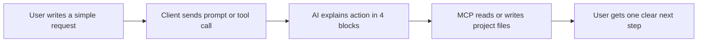
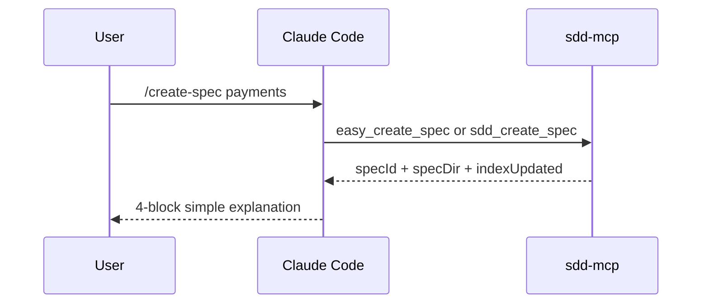
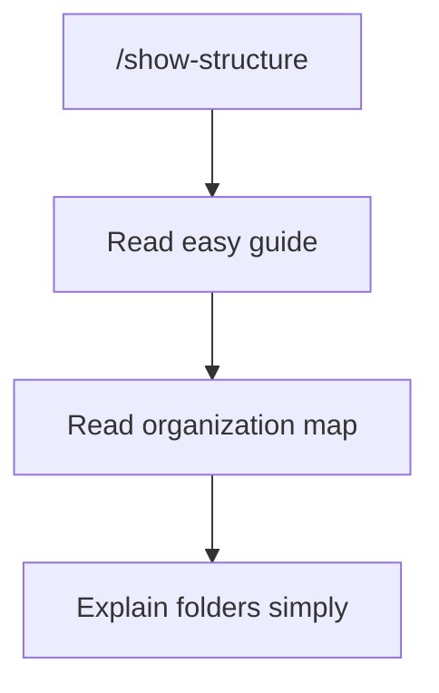

# Client Visual Examples for Easy MCP

## Purpose

This guide shows what easy MCP usage should look like in real clients.

It is not a transport specification. It is a user experience reference.

## Shared mental model



## Claude Code style example

User message:

```text
/create-spec payments
```

What the AI should say:

```text
What I am going to do:
- create a new spec called payments

Which files I will create or update:
- specs/002-payments/spec.md
- specs/002-payments/plan.md
- specs/002-payments/tasks.md
- specs/002-payments/research.md
- specs/002-payments/history.md
- specs/002-payments/contracts/README.md
- specs/INDEX.md

What you will have at the end:
- a complete spec package ready for review

What the next step is:
- review the spec and confirm scope before moving to approval
```

Visual flow:



## Cursor style example

User message:

```text
/show-structure
```

What the AI should do:
- explain `idea/`, `specs/`, `bitacora/`, and `docs/`
- point to the current active folder map
- tell the user where the next action will happen



## Codex style example

User message:

```text
/validate-project
```

What the AI should do:
- run validation
- run gate check
- translate results into plain language
- end with one next step only

Expected output shape:

```text
What I checked:
- project structure
- implementation gate

What is OK:
- required folders exist
- current spec bundle is complete

What still blocks implementation:
- current spec is not approved yet

Next step:
- review spec.md and mark approval details before coding
```

## Existing project adaptation example

User message:

```text
/start-project
My project already exists at /path/to/app.
Adapt it without breaking behavior.
```

Expected AI behavior:
- detect this is adaptation, not greenfield
- preserve existing code
- create SDD base around the existing project
- explain what new folders are being added

## Friendly alias table

| Friendly input | Expected MCP path | User-facing outcome |
|---|---|---|
| `/start-project` | `easy_start_project` + workspace or init flow | project base created or adaptation path explained |
| `/create-spec login` | `easy_create_spec` + `sdd_create_spec` | new numbered spec package |
| `/show-structure` | `easy_show_structure` | folder map explained simply |
| `/validate-project` | `easy_validate_project` + validation tools | clear validation and gate status |
| `/show-next-step` | `easy_show_next_step` | one exact next step |
| `/close-session` | `easy_close_session` | clean wrap-up and handoff guidance |

## Rule for every client

No matter the client, the response should be easy to scan and always contain:
- what the AI is doing
- what files it will touch
- what the user gets at the end
- what comes next
