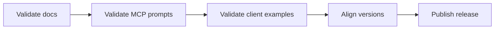

# v1.3.0 Preparation

## Purpose

This page defines the minimum bar for the `v1.3.0` release.

## Release focus

Easy MCP adoption.

## Release flow

## Minimum scope

- easy MCP guide exists in English and Spanish
- hosted onboarding model exists in English and Spanish
- client visual examples exist in English and Spanish
- MCP exposes easy prompts and easy guide resource
- README surfaces the easy route before the deep technical route
- CI and smoke tests stay green

## Release checklist

- confirm changelog includes the easy MCP layer
- confirm version numbers stay aligned
- confirm MCP smoke tests list the new prompts
- confirm all new guides have bilingual pairs
- confirm all new guides render mermaid diagrams correctly
