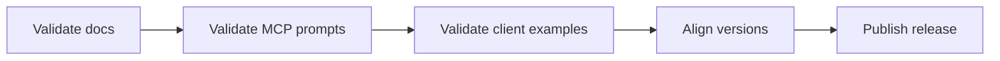

# v1.3.0 Preparation

<!-- sdd:doc-type:start -->

<strong>Project</strong> Repository material: roadmap, releases and audits. Not product documentation.

<!-- sdd:doc-type:end -->

## Purpose

**Historical record. This is not the list to follow.**

This was the minimum bar for `v1.3.0`, which shipped long ago: the project is
on 2.5.0. It is kept so the criteria behind that release can still be read.

The live list, the one followed before publishing any version, is
[guide 09](./09-release-checklist.md).

## Release focus

Easy MCP adoption.

## Release flow

```mermaid
flowchart LR
  A["Validate docs"] --> B["Validate MCP prompts"]
  B --> C["Validate client examples"]
  C --> D["Align versions"]
  D --> E["Publish release"]
```

## Minimum scope

- easy MCP guide exists in English and Spanish
- hosted onboarding model exists in English and Spanish
- client visual examples exist in English and Spanish
- MCP exposes easy prompts and easy guide resource
- README surfaces the easy route before the deep technical route
- CI and smoke tests stay green

## Release checklist

- confirm changelog includes the easy MCP layer
- confirm version numbers stay aligned
- confirm MCP smoke tests list the new prompts
- confirm all new guides have bilingual pairs
- confirm all new guides render mermaid diagrams correctly
