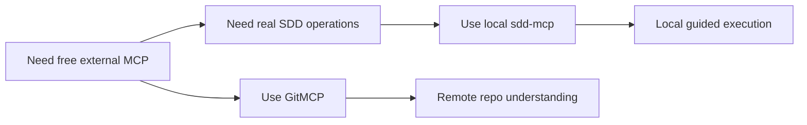

# Free External MCP Options

## Purpose

This guide explains the free external MCP options that can help users understand this framework more easily.

It focuses on one core distinction:
- free external repo-context MCP
- local operational `sdd-mcp`

## Quick answer

If you want a free external MCP today, the simplest option is:
- `GitMCP`

Use it for:
- public repository understanding
- documentation discovery
- diffusion and demos

Do not use it as a replacement for:
- local SDD operations
- project file writes
- your own framework behavior

## Comparison map



## Option 1: GitMCP

What it is:
- a free repo-context MCP for public GitHub repositories

What it is good for:
- letting AI read and understand this repository remotely
- helping the AI understand public docs and templates
- giving you a fast external MCP story for adoption

What it is not for:
- writing files inside the user's local project
- replacing `sdd-mcp`
- exposing your own custom tool contracts as a hosted product

For this repository, the idea is:
- GitHub repo: `https://github.com/juanklagos/spec-driven-development-template`
- GitMCP version: `https://gitmcp.io/juanklagos/spec-driven-development-template`

## Option 2: Your own hosted onboarding MCP

What it is:
- a future external MCP you control
- focused on prompts, docs, structure, and onboarding

What it is good for:
- your own product surface
- your own prompts and resources
- a branded onboarding experience

What it still should not replace:
- local operational writes in the user's project

## Recommended use by audience

### For public discovery
- use `GitMCP`

### For framework onboarding
- use this repository docs + `GitMCP`

### For real work on a project
- use local `sdd-mcp`

### For future product maturity
- combine `GitMCP` or similar with your own hosted onboarding MCP and local `sdd-mcp`

## User-friendly explanation

```text
If you only need the AI to understand this public repository better, a free external MCP like GitMCP is enough.
If you need the AI to guide the real SDD workflow and work with project files, you still need the framework's own MCP behavior.
```

## Next guide

If you want the exact step-by-step connection flow for this repository, continue with [How to Connect This Repository with GitMCP](./48-how-to-connect-this-repo-with-gitmcp.md).
