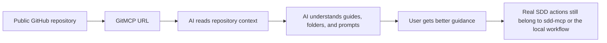
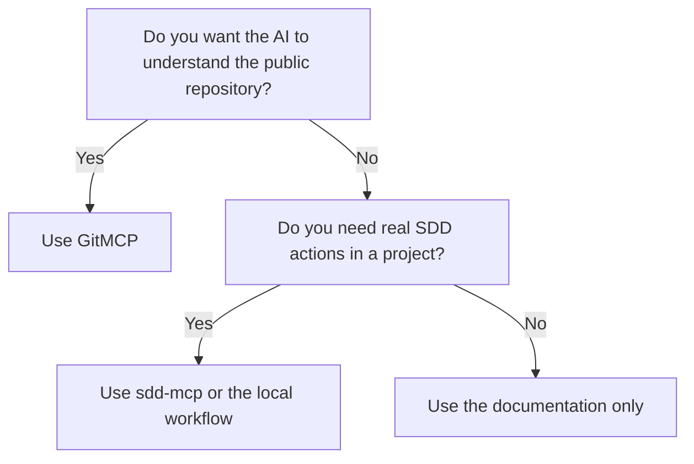

# How to Connect This Repository with GitMCP

## Purpose

This guide explains, in very simple terms, how to use `GitMCP` with this repository.

Use this guide when:
- you want a free external MCP option
- you want the AI to understand this public repository better
- you do not want to start with local MCP installation
- you want a copy/paste path that is easy to explain to another person

## The simple idea

Think about it like this:

- GitHub is the bookshelf
- GitMCP is the reader that helps the AI open the bookshelf
- `sdd-mcp` is the working assistant that helps run the real SDD workflow

So:
- use `GitHub` to share the repository with people
- use `GitMCP` so an AI can read the public repository as MCP context
- use `sdd-mcp` when you need the real guided workflow of the framework

## The two URLs you need

Main repository:
- `https://github.com/juanklagos/spec-driven-development-template`

GitMCP version of the same repository:
- `https://gitmcp.io/juanklagos/spec-driven-development-template`

## What happens when you use GitMCP



## What GitMCP is good for

GitMCP is useful for:
- reading the README
- reading the documentation
- understanding the folder structure
- understanding the SDD framework context
- understanding prompts, guides, and templates
- helping an AI answer questions about this public repository

## What GitMCP is not for

GitMCP is not the operational engine of this framework.

Do not expect it to:
- create local specs in the user's project by itself
- update local `bitacora/` files by itself
- replace the local `sdd-mcp` server
- act as the full execution layer for the user's project

## The shortest explanation possible

If you need one sentence, use this:

```text
GitMCP helps the AI understand this public repository; sdd-mcp helps the AI operate the real SDD workflow.
```

## Step-by-step

### Step 1: confirm the repository URL

For this project, the public repository is:
- `https://github.com/juanklagos/spec-driven-development-template`

### Step 2: derive the GitMCP URL

Take the GitHub path:
- `github.com/juanklagos/spec-driven-development-template`

Replace `github.com` with `gitmcp.io`:
- `gitmcp.io/juanklagos/spec-driven-development-template`

Final URL:
- `https://gitmcp.io/juanklagos/spec-driven-development-template`

### Step 3: add that URL to a client that supports remote MCP

If your AI client supports remote MCP servers by URL, use:

```text
https://gitmcp.io/juanklagos/spec-driven-development-template
```

Simple mental model:
- if the client accepts an MCP URL, paste the GitMCP URL
- if the client only supports local MCP, GitMCP may not be the right first option there

### Step 4: tell the AI what the connection is for

Use a short instruction like this:

```text
Use GitMCP for this repository so you can understand the framework documentation, folder structure, prompts, and onboarding guides.
If we need real SDD actions for a project, use the framework workflow correctly and explain what happens step by step.
```

### Step 5: check that the AI is using it correctly

A good result looks like this:
- the AI explains the framework better
- the AI names the right guides
- the AI understands the folder structure
- the AI does not confuse GitMCP with `sdd-mcp`

A bad result looks like this:
- the AI says GitMCP will create local files in your project automatically
- the AI says GitMCP replaces the full framework workflow
- the AI ignores the difference between public repo context and real project execution

## Copy/paste prompts

### Prompt for a non-technical user

```text
Use the GitMCP connection for https://github.com/juanklagos/spec-driven-development-template so you can understand this framework better.
Guide me in simple language.
Explain what each step does and what I should expect next.
If we need real SDD actions in a project, use the correct workflow and tell me before changing files.
```

### Prompt for an operator or technical user

```text
Use GitMCP for repository context.
Read the easy MCP guide, the project organization map, and the onboarding model first.
Do not confuse GitMCP with the framework's operational sdd-mcp layer.
Be explicit about which part is repository context and which part is real workflow execution.
```

## Easy decision rule

Use this rule:

- need the AI to understand the public repository: use `GitMCP`
- need the AI to help with the real SDD workflow in a project: use `sdd-mcp` or the local framework workflow
- need both: use `GitMCP` for context and `sdd-mcp` for operations



## What the user should expect

If GitMCP is being used correctly, the user should expect:
- clearer explanations
- better onboarding guidance
- better understanding of the framework structure
- better references to the right docs

The user should not expect:
- automatic project execution just because GitMCP was connected
- automatic creation of local specs just because the repository is public
- the full local workflow to happen without the operational layer

## Recommended combination for this repository

Best combination:

1. `GitMCP`
Purpose:
- help the AI understand this public framework repository

2. local `sdd-mcp`
Purpose:
- run the actual guided SDD workflow
- work with the real files of the target project

3. project documentation
Purpose:
- keep humans and AI aligned on what happens next

## Related guides

- [Easy MCP Guide](/Users/juanklagos/www/cucutadev/spec-driven-development-template/docs/en/43-easy-mcp-guide.md)
- [Hosted MCP Onboarding Model](/Users/juanklagos/www/cucutadev/spec-driven-development-template/docs/en/44-hosted-mcp-onboarding-model.md)
- [Free External MCP Options](/Users/juanklagos/www/cucutadev/spec-driven-development-template/docs/en/47-free-external-mcp-options.md)
- [Project Organization Map](/Users/juanklagos/www/cucutadev/spec-driven-development-template/docs/en/42-project-organization-map.md)
