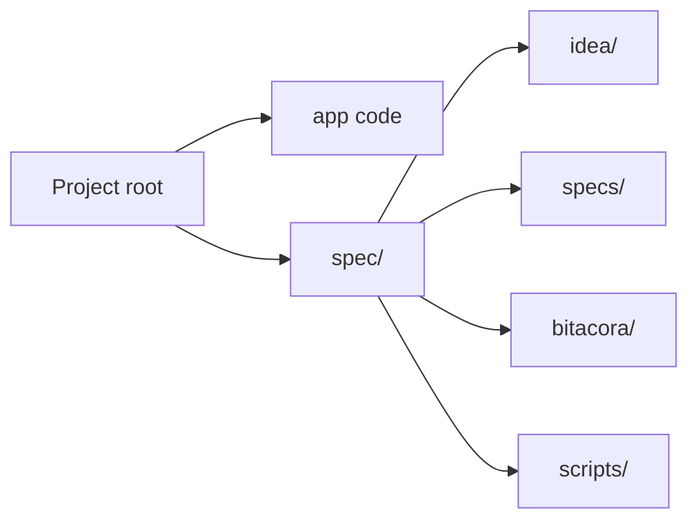
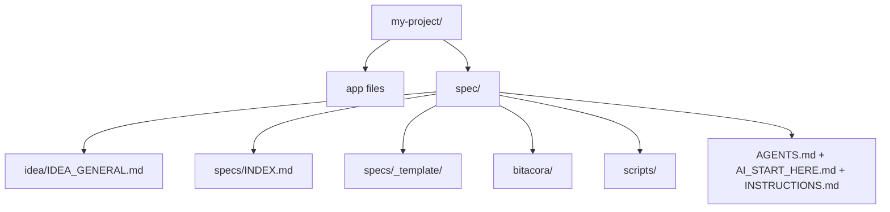

# Spec Sidecar Prompts

## Purpose

Use these prompts when you want an AI to use this framework without cloning or copying the full repository into your project.

The rule is simple:

- project code stays in the project root
- SDD artifacts stay in `./spec/`
- the full framework repository is only copied when you explicitly ask for standalone mode

## Simple mental model



## Exact prompt for a new project

```text
Use https://github.com/juanklagos/spec-driven-development-template as the main reference for my project.

Do not clone or copy the full repository into my project.
Create only the compact `spec/` sidecar inside the project.
Keep my runnable project code in the project root.

If the project is new, create a clean project root first and then install `spec/`.
If needed, use GitHub Spec Kit in the project root, but keep the SDD operating system inside `./spec/`.

Then guide me step by step:
1. define the idea
2. create the first spec
3. explain what files were created
4. explain the next step

Do not write implementation code yet.
Do not use standalone full-template mode unless I explicitly ask for it.
```

## Exact prompt for an existing project

```text
Use https://github.com/juanklagos/spec-driven-development-template as the main reference for this existing project: [PROJECT_PATH].

Do not clone or copy the full repository into the project.
Install only the compact `spec/` sidecar.
Keep the current project code in the project root.

Adapt the project to SDD by creating:
- `spec/idea/`
- `spec/specs/`
- `spec/bitacora/`
- `spec/scripts/`

Create the first spec based on the current project behavior.
Explain each step in simple language.
Tell me what files were created or updated.

Do not write implementation code yet.
Do not use full standalone mode unless I explicitly ask for it.
```

## Exact prompt for Codex, Claude, Cursor, or similar

```text
Work in sidecar mode.

Use https://github.com/juanklagos/spec-driven-development-template as the framework reference.
Do not clone or copy the full repository into my project unless I explicitly ask for standalone mode.
Install and use only the compact `spec/` sidecar by default.

The project root is for app code.
The `spec/` folder is for the SDD operating system.

Before changing files, explain:
1. what you are going to do
2. which files you will create or update
3. what I will have at the end
4. what the next step is

Do not implement code until the active spec is approved and the plan is aligned.
```

## What the AI should create

After a correct sidecar installation, the user should expect this structure:



## What the AI should not do

The AI should not:

- clone the whole repository into the project root
- copy `docs/`, `packages/`, `www/`, and every framework file into an advanced project
- mix framework maintenance files with product code
- start implementation before the first spec is clear

## Shortest prompt possible

```text
Use this SDD framework in sidecar mode.
Do not copy the full repository.
Install only `./spec/`, keep app code in the project root, create the first spec, and guide me step by step.
```

## Related guides

- [Project Organization Map](./42-project-organization-map.md)
- [Easy MCP Guide](./43-easy-mcp-guide.md)
- [How to Connect This Repository with GitMCP](./48-how-to-connect-this-repo-with-gitmcp.md)
