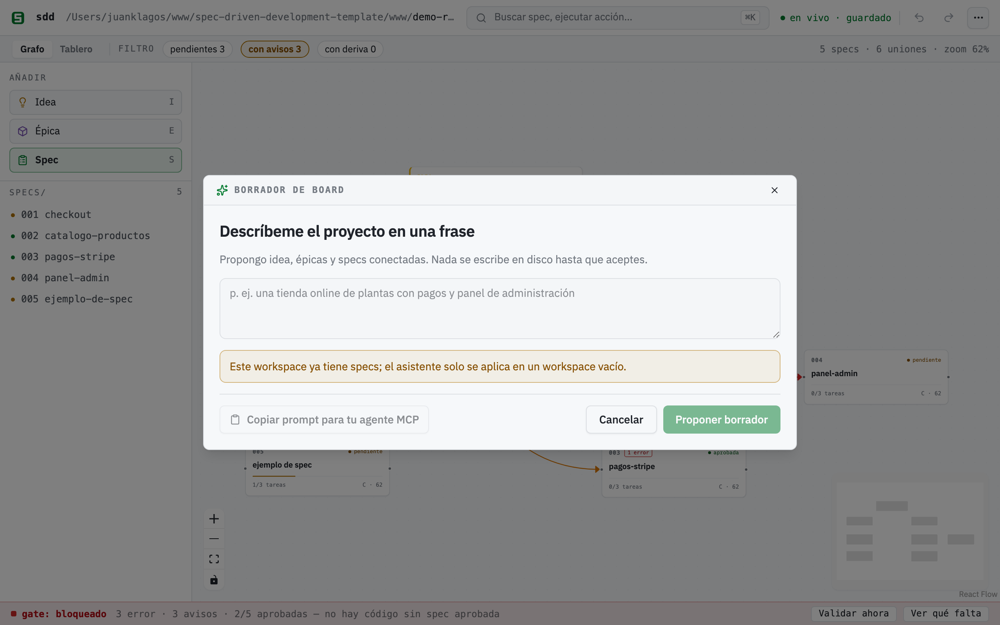
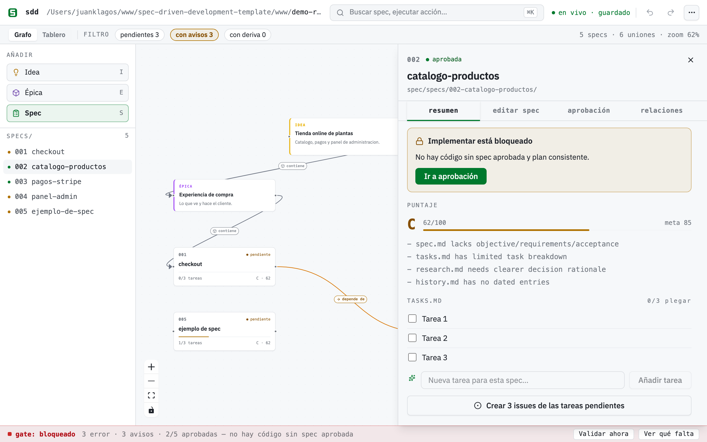
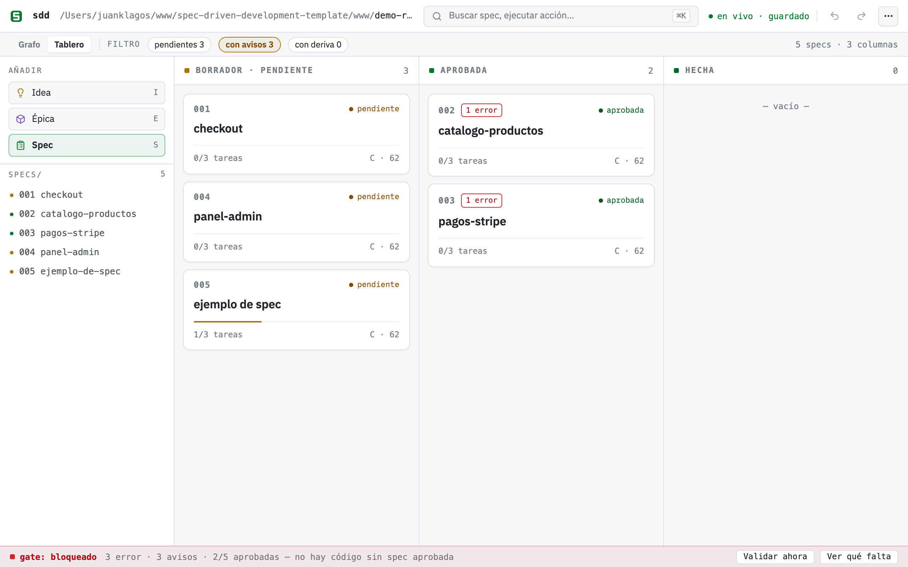
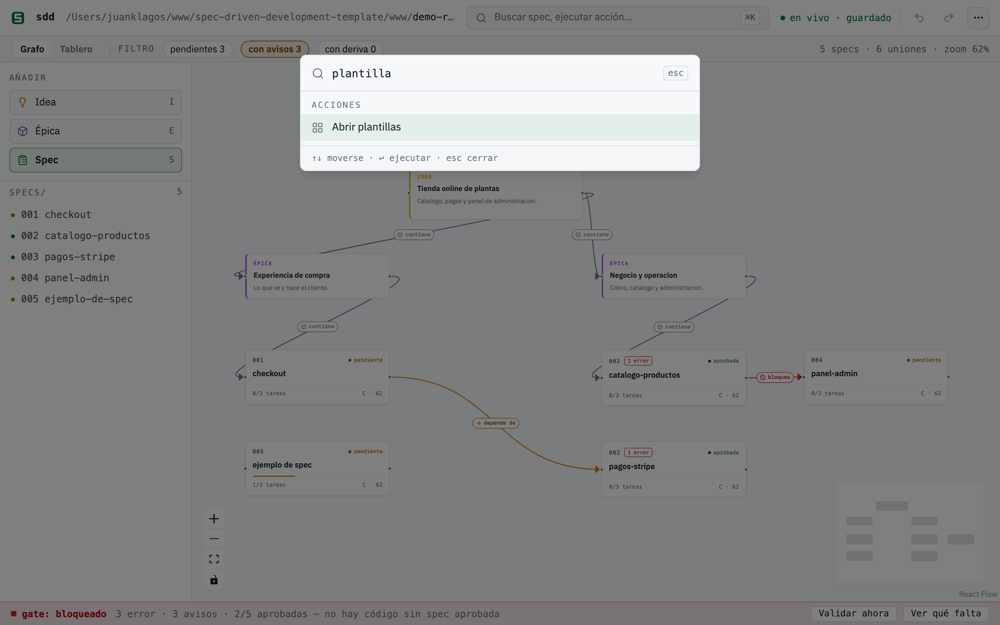
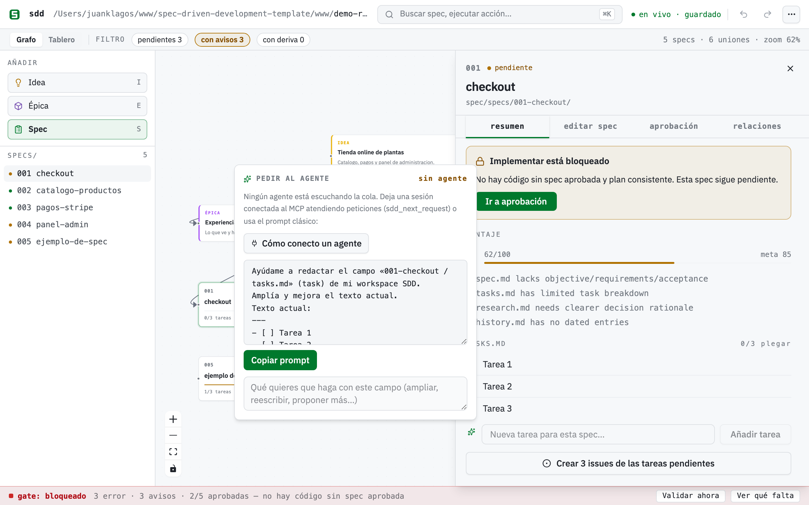

# 🎨 SDD Builder: build your specs visually

<!-- sdd:doc-type:start -->

> **How-to** · Steps for one specific job. Assumes you already know the basics.

<!-- sdd:doc-type:end -->

The SDD Builder is a drag-and-drop canvas where you compose your SDD flow as connected cards, and every card is a **real** `specs/NNN-slug/` bundle on disk. Your markdown stays the source of truth: approving, editing and ticking tasks touch only the lines they have to inside your `.md` files, while the canvas stores nothing but positions and connections in `specs/board.canvas` (the open JSON Canvas format). This guide walks the whole product from the two commands that open it to running it from an AI agent, with real screenshots of a small demo project: an online plant store.


*One board, all the truth: the gate declares "blocked" with its counts and its rule, typed connections say what contains what and what depends on what, and each card's progress and score are read live from your `.md` files.*

## Quick start

**The only thing you need installed is Node.js 20 or newer.** `npx` ships with Node, so there is nothing to install globally, no repository to clone and nothing to compile: the canvas travels inside the published package. Two commands.

### Step 1 — Put SDD inside your project

Pick the case that is yours. Both use the same command and both leave your code where it is.

**New project** (the folder does not exist yet):

```bash
npx @juanklagos/create-sdd-project@latest my-app
cd my-app
```

**Existing project** (it has code, git, dependencies — any language):

```bash
cd /path/to/my-project
npx @juanklagos/create-sdd-project@latest .
```

The dot means "right here". It does not move, rename or overwrite a single file of yours: it only adds a `spec/` folder next to what you already have. Everything SDD lives in there — `spec/idea/`, `spec/specs/`, `spec/bitacora/` and the scripts in `spec/scripts/` — and when it finishes the command prints your exact next steps.

> If an AI agent runs it for you instead of you typing it, it works the same: the scaffolder detects that nobody can answer an interactive prompt, takes the sidecar defaults, and states in its output what it assumed.

### Step 2 — Open the canvas

From the project folder (this matters: the server discovers the workspace from the directory you launch it in):

```bash
npx @juanklagos/sdd-mcp@latest --http
```

You will see exactly this:

```
SDD Builder — el lienzo / the board:  http://127.0.0.1:3334/builder
Dashboard:                            http://127.0.0.1:3334/dashboard
MCP endpoint (para tu agente / for your agent):  http://127.0.0.1:3334/mcp
```

Open the **first** URL, `http://127.0.0.1:3334/builder`, in your browser. That is the canvas. The third one (`/mcp`) is not a page: it is the endpoint your AI agent connects to, and opening it in a browser shows protocol text, not a board.

The server keeps running in that terminal for as long as you use it; stop it with `Ctrl+C`. If port 3334 is already taken, change it:

```bash
SDD_MCP_HTTP_PORT=4000 npx @juanklagos/sdd-mcp@latest --http
```

And if you would rather launch it from somewhere else instead of `cd`-ing into the folder, tell it where the project is:

```bash
SDD_PROJECT_ROOT=/path/to/my-project npx @juanklagos/sdd-mcp@latest --http
```

### Step 3 — What you will see the first time

The canvas opens empty if the project has no specs yet, and that is correct: in SDD there is no contract on disk yet. A **welcome tour** offers five anchored steps (palette → create → connect → tasks → gate); dismiss it with "Don't show again" and re-launch it anytime from ⌘K ("tour") or the **⋯** menu. To fill the board in one go, use the **assistant** from ⌘K, covered further down.

<details>
<summary>Longer route: working inside a clone of this repository (template contributors)</summary>

Only if you are going to modify the builder or the template itself. Here you do have to build the frontend, and the builder is blocked on purpose against the template root (no target-project work happens in there), so `SDD_PROJECT_ROOT` has to point at another workspace:

```bash
# one-time: build the frontend
npm run builder:build

# create a playground workspace (or use any project with a spec/ sidecar)
./scripts/install-spec-sidecar.sh ~/sdd-playground --profile=recommended

# start the server pointing at that workspace
SDD_PROJECT_ROOT=~/sdd-playground npm run mcp:http:start
```

</details>

## Where everything lives

Almost nothing lives in buttons: it is in the **⌘K search** (Ctrl+K on Windows and Linux) and the **⋯** menu. You type what you want and press Enter.

The full tables — every ⌘K action, the keyboard shortcuts and what each filter does — are in the [builder reference](./54-builder-reference.md), so this guide can be read straight through.

## Your first project with the ✨ assistant

The fastest way to go from nothing to a connected board is the **assistant**, in ⌘K ("assistant") or the **⋯** menu. Describe your project in one sentence (*"an online plant store with catalog, payments and an admin panel"*) and the builder proposes a draft board: one idea note, 2-4 epics and 3-6 specs grouped by the domains it detects (auth, payments, catalog, admin, API, notifications, profile, search; with a generic MVP fallback when nothing matches).



*The draft is a preview: rename or remove specs, press "↺ Regenerate" for alternative names. Nothing touches the disk until you confirm.*

The important part is what the assistant does **not** do: it never calls an LLM (local heuristics only, no API keys to configure), and nothing is written until you press **"Create N specs on disk"**. At that moment it runs the same real calls as the template gallery, one `POST /api/spec` per spec plus the pre-laid-out canvas, so you end up with genuine `specs/NNN-slug/` bundles, not mockups. The assistant only applies to an empty workspace.

If you *do* have an AI agent, the collapsible "🤖 Have an AI agent?" section preloads a copyable orchestrator prompt that delegates the same job to real intelligence over MCP — see [From an AI agent](#from-an-ai-agent-mcp) below.

## The canvas, day to day

Everything on the canvas maps to something real:

- **Spec cards** show the bundle number and name, an approval badge (Pending / Approved / Done), and a progress bar computed from the real checkboxes in `tasks.md`. Drag a **Spec** card from the palette and name it: a real `specs/NNN-slug/` bundle (spec, plan, tasks, history) is created on the spot.
- **💡 Idea and 📦 Epic notes** are free, color-coded text nodes for shaping the story around your specs. They live only in `board.canvas`.
- **Connections** are drawn by dragging between cards, and the moment you create one a purpose picker opens right on the edge (spec 010): **contains** (gray, epic → spec), **depends on** (amber), **blocks** (red), **related** (blue, the default) or any free-text label. Double-click a connection to change its purpose later. The purpose travels in the `label` field of `board.canvas` (EN and ES spellings are both canonical) plus a standard JSON Canvas `color`.
- **Moving cards** saves positions (debounced) to `board.canvas`. It never touches your `.md` files. The canvas has undo/redo (Cmd/Ctrl+Z, Shift+Cmd/Ctrl+Z) and a "Export PNG" (⌘K or the ⋯ menu) button to export the board as an image.

Typed connections earn their keep through **dependency warnings**: when a typed edge links two real specs and the dependent spec is approved while its dependency is not, the builder warns you. An amber `⚠ N dep` chip appears next to the gate semaphore (full list in the tooltip) and an amber `⚠ dep` badge on the dependent card, in both views. The warning is informational; the gate itself never closes because of it. In the screenshot above, `002-checkout-y-pagos` is approved but depends on `004-envios-y-seguimiento`, which is still pending: you cannot charge the total without knowing the shipping cost. Hence the warning.

The **gate bar**, pinned at the bottom, is the SDD hard stop made visible: the verdict (open / closed / blocked), the counts of errors, warnings and approved specs, the rule written out — "no code before an approved spec" — and two buttons, "Validate now" and "See what's missing". Gate errors show up as a red `⚠ N` badge with a tooltip on the affected card.

Clicking any spec card opens the **drawer** — the bridge between canvas and markdown:



*The sheet of an approved spec: tasks are the real `tasks.md` checkboxes, the "Implement with agent" button is enabled because the spec is approved, and the four tabs (Summary, Edit spec, Approval, Relations) cover the whole loop.*

In the drawer, tasks are live checkboxes: toggling one flips the `- [ ]` line in `tasks.md` to `- [x]` surgically, and the card's progress bar follows. Below the tasks you get a read-only excerpt of `spec.md` — long-form content is edited in your editor, by design: the canvas composes, your editor writes.

**Live sync** keeps the two sides from drifting. The server watches your `specs/` directory: edit any `tasks.md` in your editor and the card updates by itself, no reload. The identity bar shows **live · saved**; if the server restarts on a different workspace, an amber banner asks you to reload. Concurrency rule: your markdown always wins; canvas layout is last-writer-wins.

## Editing and approving specs

The sheet's **"✏️ Edit spec" tab** is a full guided editor (spec 010). One form per template section, in an ordered accordion you can add to, remove from and reorder: user story, acceptance scenarios, EARS criteria, requirements, spec properties, success criteria, out-of-scope. Saves are surgical. Only the headings you edited get rewritten; the approval block is never touched. The EARS field fills in the `WHEN … THE SYSTEM SHALL …` prefix when you focus it, and a **live EARS lint** marks each criterion green (EARS-shaped) or amber (a suggestion) with a short hint: usually the skeleton to follow, or a vague word with no measurable number behind it (*fast, easy, user-friendly…*). Advisory only: it never blocks saving. The same rule is exported for agents as `validateEarsCriterion` in `sdd-core`.

When the spec is ready, the **"Approval" tab** shows the real block as a form: status and date read-only (approving stamps `Aprobado` + today), approver and evidence editable. It writes the result straight into `spec.md`, one block, nothing else. If the spec has no approval block, you get a clear error instead of a silent fix. The **"Relations" tab** lists every purposeful connection touching the spec (incoming/outgoing) with its icon and color, and lets you change the purpose or delete the connection.

Approval unlocks **"Prepare the exact prompt for your agent"**: a modal preloads the exact implementation kickoff prompt (workspace path, spec folder, run the SDD gate, record consent, hard stop, tick tasks, close with the session contract) behind one "Copy prompt" button. Copy-first by design: no fragile deep links, works with Claude Code, Codex, Cursor, anything. On a non-approved spec the button is disabled with the hard stop spelled out: *no code before approved spec and consistent plan*.

### The spec score and the EARS summary (spec 028)

Under the drawer header sits the **Spec score**: a grade (A/B/C/D), a 0-100 number and the list of notes about what is missing. It is not a canvas-only metric: it is the very same `scoreSpec` agents ask for over MCP with `sdd_score_spec` (required files, spec sections, plan signals, task breakdown, `research.md` rationale, dated history), served by `GET /api/spec/:id/score`. Canvas and agent never disagree, because they read the same function.

Next to it is the **EARS: N/M clean** summary, which runs the guided editor's lint over every acceptance criterion in the spec and leaves the hints in the tooltip. Until now the lint only existed criterion by criterion *while* you typed; now you get the state of the whole set at a glance.

### Adding tasks from the drawer (spec 028)

Below the task list there is a **"New task for this spec…"** field with its **"Add task"** button. Type, and the `- [ ] …` line is appended to `tasks.md` with the same atomic write the checkbox uses. Before this, the canvas could only *tick* tasks: adding one meant opening a terminal or an editor.

### The logbook from the canvas (spec 028)

The **Logbook** action (⌘K or the **⋯** menu) opens a modal to record all four entry types without leaving the canvas: **Decision**, **Handoff**, **Daily log** and **Global project log**. Each type asks for what it needs (a `.md` file name for decisions and handoffs, a date for the daily, free text for the global log) and preloads a markdown skeleton as a placeholder. The same `sdd-core` writers the MCP tools and the scripts use do the writing, so the format never forks depending on where you came in from.

### STATUS and roadmap from ⌘K (spec 028)

The **Reports** action (⌘K or the **⋯** menu) regenerates `STATUS.md` and `docs/roadmap.md` from `specs/INDEX.md` — the same generators behind `sdd_generate_status` and `sdd_generate_roadmap`. It confirms with a ✓ and returns to normal after a few seconds; if it fails, the error stays in the button's tooltip instead of vanishing.

### The drift semaphore (spec 025)

Once a spec is approved, the builder watches whether the code it governs kept moving. If a spec declares an **"Ámbito de archivos / File scope"** section and any commit touched those paths **after** its approval date, the card shows an amber **🔀** chip, and the drawer lists the offending commits (hash, date, subject). It is a plain `git log` × file scope × approval date — **no LLM, no network**, computed once in `sdd-core` and painted like the status color, so the canvas, the MCP tool and any agent see the same signal. It is a *signal, not a verdict*: whether the code contradicts the spec, and which one should change, stays your call (or your agent's). A spec with no file scope reads as "unscoped" rather than a false "clean"; a workspace that is not a git repo degrades quietly.

## The team view

The **"Graph ↔ Board" toggle** in the context strip shows the same specs as a kanban — three columns driven by the real state of your `.md` files: **Draft · Pending**, **Approved** (the `Estado / Status` line in `spec.md`), and **Done** (every task ticked). Cards keep their progress bar and open the same drawer.



*Same data, another projection: the columns come from `spec.md` and `tasks.md`, not from a separate board state.*

In v1, dragging a card to another column changes *nothing* on disk. Approval is a real act on the spec, so the drop shows a toast ("Approval happens on the spec") with an "Open spec" button straight to the drawer's Approve flow.

Two more team features live here:

- **Tasks → GitHub issues**: in the drawer, "Create N issues from the pending tasks" creates one GitHub issue per **pending** task via your local `gh` CLI: title `[<specId>] <task>` for traceability, body linking the bundle's `tasks.md`. Idempotent by title: tasks whose exact title already exists are skipped, and the result is reported per task (created / skipped / failed) with links. Without a git repo, a remote, or an authenticated `gh` it does not fail vaguely; you get a clear bilingual error telling you exactly what to run.
- **Working in parallel**: several people (or agents) can have the builder open on the same workspace. Every change on disk reaches all screens through the same live channel — powered by the same SSE hub as live sync, join/leave updates included.

## Templates

If you would rather start from a proven shape than from a sentence, the **🧩 Templates** button opens a gallery of four playbooks: Web App, API/Backend, E-commerce and SaaS. Each one creates real specs plus a connected, tidy board. Like the assistant, templates only apply to a workspace with zero specs.



*Each template card tells you exactly what it will create: real `specs/NNN-…` bundles and a connected board — no placeholders.*

## From an AI agent (MCP)

Any MCP client connected to `sdd-mcp` can work with the same board. The board tools — `sdd_board_read`, `sdd_board_write`, `sdd_board_connect`, `sdd_read_tasks`, `sdd_set_task_done` — are backed by the exact same `sdd-core` layer as the canvas, so what your agent writes is what you see in `/builder` (and vice versa). Agents also get the drawer's powers (`sdd_gate_summary`, `sdd_approve_spec`, `sdd_update_spec_sections`, `sdd_create_spec`), and the dependency warnings appear in the `dependencyWarnings` field of `sdd_gate_summary` and of `GET /api/gate`. See guide 41 (complete MCP reference).

### Connect your agent in one command (spec 032)


The short way, from your project folder:

```bash
npx @juanklagos/sdd-mcp@latest connect
```

It detects which clients you have, writes the MCP configuration **into each one's own file**, and installs the `/sdd-serve` skill that serves the queue. It overwrites nothing: it merges the `sdd` entry and leaves the rest of your configuration untouched; if a file cannot be parsed it is left exactly as it is and reported. Running it twice changes nothing ("unchanged").

| Client | File it writes | Key | Serve the queue |
| :--- | :--- | :--- | :--- |
| Claude Code | `.mcp.json` | `mcpServers.sdd` | `/sdd-serve` |
| Codex | `.codex/config.toml` | `[mcp_servers.sdd]` | `/sdd-serve` |
| Cursor | `.cursor/mcp.json` | `mcpServers.sdd` | `/sdd-serve` |
| VS Code | `.vscode/mcp.json` | `servers.sdd` | MCP prompt `sdd_serve_requests` |
| Windsurf | `.windsurf/mcp_config.json` | `mcpServers.sdd` | MCP prompt `sdd_serve_requests` |
| Gemini CLI | `.gemini/settings.json` | `mcpServers.sdd` | `/sdd:serve` |
| opencode | `opencode.json` | `mcp.sdd` | `/sdd-serve` |

Useful options:

- `--dry-run` — print which files it would touch and what would change, writing nothing.
- `--client codex,cursor` — only those clients (useful when one is installed but not used yet).
- `--global` — user-level configuration instead of the project's.
- `--project-root <path>` — register a different workspace.

The builder has the same thing in **⌘K → Connect agent** (and behind the "no agent" note on any ✨ button): it shows the command with your path already in it and, per client, the exact configuration in case you would rather paste it by hand.

Three paths, because in 2026 no single one covers every client: the **skill** `/sdd-serve` (open SKILL.md standard, read by Claude Code, Codex, Cursor and compatible tools), the **native commands** for Gemini and opencode, and the **MCP prompt** `sdd_serve_requests`, which needs no install at all in clients that surface MCP prompts as slash commands (Claude Code, VS Code; Codex does not support it yet).

### Connect your agent by hand

The exact command per client — run each one from (or pointing at) the project you want the agent to work on. Everything the agent writes shows up **live** in `/builder` (the SSE watcher picks up every disk change), and everything you do in the builder is instantly visible to the agent.

**Claude Code** (one command, from your project directory):

```bash
claude mcp add sdd --env SDD_PROJECT_ROOT=$(pwd) -- npx -y @juanklagos/sdd-mcp@latest
```

**Codex** (add to `~/.codex/config.toml`):

```toml
[mcp_servers.sdd]
command = "npx"
args = ["-y", "@juanklagos/sdd-mcp@latest"]
env = { SDD_PROJECT_ROOT = "/absolute/path/to/your/project" }
```

**Gemini CLI** (add to `~/.gemini/settings.json`, or the project's `.gemini/settings.json`):

```json
{
  "mcpServers": {
    "sdd": {
      "command": "npx",
      "args": ["-y", "@juanklagos/sdd-mcp@latest"],
      "env": { "SDD_PROJECT_ROOT": "/absolute/path/to/your/project" }
    }
  }
}
```

**Claude Desktop / ChatGPT (HTTP connector)**: start the HTTP server and point a custom connector at the Streamable HTTP endpoint:

```bash
SDD_PROJECT_ROOT=/absolute/path/to/your/project npx @juanklagos/sdd-mcp@latest --http
# connector URL: http://127.0.0.1:3334/mcp   (SDD_MCP_HTTP_PORT changes the port)
```

In clients that support MCP Apps, asking for the board renders the embedded board view right inside the chat (the `sdd_board_app` tool — see the MCP App section below).

### The orchestrator prompt (real AI via MCP)

The assistant's "Have an AI agent?" section offers this prompt (also copy it from here). Paste it into any agent connected to `sdd-mcp` and it will build the board with real intelligence — including drafted sections inside each spec:

```text
You are my SDD agent connected to the `sdd-mcp` MCP. My project: "<describe your project>".
Goal: populate the SDD Builder board like the ✨ assistant, but with real intelligence.
1. Read the current state with `sdd_board_read` (projectRoot: <workspace path>).
2. Propose 2-4 epics and 3-6 specs with clear lowercase accent-free names; show me the proposal and wait for my OK before writing anything.
3. On my OK: create each real spec with `sdd_create_spec`; fill its draft with `sdd_update_spec_sections` (user story, scenarios, EARS criteria "WHEN … THE SYSTEM SHALL …", out of scope); draw the board with `sdd_board_write` + `sdd_board_connect` (idea note → epics → specs, labeled edges).
4. Do not implement code: the SDD gate stays closed until I approve the specs.
```

### The board inside your AI client (MCP App)

The server also ships the board as an **MCP App** (SEP-1865, the first official MCP extension, part of the 2026-07-28 protocol release, built with the official `@modelcontextprotocol/ext-apps` SDK). In a client that supports MCP Apps, ask your agent to show the board. It calls the `sdd_board_app` tool and the view renders **inside the chat**: spec cards with approval status and task progress, the canvas with its typed connections, the gate semaphore and dependency warnings, plus a "↻ Actualizar / Refresh" button that re-reads the workspace. Read-only in v1, bilingual, dark/light aware.

Where the standard actually is: the MCP 2026-07-28 spec is a release candidate frozen since 2026-05-21 with final publication on 2026-07-28; the Apps extension itself has a stable revision (2026-01-26) and a published SDK, so this view is built on the stable surface. In practice:

- It works in hosts that implement MCP Apps; support is rolling out across clients during the finalization window.
- Hosts **without** MCP Apps degrade gracefully: `sdd_board_app` returns the same board + gate data as JSON text.
- The view is fully self-contained (no CDNs): the official ext-apps bridge is inlined into the `ui://sdd/board.html` resource.
- To re-check after 2026-07-28: confirm the final spec text kept `_meta.ui.resourceUri` + `text/html;profile=mcp-app` as-is and bump `@modelcontextprotocol/ext-apps` if a final-release version lands.

### Connected mode: "Expand with AI" without copy-paste (spec 031)



Every editable content field in the builder — the 7 `spec.md` sections,
tasks, canvas notes and bitácora drafts — has an **✨ Expand with AI**
button. Using it, the builder does NOT call any AI API: it publishes a
request under `.sdd/requests/` and your own agent session serves it over
MCP. The full cycle:

1. In the builder: press "Expand with AI" on a field, type the instruction
   and send. The request stays visible in the status bar (`AI: 1 request`).
2. In your agent (Claude Code or any connected MCP client): call
   `sdd_next_request` — it returns the oldest request with the field, its
   current text and your instruction — draft the proposal and answer with
   `sdd_respond_request`. **The agent never writes specs**: it only proposes.
3. Back in the builder: the proposal shows up on its own as a diff (current
   vs. proposed). **Accept** writes only that field through the usual route;
   **Reject** touches nothing.

To keep a session listening, ask your agent something like:

> Serve the SDD Builder queue: call `sdd_next_request` (projectRoot: …) in a
> loop; for each request draft the proposal and answer with
> `sdd_respond_request`. Do not write any spec files.

In Claude Code, `/loop` is exactly this. If no agent has polled the queue in
the last 5 minutes, the AI buttons say so ("no agent") and offer the classic
copyable prompt — nobody is left waiting. A request stalled for >10 minutes
gets flagged and can be cancelled right from the status bar.

The ✨ assistant also takes a raw braindump: **Structure with AI** sends it
through the same queue and returns a full spec draft (story, scenarios, EARS
criteria, requirements), editable before anything is created. Approval and
consent fields have no AI button on purpose: they are the human signature of
the gate.

## Limitations (honest)

- Long-form `spec.md` content beyond the guided sections is edited in your editor, not on the canvas.
- Deleting a spec folder on disk does not remove its card automatically (conservative; delete the card manually).
- One workspace per server instance (`SDD_PROJECT_ROOT`).
- The kanban is a read-only projection of state: moving cards between columns never approves or un-approves anything (use the drawer). Issue idempotency is title-based (renaming a task creates a new issue).
- An interactive demo on the website is still pending (it needs the Chrome-only FS Access API); see `specs/006-visual-spec-builder/`.

## Quick reference: canvas → disk

| On the canvas | What happens on disk |
| :--- | :--- |
| Drag a **Spec** card from the palette, give it a name | A real `specs/NNN-slug/` bundle is created (spec, plan, tasks, history) |
| Click a spec card | Drawer with its tasks as checkboxes; the spec.md excerpt read-only |
| Toggle a task checkbox | The `- [ ]` line in `tasks.md` flips to `- [x]` surgically |
| Connect two cards, double-click the line | Labeled (optionally typed) dependency saved in `board.canvas` |
| Add 💡 Idea / 📦 Epic cards | Free note nodes (color-coded) in `board.canvas` |
| Move cards around | Positions saved (debounced) — never touches your .md files |
| Approve in the drawer | The real approval block (status, date, approver, evidence) written into `spec.md` |
| Save in the drawer's Edit tab | Only the guided sections of `spec.md` are rewritten — approval and requirements untouched |
| Type in "New task" and hit Add | A `- [ ] …` line is appended to `tasks.md` |
| Save an entry in Logbook | A real file in `bitacora/decisiones`, `handoffs`, `diaria`, or an entry in `bitacora/global/PROJECT_LOG.md` |
| Run Reports | `STATUS.md` and `docs/roadmap.md` are regenerated from `specs/INDEX.md` |
