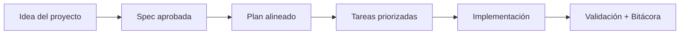

# Introducción

<a href="../README.md"></a>

---

## 🌍 Par de idioma / Language pair

- Español: **00-introduccion.md**
- English: [../en/00-introduction.md](../en/00-introduction.md)


## 🗣️ Prompt amigable (copiar y pegar)

Úsalo si no eres técnico y quieres que la IA lo integre todo y te vaya guiando:

```text
Usando https://github.com/juanklagos/spec-driven-development-template, crea todo lo necesario para llevar a cabo mi proyecto de principio a fin.
Mi proyecto es: [explica tu proyecto en lenguaje simple].

Si mi proyecto es nuevo, inicialízalo con este template y GitHub Spec Kit.
Si mi proyecto ya existe, adáptalo a idea/specs/bitacora sin romper el comportamiento actual.
Guíame paso a paso según mi nivel (principiante/intermedio/avanzado), con lenguaje claro.
No omitas especificación, plan, tareas, traza de refinamiento, bitácora y validación.
```


> [!TIP]
> Para inicio rápido y prompts, usa:
> - [`AI_START_HERE.md`](../../AI_START_HERE.md)
> - [Matriz de prompts](./19-matriz-prompts-por-objetivo.md)
> - [Banco de prompts validados](./26-banco-prompts-validados.md)


## Para quién es esta plantilla

Para quien empieza y para quien lleva años, siempre que la meta sea la misma: un sistema que se repite igual cada vez y que otra persona pueda auditar sin pedir explicaciones.

## Problema que resuelve

En muchos proyectos:

- Las decisiones quedan en conversaciones y se pierden.
- Se cambia código sin contexto.
- Es difícil retomar trabajo después de varios días.

La estructura fija de esta plantilla existe para cortar esos tres problemas de raíz.

## Resultado esperado

Menos tiempo perdido reconstruyendo contexto, y una base común entre las personas del equipo y las herramientas de IA que trabajan sobre el mismo proyecto.

Si solo te llevas una cosa de aquí: la spec activa se confirma antes de escribir código, no después.

## El flujo


