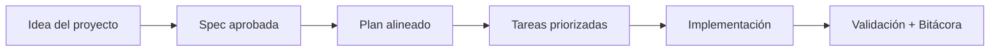

# Introducción

<a href="../README.md"></a>

---

## 🌍 Par de idioma / Language pair

- Español: **00-introduccion.md**
- English: [../en/00-introduction.md](../en/00-introduction.md)


## 🗣️ Prompt amigable (copiar y pegar)

Usa esto cuando no eres técnico y quieres que la IA haga la integración + guía completa:

```text
Usando https://github.com/juanklagos/spec-driven-development-template, crea todo lo necesario para llevar a cabo mi proyecto de principio a fin.
Mi proyecto es: [explica tu proyecto en lenguaje simple].

Si mi proyecto es nuevo, inicialízalo con este template y GitHub Spec Kit.
Si mi proyecto ya existe, adáptalo a idea/specs/bitacora sin romper el comportamiento actual.
Guíame paso a paso según mi nivel (principiante/intermedio/avanzado), con lenguaje claro.
No omitas especificación, plan, tareas, traza de refinamiento, bitácora y validación.
```


> [!TIP]
> Para inicio rápido y prompts, usa:
> - [`AI_START_HERE.md`](../../AI_START_HERE.md)
> - [Matriz de prompts](./19-matriz-prompts-por-objetivo.md)
> - [Banco de prompts validados](./26-banco-prompts-validados.md)


## Para quién es esta plantilla

Para personas nuevas y para profesionales que quieren un sistema claro, repetible y fácil de auditar.

## Problema que resuelve

En muchos proyectos:

- Las decisiones quedan en conversaciones y se pierden.
- Se cambia código sin contexto.
- Es difícil retomar trabajo después de varios días.

Esta plantilla evita eso usando una estructura fija.

## Resultado esperado

- Menos confusión.
- Más continuidad.
- Mejor colaboración entre personas y herramientas de Inteligencia Artificial.

## 💡 Tips rápidos

- Empieza con una descripción corta del proyecto en lenguaje simple.
- Pide a la IA confirmar la spec activa antes de programar.
- Cierra cada sesión con validación y próximo paso claro.

## 📊 Flujo visual


