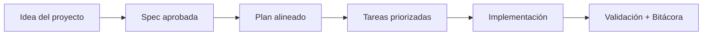

# Estructura detallada

## 🌍 Par de idioma / Language pair

- Español: **01-estructura.md**
- English: [../en/01-structure.md](../en/01-structure.md)


> [!TIP]
> Para inicio rápido y prompts, usa:
> - [`AI_START_HERE.md`](../../AI_START_HERE.md)
> - [Matriz de prompts](./19-matriz-prompts-por-objetivo.md)
> - [Banco de prompts validados](./26-banco-prompts-validados.md)

## 🗣️ Prompt amigable (copiar y pegar)

```text
Usando https://github.com/juanklagos/spec-driven-development-template, prepara la estructura de mi proyecto con un sidecar compacto spec/ y guíame con lenguaje simple.
Mi proyecto es: [explica el proyecto].
No clones el template completo dentro de mi proyecto salvo que yo pida un workspace standalone.
Si es nuevo, crea una raíz de proyecto limpia e instala spec/.
Si ya existe, adáptalo sin romper el comportamiento actual.
```

Forma recomendada del proyecto destino:
- raíz del proyecto = código app
- `spec/` = sistema operativo SDD

Eso significa:
- `spec/idea/`
- `spec/specs/`
- `spec/bitacora/`

GitHub Spec Kit sigue siendo la referencia base del flujo de trabajo.
Este repositorio agrega la estructura, el modo sidecar, las reglas para IA y la guía alrededor de esa base.


## Carpeta idea

Ruta:
- modo raíz del framework: `idea/`
- modo sidecar en proyecto real: `spec/idea/`

Archivo principal:

- `IDEA_GENERAL.md`: define el problema, objetivo, alcance, usuarios, riesgos y criterio de terminado.

## Carpeta specs

Ruta:
- modo raíz del framework: `specs/`
- modo sidecar en proyecto real: `spec/specs/`

Archivos principales:

- `INDEX.md`: lista de todas las especificaciones.
- `README.md`: reglas del formato.
- `_template/`: plantilla para nuevas especificaciones.

Cada especificación vive en una carpeta enumerada:

- `001-nombre`
- `002-nombre`
- `003-nombre`

## Carpeta bitacora

Ruta:
- modo raíz del framework: `bitacora/`
- modo sidecar en proyecto real: `spec/bitacora/`

Subcarpetas:

- `global/`: historial general del proyecto.
- `diaria/`: trabajo por fecha.
- `handoffs/`: contexto para retomar trabajo.
- `decisiones/`: decisiones importantes.
- `templates/`: plantillas para registrar información.

## Carpeta docs

Ruta: `docs/`

Contiene la documentación pedagógica del sistema.

## Carpeta scripts

Ruta:
- modo raíz del framework: `scripts/`
- modo sidecar en proyecto real: `spec/scripts/`

Contiene scripts para instalar esta estructura en otro repositorio.

## Carpetas opcionales (aceleradores)

- `playbooks/`: guías por tipo de proyecto (SaaS, e-commerce, app móvil, backend API).
- `quality/`: plantillas de evidencia para pruebas y control de calidad.

Estas carpetas son opcionales. Si no se usan, el flujo base `idea/specs/bitacora` sigue siendo válido.

## 💡 Tips rápidos

- Empieza con una descripción corta del proyecto en lenguaje simple.
- Pide a la IA confirmar la spec activa antes de programar.
- Cierra cada sesión con validación y próximo paso claro.

## 📊 Flujo visual


