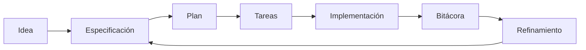

# 🧭 Flujo de trabajo

> ✅ **Inicio recomendado (baja fricción):** no necesitas clonar este repositorio si ya estás trabajando en un proyecto.
>
> **Regla obligatoria:** indica a la IA que debe trabajar usando este template y sus guías como referencia principal.
>
> Opciones:
> - Si ya tienes este repositorio en local, úsalo directamente.
> - Si trabajas en otro proyecto, pide a la IA adaptar ese proyecto usando esta guía.
> - Si no tienes este repositorio, puedes clonarlo como opción:
>
> ```bash
> git clone https://github.com/juanklagos/spec-driven-development-template.git
> cd spec-driven-development-template
> ```

## ⭐ Uso explícito del repositorio base

Usa siempre este repositorio como referencia principal:

- `https://github.com/juanklagos/spec-driven-development-template`

### 🆕 Caso 1: crear un proyecto nuevo desde esta base

Prompt sugerido para la IA:

```text
Usando https://github.com/juanklagos/spec-driven-development-template crea un proyecto nuevo para [OBJETIVO].
Si no tengo este repositorio disponible en local, indícame cómo obtenerlo; luego inicializa la estructura y guíame paso a paso para definir idea, primera spec y bitácora.
No saltes pasos.
```

### ♻️ Caso 2: adaptar un proyecto existente usando esta base

Prompt sugerido para la IA:

```text
Usando https://github.com/juanklagos/spec-driven-development-template y su guía, adapta este proyecto existente: [RUTA_DEL_PROYECTO].
Mantén el código actual, integra la estructura idea/specs/bitacora, crea la primera spec basada en lo que ya existe y deja trazabilidad completa.
```

### ✅ Resultado mínimo esperado

- Proyecto creado o adaptado con estructura estándar.
- Primera especificación creada.
- Bitácora inicial registrada.
- Próximo paso claro para continuar.


## Vista rápida

| Paso | Acción | Resultado |
|---|---|---|
| 1 | Definir idea | Dirección clara del proyecto |
| 2 | Crear especificación | Alcance definido |
| 3 | Planificar y dividir tareas | Ejecución ordenada |
| 4 | Implementar | Entregable real |
| 5 | Registrar bitácora | Trazabilidad completa |
| 6 | Refinar | Mejora continua |

## Flujo visual



## Paso 1: Definir la idea general ✨

Completa `idea/IDEA_GENERAL.md`.

## Paso 2: Crear una especificación 📄

Crea carpeta numerada dentro de `specs/`.

Ejemplo:

- `specs/001-autenticacion/`

## Paso 3: Llenar archivos obligatorios ✅

- `spec.md`
- `plan.md`
- `tasks.md`
- `research.md`
- `history.md`
- `contracts/` si aplica

## Paso 4: Ejecutar trabajo real ⚙️

Implementa tareas del archivo `tasks.md`.

## Paso 5: Registrar lo que pasó 📝

Actualiza:

- `bitacora/global/PROJECT_LOG.md`
- `bitacora/diaria/AAAA-MM-DD.md`
- `bitacora/handoffs/` cuando dejes trabajo pendiente

## Paso 6: Refinar 🔁

Si cambian ideas o requisitos, sigue:

- `docs/es/11-refinamiento-continuo.md`
