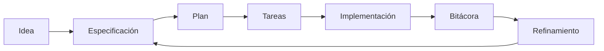

# 🧭 Flujo de trabajo

<a href="../README.md"></a>

---

## 🗣️ Prompt amigable (copiar y pegar)

Usa esto cuando no eres técnico y quieres que la IA haga la integración + guía completa:

```text
Usando https://github.com/juanklagos/spec-driven-development-template, crea todo lo necesario para llevar a cabo mi proyecto de principio a fin.
Mi proyecto es: [explica tu proyecto en lenguaje simple].

Si mi proyecto es nuevo, inicialízalo con este template y GitHub Spec Kit.
Si mi proyecto ya existe, adáptalo a idea/specs/bitacora sin romper el comportamiento actual.
Guíame paso a paso según mi nivel (principiante/intermedio/avanzado), con lenguaje claro.
No omitas especificación, plan, tareas, traza de refinamiento, bitácora y validación.
```


> [!TIP]
> Para inicio rápido y prompts, usa:
> - [`AI_START_HERE.md`](../../AI_START_HERE.md)
> - [Matriz de prompts](./19-matriz-prompts-por-objetivo.md)
> - [Banco de prompts validados](./26-banco-prompts-validados.md)


## Vista rápida

| Paso | Acción | Resultado |
|---|---|---|
| 1 | Definir idea | Dirección clara del proyecto |
| 2 | Crear especificación | Alcance definido |
| 3 | Planificar y dividir tareas | Ejecución ordenada |
| 4 | Implementar | Entregable real |
| 5 | Registrar bitácora | Trazabilidad completa |
| 6 | Refinar | Mejora continua |

## Flujo visual



## Paso 1: Definir la idea general ✨

Completa `idea/IDEA_GENERAL.md`.

## Paso 2: Crear una especificación 📄

Crea carpeta numerada dentro de `specs/`.

Ejemplo:

- `specs/001-autenticacion/`

## Paso 3: Llenar archivos obligatorios ✅

- `spec.md`
- `plan.md`
- `tasks.md`
- `research.md`
- `history.md`
- `contracts/` si aplica

## Paso 4: Ejecutar trabajo real ⚙️

Implementa tareas del archivo `tasks.md`.

## Paso 5: Registrar lo que pasó 📝

Actualiza:

- `bitacora/global/PROJECT_LOG.md`
- `bitacora/diaria/AAAA-MM-DD.md`
- `bitacora/handoffs/` cuando dejes trabajo pendiente

## Paso 6: Refinar 🔁

Si cambian ideas o requisitos, sigue:

- `docs/es/11-refinamiento-continuo.md`
