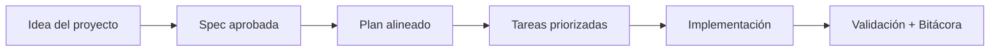

# Cómo usar con cualquier herramienta de Inteligencia Artificial

<a href="../README.md"></a>

---

## 🌍 Par de idioma / Language pair

- Español: **03-como-usar-con-cualquier-inteligencia-artificial.md**
- English: [../en/03-how-to-use-with-any-ai.md](../en/03-how-to-use-with-any-ai.md)


## 🗣️ Prompt amigable (copiar y pegar)

Usa esto cuando no eres técnico y quieres que la IA haga la integración + guía completa:

```text
Usando https://github.com/juanklagos/spec-driven-development-template, crea todo lo necesario para llevar a cabo mi proyecto de principio a fin.
Mi proyecto es: [explica tu proyecto en lenguaje simple].

Si mi proyecto es nuevo, inicialízalo con este template y GitHub Spec Kit.
Si mi proyecto ya existe, adáptalo a idea/specs/bitacora sin romper el comportamiento actual.
Guíame paso a paso según mi nivel (principiante/intermedio/avanzado), con lenguaje claro.
No omitas especificación, plan, tareas, traza de refinamiento, bitácora y validación.
```


> [!TIP]
> Para inicio rápido y prompts, usa:
> - [`AI_START_HERE.md`](../../AI_START_HERE.md)
> - [Matriz de prompts](./19-matriz-prompts-por-objetivo.md)
> - [Banco de prompts validados](./26-banco-prompts-validados.md)


## Principio

No dependas de una sola herramienta. El formato debe funcionar igual con cualquier herramienta de Inteligencia Artificial.

## Reglas para el uso con Inteligencia Artificial

1. Siempre iniciar leyendo:
   - `idea/IDEA_GENERAL.md`
   - `specs/INDEX.md`
   - último archivo en `bitacora/handoffs/`
2. Trabajar solo sobre una especificación activa.
3. No cerrar sesión sin actualizar bitácora.
4. Si una decisión cambia arquitectura, registrarla en `bitacora/decisiones/`.

## Prompt sugerido para iniciar sesión

"Lee `idea/IDEA_GENERAL.md`, `specs/INDEX.md` y el último archivo de `bitacora/handoffs/`. Luego continúa solo con la especificación activa y actualiza bitácora al finalizar."

## 💡 Tips rápidos

- Empieza con una descripción corta del proyecto en lenguaje simple.
- Pide a la IA confirmar la spec activa antes de programar.
- Cierra cada sesión con validación y próximo paso claro.

## 📊 Flujo visual


