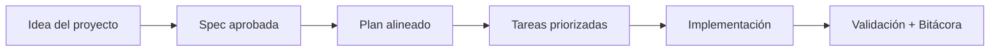

# Qué usa esta plantilla

<a href="../README.md"></a>

---

## 🌍 Par de idioma / Language pair

- Español: **06-que-usa-esta-plantilla.md**
- English: [../en/06-what-this-template-uses.md](../en/06-what-this-template-uses.md)


## 🗣️ Prompt amigable (copiar y pegar)

Usa esto cuando no eres técnico y quieres que la IA haga la integración + guía completa:

```text
Usando https://github.com/juanklagos/spec-driven-development-template, crea todo lo necesario para llevar a cabo mi proyecto de principio a fin.
Mi proyecto es: [explica tu proyecto en lenguaje simple].

Si mi proyecto es nuevo, inicialízalo con este template y GitHub Spec Kit.
Si mi proyecto ya existe, adáptalo a idea/specs/bitacora sin romper el comportamiento actual.
Guíame paso a paso según mi nivel (principiante/intermedio/avanzado), con lenguaje claro.
No omitas especificación, plan, tareas, traza de refinamiento, bitácora y validación.
```


> [!TIP]
> Para inicio rápido y prompts, usa:
> - [`AI_START_HERE.md`](../../AI_START_HERE.md)
> - [Matriz de prompts](./19-matriz-prompts-por-objetivo.md)
> - [Banco de prompts validados](./26-banco-prompts-validados.md)


Esta plantilla está hecha para ser simple y universal.

## Formatos de archivo

- Markdown: para toda la documentación.
- Texto plano: para algunas plantillas y archivos de configuración.
- Script de terminal: para inicializar la estructura en otro proyecto.

## Herramientas recomendadas

- Editor de texto.
- Sistema de control de versiones Git.
- Plataforma GitHub para compartir.

## Qué no exige

- No exige un lenguaje de programación específico.
- No exige un marco de trabajo específico.
- No exige una herramienta de Inteligencia Artificial específica.

## Qué sí exige

- Disciplina para escribir especificaciones antes de cambiar código.
- Disciplina para registrar bitácora por sesión.
- Claridad en decisiones importantes.

## 💡 Tips rápidos

- Empieza con una descripción corta del proyecto en lenguaje simple.
- Pide a la IA confirmar la spec activa antes de programar.
- Cierra cada sesión con validación y próximo paso claro.

## 📊 Flujo visual


