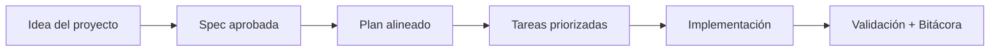

# Cómo publicar en GitHub paso a paso

## 🌍 Par de idioma / Language pair

- Español: **07-como-publicar-en-github-paso-a-paso.md**
- English: [../en/07-how-to-publish-on-github-step-by-step.md](../en/07-how-to-publish-on-github-step-by-step.md)


> [!TIP]
> Para inicio rápido y prompts, usa:
> - [`AI_START_HERE.md`](../../AI_START_HERE.md)
> - [Matriz de prompts](./19-matriz-prompts-por-objetivo.md)
> - [Banco de prompts validados](./26-banco-prompts-validados.md)

## 🗣️ Prompt amigable (copiar y pegar)

```text
Usando https://github.com/juanklagos/spec-driven-development-template, ayúdame a publicar mi proyecto en GitHub paso a paso.
Mi proyecto es: [explica el proyecto].
Haz la configuración y explícame cada paso con lenguaje simple.
```


## Requisitos previos

- Tener cuenta en GitHub.
- Tener Git instalado en tu computadora.

## Paso 1: Crear repositorio en GitHub

1. Entra a GitHub.
2. Crea un nuevo repositorio.
3. Copia la dirección del repositorio.

## Paso 2: Inicializar el repositorio local

Desde la carpeta `spec-driven-development-template` ejecuta:

```bash
git init
git add .
git commit -m "Initial template release"
```

## Paso 3: Conectar con GitHub

```bash
git branch -M main
git remote add origin <URL_DEL_REPOSITORIO>
git push -u origin main
```

## Paso 4: Revisar archivos visibles

Confirma en GitHub que se ven:

- `README.md`
- `LICENSE`
- `CONTRIBUTING.md`
- `CODE_OF_CONDUCT.md`
- carpeta `docs/`

## Paso 5: Publicar versión inicial

Puedes crear una versión etiquetada para marcar la salida inicial.

Ejemplo:

```bash
git tag v1.0.0
git push origin v1.0.0
```

## Recomendación

En la descripción del repositorio explica en una frase para quién es la plantilla y qué problema resuelve.

## 💡 Tips rápidos

- Empieza con una descripción corta del proyecto en lenguaje simple.
- Pide a la IA confirmar la spec activa antes de programar.
- Cierra cada sesión con validación y próximo paso claro.

## 📊 Flujo visual


