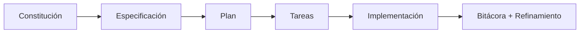

# 🤖 Integración con GitHub Spec Kit

<a href="../README.md"></a>

---

> [!TIP]
> **Inicio recomendado (baja fricción):** no necesitas clonar este repositorio si ya estás trabajando en un proyecto.
>
> **Regla obligatoria:** indica a la IA que debe trabajar usando este template y sus guías como referencia principal.
>
> Opciones:
> - Si ya tienes este repositorio en local, úsalo directamente.
> - Si trabajas en otro proyecto, pide a la IA adaptar ese proyecto usando esta guía.
> - Si no tienes este repositorio, puedes clonarlo como opción:
>
> ```bash
> git clone https://github.com/juanklagos/spec-driven-development-template.git
> cd spec-driven-development-template
> ```

## ⭐ Uso explícito del repositorio base

Usa siempre este repositorio como referencia principal:

- `https://github.com/juanklagos/spec-driven-development-template`

### 🆕 Caso 1: crear un proyecto nuevo desde esta base

Prompt sugerido para la IA:

```text
Usando https://github.com/juanklagos/spec-driven-development-template crea un proyecto nuevo para [OBJETIVO].
Si no tengo este repositorio disponible en local, indícame cómo obtenerlo; luego inicializa la estructura y guíame paso a paso para definir idea, primera spec y bitácora.
No saltes pasos.
```

### ♻️ Caso 2: adaptar un proyecto existente usando esta base

Prompt sugerido para la IA:

```text
Usando https://github.com/juanklagos/spec-driven-development-template y su guía, adapta este proyecto existente: [RUTA_DEL_PROYECTO].
Mantén el código actual, integra la estructura idea/specs/bitacora, crea la primera spec basada en lo que ya existe y deja trazabilidad completa.
```

### ✅ Resultado mínimo esperado

- Proyecto creado o adaptado con estructura estándar.
- Primera especificación creada.
- Bitácora inicial registrada.
- Próximo paso claro para continuar.


Esta plantilla recomienda usar GitHub Spec Kit como motor de flujo de trabajo.

## Mapa rápido

| Fase | Comando | Propósito |
|---|---|---|
| 1 | <kbd>/speckit.constitution</kbd> | Definir principios del proyecto |
| 2 | <kbd>/speckit.specify</kbd> | Definir qué se construye |
| 3 | <kbd>/speckit.plan</kbd> | Definir cómo se construye |
| 4 | <kbd>/speckit.tasks</kbd> | Generar tareas ejecutables |
| 5 | <kbd>/speckit.implement</kbd> | Ejecutar implementación |

## Flujo visual



## Instalación recomendada

### Opción 1: instalación persistente

```bash
uv tool install specify-cli --from git+https://github.com/github/spec-kit.git
```

### Opción 2: uso puntual

```bash
uvx --from git+https://github.com/github/spec-kit.git specify init <NOMBRE_PROYECTO>
```

## Inicializar en proyecto existente

```bash
specify init . --ai codex
# o
specify init --here --ai codex
```

También puedes usar ejecución puntual:

```bash
uvx --from git+https://github.com/github/spec-kit.git specify init . --ai codex
```

## Inicialización recomendada con este template

Si ya tienes este template en local, puedes arrancar un proyecto nuevo y dejar Spec Kit listo en un solo paso:

```bash
./scripts/init-project-with-spec-kit.sh /ruta/proyecto codex
```

## Relación con esta plantilla

- `idea/` define intención general.
- `specs/` guarda especificaciones numeradas.
- `bitacora/` mantiene trazabilidad real.

## Recomendación práctica

Después de usar comandos de Spec Kit, actualiza siempre:

- `specs/INDEX.md`
- `history.md` de la spec activa
- `bitacora/global/PROJECT_LOG.md`
- `bitacora/diaria/`
- `bitacora/handoffs/` si dejas trabajo pendiente

Y valida:

```bash
./scripts/validate-sdd.sh . --strict
./scripts/check-sdd-gate.sh .
```
