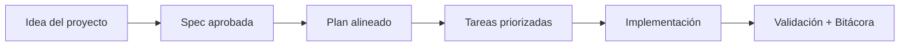

# Checklist de publicación (Release Checklist)

## 🌍 Par de idioma / Language pair

- Español: **09-release-checklist.md**
- English: [../en/09-release-checklist.md](../en/09-release-checklist.md)


> [!TIP]
> Para inicio rápido y prompts, usa:
> - [`AI_START_HERE.md`](../../AI_START_HERE.md)
> - [Matriz de prompts](./19-matriz-prompts-por-objetivo.md)
> - [Banco de prompts validados](./26-banco-prompts-validados.md)

## 🗣️ Prompt amigable (copiar y pegar)

```text
Usando https://github.com/juanklagos/spec-driven-development-template, haz una revisión de release para mi proyecto.
Mi proyecto es: [explica el proyecto].
Revisa este checklist, dime qué falta y propón acciones exactas en lenguaje simple.
```


Usa esta lista antes de publicar la plantilla en GitHub.

## 1. Validación de contenido

- [ ] El `README.md` explica claramente objetivo, estructura y uso.
- [ ] La carpeta `idea/` tiene plantilla de idea general.
- [ ] La carpeta `specs/` tiene reglas, índice y plantilla.
- [ ] La carpeta `bitacora/` tiene estructura y plantillas.
- [ ] Existe al menos un ejemplo completo de especificación (`001-ejemplo-inicial`).

## 2. Integración con GitHub Spec Kit

- [ ] Existe guía específica de integración (`docs/08-integracion-github-spec-kit.md`).
- [ ] Se explican comandos de instalación e inicialización.
- [ ] Se explica el flujo de comandos recomendado (`constitution`, `specify`, `plan`, `tasks`, `implement`).
- [ ] Existe script de inicialización con Spec Kit (`scripts/init-project-with-spec-kit.sh`).

## 3. Archivos de comunidad y gobernanza

- [ ] `LICENSE` presente.
- [ ] `CONTRIBUTING.md` presente.
- [ ] `CODE_OF_CONDUCT.md` presente.
- [ ] Plantillas de issue y pull request en `.github/`.

## 4. Calidad de lenguaje

- [ ] No hay siglas sin explicación.
- [ ] El lenguaje es comprensible para personas nuevas y profesionales.
- [ ] La documentación evita términos ambiguos.

## 5. Preparación técnica para publicar

- [ ] Git inicializado en el repositorio.
- [ ] Primer commit realizado.
- [ ] Rama principal definida (`main`).
- [ ] Repositorio remoto conectado.
- [ ] Push inicial realizado.

## 6. Metadata recomendada en GitHub

- [ ] Descripción breve del repositorio.
- [ ] Temas (topics) añadidos. Recomendados:
  - `spec-driven-development`
  - `spec-kit`
  - `template`
  - `documentation`
  - `ai-workflow`
- [ ] Sitio o enlace de referencia (opcional).

## 7. Versionado inicial

- [ ] Crear etiqueta inicial:

```bash
git tag v1.0.0
git push origin v1.0.0
```

## 8. Verificación final

- [ ] Cualquier persona puede seguir la guía sin pedir contexto adicional.
- [ ] La plantilla se puede inicializar con `scripts/init-project.sh`.
- [ ] La plantilla se puede inicializar con `scripts/init-project-with-spec-kit.sh`.

## 💡 Tips rápidos

- Empieza con una descripción corta del proyecto en lenguaje simple.
- Pide a la IA confirmar la spec activa antes de programar.
- Cierra cada sesión con validación y próximo paso claro.

## 📊 Flujo visual


