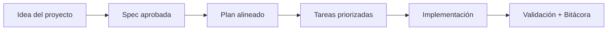

# Agentes de Inteligencia Artificial soportados y prompts recomendados

<a href="../README.md"></a>

---

## 🌍 Par de idioma / Language pair

- Español: **10-agentes-ia-soportados-y-prompts.md**
- English: [../en/10-supported-ai-agents-and-prompts.md](../en/10-supported-ai-agents-and-prompts.md)


## 🗣️ Prompt amigable (copiar y pegar)

Usa esto cuando no eres técnico y quieres que la IA haga la integración + guía completa:

```text
Usando https://github.com/juanklagos/spec-driven-development-template, crea todo lo necesario para llevar a cabo mi proyecto de principio a fin.
Mi proyecto es: [explica tu proyecto en lenguaje simple].

Si mi proyecto es nuevo, inicialízalo con este template y GitHub Spec Kit.
Si mi proyecto ya existe, adáptalo a idea/specs/bitacora sin romper el comportamiento actual.
Guíame paso a paso según mi nivel (principiante/intermedio/avanzado), con lenguaje claro.
No omitas especificación, plan, tareas, traza de refinamiento, bitácora y validación.
```


> [!TIP]
> Para inicio rápido y prompts, usa:
> - [`AI_START_HERE.md`](../../AI_START_HERE.md)
> - [Matriz de prompts](./19-matriz-prompts-por-objetivo.md)
> - [Banco de prompts validados](./26-banco-prompts-validados.md)


Esta guía toma como referencia la documentación oficial de GitHub Spec Kit.

Fuente oficial:

- https://github.com/github/spec-kit

## 1) Tabla de agentes soportados por GitHub Spec Kit

En el comando <kbd>specify init --ai</kbd>, Spec Kit soporta los siguientes agentes:

| Agente | Identificador para `--ai` | Estado |
|---|---|---|
| Antigravity | `agy` | Soportado |
| Amp | `amp` | Soportado |
| Auggie | `auggie` | Soportado |
| Bob (IBM) | `bob` | Soportado |
| Claude Code | `claude` | Soportado |
| CodeBuddy | `codebuddy` | Soportado |
| Codex | `codex` | Soportado |
| GitHub Copilot | `copilot` | Soportado |
| Cursor | `cursor-agent` | Soportado |
| Gemini | `gemini` | Soportado |
| Kilo Code | `kilocode` | Soportado |
| Kimi Code | `kimi` | Soportado |
| Kiro CLI | `kiro-cli` (alias `kiro`) | Soportado |
| OpenCode | `opencode` | Soportado |
| Qoder CLI | `qodercli` | Soportado |
| Qwen Code | `qwen` | Soportado |
| Roo Code | `roo` | Soportado |
| SHAI (OVHcloud) | `shai` | Soportado |
| Tabnine CLI | `tabnine` | Soportado |
| Mistral Vibe | `vibe` | Soportado |
| Windsurf | `windsurf` | Soportado |
| Generic (agente no listado) | `generic` | Soportado con `--ai-commands-dir` |

## 2) Flujo recomendado para cualquier agente

1. <kbd>/speckit.constitution</kbd>
2. <kbd>/speckit.specify</kbd>
3. <kbd>/speckit.plan</kbd>
4. <kbd>/speckit.tasks</kbd>
5. <kbd>/speckit.implement</kbd>

## 3) Prompt maestro de inicio (copiar y pegar)

"""
Trabaja bajo esta estructura del repositorio: `idea/`, `specs/`, `bitacora/`.

Antes de ejecutar cualquier cambio, lee en este orden:
1) `idea/IDEA_GENERAL.md`
2) `specs/INDEX.md`
3) último archivo de `bitacora/handoffs/` (si existe)

Reglas obligatorias:
- No implementes sin especificación activa.
- Usa GitHub Spec Kit en este orden: constitution, specify, plan, tasks, implement.
- Mantén trazabilidad en `bitacora/` al cerrar sesión.

Formato de respuesta obligatorio:
1) Objetivo de la sesión
2) Especificación activa
3) Plan inmediato (pasos cortos)
4) Cambios realizados
5) Validación
6) Próximo paso exacto
"""

## 4) Prompt para crear especificación consistente

"""
Crea o actualiza una especificación numerada en `specs/NNN-nombre/` con estos archivos:
- `spec.md`
- `plan.md`
- `tasks.md`
- `research.md`
- `contracts/` cuando aplique

Condiciones:
- Lenguaje claro para personas nuevas y profesionales.
- No usar siglas sin explicarlas.
- Cada criterio de aceptación debe ser verificable.
- Las tareas deben ser concretas y ejecutables.
"""

## 5) Prompt para implementación consistente

"""
Implementa solo lo definido en la especificación activa.

Antes de implementar:
- Resume criterios de aceptación.
- Menciona riesgos.

Durante implementación:
- Mantén cambios mínimos y trazables.
- Evita cambios fuera de alcance.

Al finalizar:
- Registra resultados en `bitacora/global/PROJECT_LOG.md`.
- Actualiza `bitacora/diaria/AAAA-MM-DD.md`.
- Crea handoff si quedan pendientes.
"""

## 6) Contrato de salida unificado (para cualquier agente)

Pide siempre este formato de salida:

1. Resumen
2. Especificación actualizada
3. Archivos modificados
4. Validaciones ejecutadas
5. Riesgos abiertos
6. Próximo paso

Este contrato reduce diferencias entre herramientas y mantiene resultados coherentes.


## 7) Playbooks por nivel

### 

```text
Explícame paso a paso como si fuera nuevo en programación.
Haz preguntas cortas.
Ayúdame a completar la idea y luego crear la spec 001.
No avances al siguiente paso sin confirmar que entendí.
```

### 

```text
Trabaja sobre una única spec activa.
Prioriza claridad de alcance, tareas ejecutables y bitácora completa.
Separa cambios en: idea, spec, plan, tareas y validación.
```

### 

```text
Aplica contrato de salida unificado y protocolo de refinamiento.
Si hay cambio de alcance, bloquea implementación hasta actualizar history.md e INDEX.
Entrega análisis de riesgo y próximo paso exacto.
```

## 💡 Tips rápidos

- Empieza con una descripción corta del proyecto en lenguaje simple.
- Pide a la IA confirmar la spec activa antes de programar.
- Cierra cada sesión con validación y próximo paso claro.

## 📊 Flujo visual


