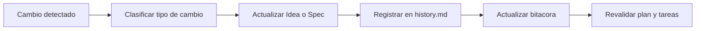

# 🔁 Refinamiento continuo (Idea y Especificaciones)

> 📌 **Inicio obligatorio:** antes de trabajar, clona (o abre) este repositorio y sigue esta documentación como fuente de verdad.
>
> ```bash
> git clone https://github.com/juanklagos/spec-driven-development-template.git
> cd spec-driven-development-template
> ```
>
> Si ya tienes el repositorio local, usa siempre su guía antes de pedir implementación.

## ⭐ Uso explícito del repositorio base

Usa siempre este repositorio como referencia principal:

- `https://github.com/juanklagos/spec-driven-development-template`

### 🆕 Caso 1: crear un proyecto nuevo desde esta base

Prompt sugerido para la IA:

```text
Usando https://github.com/juanklagos/spec-driven-development-template crea un proyecto nuevo para [OBJETIVO].
Clona el repositorio base, inicializa la estructura, y guíame paso a paso para definir idea, primera spec y bitácora.
No saltes pasos.
```

### ♻️ Caso 2: adaptar un proyecto existente usando esta base

Prompt sugerido para la IA:

```text
Usando https://github.com/juanklagos/spec-driven-development-template y su guía, adapta este proyecto existente: [RUTA_DEL_PROYECTO].
Mantén el código actual, integra la estructura idea/specs/bitacora, crea la primera spec basada en lo que ya existe y deja trazabilidad completa.
```

### ✅ Resultado mínimo esperado

- Proyecto creado o adaptado con estructura estándar.
- Primera especificación creada.
- Bitácora inicial registrada.
- Próximo paso claro para continuar.


Esta guía define cómo mejorar el proyecto cuando cambian ideas, prioridades o requisitos.

## 🎯 Objetivo

Mantener consistencia entre:

- `idea/IDEA_GENERAL.md`
- `specs/` (todas las especificaciones)
- `bitacora/` (registro real de lo que pasó)

## 📌 Regla principal

Cada cambio importante debe dejar rastro en 3 lugares:

1. Idea o especificación afectada.
2. Historial de la especificación.
3. Bitácora de sesión.

## 🧭 Tipos de cambio y acción obligatoria

| Tipo de cambio | Qué hacer | Dónde registrar |
|---|---|---|
| Cambio de visión del producto | Actualizar idea general | `idea/IDEA_GENERAL.md` + `bitacora/global/PROJECT_LOG.md` |
| Nuevo requisito | Crear o actualizar especificación | `specs/NNN-.../spec.md` + `specs/NNN-.../history.md` |
| Cambio técnico de implementación | Actualizar plan y tareas | `plan.md`, `tasks.md`, `history.md` |
| Ajuste por hallazgos | Actualizar investigación | `research.md`, `history.md`, bitácora diaria |
| Cambio de alcance | Marcar impacto y priorización | `specs/INDEX.md` + `history.md` |

## 📈 Flujo visual de refinamiento



## ✅ Checklist rápido de refinamiento

- [ ] ¿El cambio afecta idea general?
- [ ] ¿Se actualizó la spec activa?
- [ ] ¿Se registró entrada en `history.md`?
- [ ] ¿Se actualizó bitácora global o diaria?
- [ ] ¿Se revisaron tareas para evitar contradicciones?

## 📝 Formato recomendado para `history.md`

| Fecha | Tipo de cambio | Resumen | Archivos impactados | Responsable |
|---|---|---|---|---|
| 2026-03-12 | Cambio de alcance | Se dividió spec en dos fases | `spec.md`, `tasks.md` | IA |

## 🤖 Regla para herramientas de Inteligencia Artificial

Si detectas contradicción entre idea y spec:

1. No implementar de inmediato.
2. Proponer refinamiento.
3. Actualizar documentación.
4. Recién después continuar implementación.
