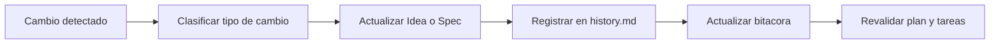

# 🔁 Refinamiento continuo (Idea y Especificaciones)

<a href="../README.md"></a>

---

## 🗣️ Prompt amigable (copiar y pegar)

Usa esto cuando no eres técnico y quieres que la IA haga la integración + guía completa:

```text
Usando https://github.com/juanklagos/spec-driven-development-template, crea todo lo necesario para llevar a cabo mi proyecto de principio a fin.
Mi proyecto es: [explica tu proyecto en lenguaje simple].

Si mi proyecto es nuevo, inicialízalo con este template y GitHub Spec Kit.
Si mi proyecto ya existe, adáptalo a idea/specs/bitacora sin romper el comportamiento actual.
Guíame paso a paso según mi nivel (principiante/intermedio/avanzado), con lenguaje claro.
No omitas especificación, plan, tareas, traza de refinamiento, bitácora y validación.
```


> [!TIP]
> Para inicio rápido y prompts, usa:
> - [`AI_START_HERE.md`](../../AI_START_HERE.md)
> - [Matriz de prompts](./19-matriz-prompts-por-objetivo.md)
> - [Banco de prompts validados](./26-banco-prompts-validados.md)


Esta guía define cómo mejorar el proyecto cuando cambian ideas, prioridades o requisitos.

## 🎯 Objetivo

Mantener consistencia entre:

- `idea/IDEA_GENERAL.md`
- `specs/` (todas las especificaciones)
- `bitacora/` (registro real de lo que pasó)

## 📌 Regla principal

Cada cambio importante debe dejar rastro en 3 lugares:

1. Idea o especificación afectada.
2. Historial de la especificación.
3. Bitácora de sesión.

## 🧭 Tipos de cambio y acción obligatoria

| Tipo de cambio | Qué hacer | Dónde registrar |
|---|---|---|
| Cambio de visión del producto | Actualizar idea general | `idea/IDEA_GENERAL.md` + `bitacora/global/PROJECT_LOG.md` |
| Nuevo requisito | Crear o actualizar especificación | `specs/NNN-.../spec.md` + `specs/NNN-.../history.md` |
| Cambio técnico de implementación | Actualizar plan y tareas | `plan.md`, `tasks.md`, `history.md` |
| Ajuste por hallazgos | Actualizar investigación | `research.md`, `history.md`, bitácora diaria |
| Cambio de alcance | Marcar impacto y priorización | `specs/INDEX.md` + `history.md` |

## 📈 Flujo visual de refinamiento



## ✅ Checklist rápido de refinamiento

- [ ] ¿El cambio afecta idea general?
- [ ] ¿Se actualizó la spec activa?
- [ ] ¿Se registró entrada en `history.md`?
- [ ] ¿Se actualizó bitácora global o diaria?
- [ ] ¿Se revisaron tareas para evitar contradicciones?

## 📝 Formato recomendado para `history.md`

| Fecha | Tipo de cambio | Resumen | Archivos impactados | Responsable |
|---|---|---|---|---|
| 2026-03-12 | Cambio de alcance | Se dividió spec en dos fases | `spec.md`, `tasks.md` | IA |

## 🤖 Regla para herramientas de Inteligencia Artificial

Si detectas contradicción entre idea y spec:

1. No implementar de inmediato.
2. Proponer refinamiento.
3. Actualizar documentación.
4. Recién después continuar implementación.
