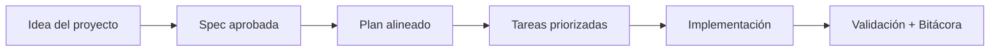

# 🧪 TDD y BDD: cómo escribir buenas especificaciones

<a href="../README.md"></a>

---

## 🌍 Par de idioma / Language pair

- Español: **12-tdd-y-bdd-como-escribir-specs.md**
- English: [../en/12-tdd-and-bdd-how-to-write-specs.md](../en/12-tdd-and-bdd-how-to-write-specs.md)


## 🗣️ Prompt amigable (copiar y pegar)

Usa esto cuando no eres técnico y quieres que la IA haga la integración + guía completa:

```text
Usando https://github.com/juanklagos/spec-driven-development-template, crea todo lo necesario para llevar a cabo mi proyecto de principio a fin.
Mi proyecto es: [explica tu proyecto en lenguaje simple].

Si mi proyecto es nuevo, inicialízalo con este template y GitHub Spec Kit.
Si mi proyecto ya existe, adáptalo a idea/specs/bitacora sin romper el comportamiento actual.
Guíame paso a paso según mi nivel (principiante/intermedio/avanzado), con lenguaje claro.
No omitas especificación, plan, tareas, traza de refinamiento, bitácora y validación.
```


> [!TIP]
> Para inicio rápido y prompts, usa:
> - [`AI_START_HERE.md`](../../AI_START_HERE.md)
> - [Matriz de prompts](./19-matriz-prompts-por-objetivo.md)
> - [Banco de prompts validados](./26-banco-prompts-validados.md)


Este apartado es un plus del repositorio para conectar desarrollo guiado por especificaciones con prácticas de calidad.

## 1) Diferencia simple entre TDD y BDD

| Enfoque | Significado | Pregunta principal | Resultado esperado |
|---|---|---|---|
| TDD | Desarrollo guiado por pruebas | ¿Cómo validamos el comportamiento técnico? | Pruebas que guían implementación |
| BDD | Desarrollo guiado por comportamiento | ¿Cómo se comporta el sistema para la persona usuaria? | Escenarios de negocio claros |

## 2) Relación con esta plantilla

- `spec.md` define el comportamiento esperado (muy alineado con BDD).
- `tasks.md` puede incluir tareas de pruebas técnicas (alineado con TDD).
- `contracts/` ayuda a definir reglas verificables para ambos enfoques.

## 3) Cómo escribir una spec sólida para TDD

### Estructura recomendada

1. En `spec.md`, define reglas precisas y medibles.
2. En `plan.md`, define estrategia de prueba técnica.
3. En `tasks.md`, agrega tareas explícitas de pruebas antes de implementación.

### Checklist TDD

- [ ] Cada requisito tiene una validación técnica asociada.
- [ ] Las tareas de prueba existen y son ejecutables.
- [ ] Hay criterio de fallo claro antes de implementar.
- [ ] Se registran resultados de pruebas en bitácora.

## 4) Cómo escribir una spec sólida para BDD

### Estructura recomendada

1. En `spec.md`, usa escenarios en formato:
   - Dado
   - Cuando
   - Entonces
2. Describe comportamiento observable, no detalles internos de código.
3. Prioriza lenguaje entendible para negocio y personas técnicas.

### Checklist BDD

- [ ] Escenarios claros y verificables.
- [ ] Lenguaje sin ambigüedad.
- [ ] Cada escenario conecta con un requisito.
- [ ] Se puede demostrar el comportamiento en una revisión funcional.

## 5) Plantilla rápida de escenarios

```text
Dado [contexto inicial]
Cuando [acción o evento]
Entonces [resultado esperado]
```

## 6) EARS: criterios de aceptación verificables (estándar de la industria)

EARS (Easy Approach to Requirements Syntax) es la notación que la industria SDD consolidó para criterios de aceptación — AWS Kiro genera su `requirements.md` en EARS, y cada línea mapea casi 1:1 a un caso de prueba. Úsala dentro de la sección de criterios de aceptación de `spec.md`.

Patrones base:

| Patrón | Plantilla | Úsalo para |
|---|---|---|
| Ubicuo | EL SISTEMA DEBERÁ [comportamiento] | Reglas que aplican siempre |
| Por evento | CUANDO [disparador], EL SISTEMA DEBERÁ [comportamiento] | Respuestas a eventos |
| Por estado | MIENTRAS [estado], EL SISTEMA DEBERÁ [comportamiento] | Comportamiento durante un estado |
| Comportamiento no deseado | SI [condición de error], ENTONCES EL SISTEMA DEBERÁ [comportamiento] | Manejo de errores |
| Funcionalidad opcional | DONDE [funcionalidad activada], EL SISTEMA DEBERÁ [comportamiento] | Funcionalidades configurables |

Ejemplo (feature de login):

```text
EL SISTEMA DEBERÁ guardar las contraseñas con hash, nunca en texto plano.
CUANDO el usuario envíe credenciales válidas, EL SISTEMA DEBERÁ crear una sesión y redirigir al dashboard.
SI el usuario envía credenciales inválidas 5 veces, ENTONCES EL SISTEMA DEBERÁ bloquear la cuenta por 15 minutos.
```

Nota: en equipos que trabajan en inglés se usa la forma original `WHEN ... THE SYSTEM SHALL ...`; ambas son válidas mientras seas consistente.

Cómo se complementan EARS y Dado/Cuando/Entonces:

- Dado/Cuando/Entonces describe un **ejemplo** en lenguaje de negocio (ideal para conversar y revisar).
- EARS enuncia la **regla** en lenguaje verificable (ideal para pruebas y para agentes de IA).
- Una spec sólida usa ambos: escenarios para entender, líneas EARS para verificar.

Checklist EARS:

- [ ] Cada línea EARS tiene exactamente un DEBERÁ y un comportamiento observable.
- [ ] Sin palabras vagas ("rápido", "fácil", "intuitivo") sin un valor medible.
- [ ] Cada criterio de aceptación mapea al menos a una tarea de prueba en `tasks.md`.

## 7) Estrategia combinada recomendada (TDD + BDD + EARS)

1. Define comportamiento en `spec.md` (escenarios BDD).
2. Escribe los criterios de aceptación como líneas EARS en `spec.md`.
3. Traduce a tareas técnicas en `tasks.md` (TDD).
4. Implementa por iteraciones cortas.
5. Registra hallazgos y ajustes en `history.md` y `bitacora/`.

## 8) Errores comunes

- Escribir specs vagas sin criterios verificables.
- Mezclar alcance de negocio con detalles técnicos en la misma sección.
- No actualizar `history.md` cuando cambian escenarios.
- Implementar sin revisar primero si la spec sigue vigente.

## 💡 Tips rápidos

- Empieza con una descripción corta del proyecto en lenguaje simple.
- Pide a la IA confirmar la spec activa antes de programar.
- Cierra cada sesión con validación y próximo paso claro.

## 📊 Flujo visual


