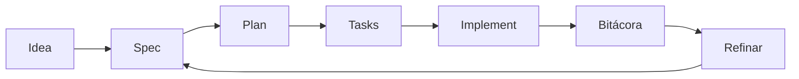

# 🛠️ Guía intermedia (equipos y proyectos reales)

> Objetivo: trabajar con consistencia entre varias sesiones y personas.

## 🎯 Enfoque

- Especificación activa clara
- Tareas ejecutables
- Bitácora actualizada
- Refinamiento continuo

## 🔁 Flujo recomendado



## 🗣️ Prompt listo (sesión intermedia)

```text
Lee idea/IDEA_GENERAL.md, specs/INDEX.md y el último handoff.
Selecciona una especificación activa.
Propón un plan de sesión de máximo 5 pasos.
Ejecuta solo tareas dentro del alcance.
Al terminar, actualiza bitácora global, diaria y handoff.
```

## 📊 Tabla de control

| Control | Archivo | Frecuencia |
|---|---|---|
| Estado de specs | `specs/INDEX.md` | Cada sesión |
| Historial de cambios | `specs/NNN-.../history.md` | Cada cambio importante |
| Registro global | `bitacora/global/PROJECT_LOG.md` | Cada sesión |
| Traspaso | `bitacora/handoffs/` | Cuando hay pendientes |

## ⚠️ Error común

Implementar directamente cuando hay contradicciones entre idea y spec.

## ✅ Buen hábito

Primero alinear, luego implementar.
