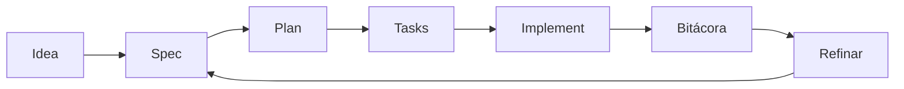

# 🛠️ Guía intermedia (equipos y proyectos reales)

⬅️ [Volver al índice](../README.md)

---

> [!TIP]
> **Inicio recomendado (baja fricción):** no necesitas clonar este repositorio si ya estás trabajando en un proyecto.
>
> **Regla obligatoria:** indica a la IA que debe trabajar usando este template y sus guías como referencia principal.
>
> Opciones:
> - Si ya tienes este repositorio en local, úsalo directamente.
> - Si trabajas en otro proyecto, pide a la IA adaptar ese proyecto usando esta guía.
> - Si no tienes este repositorio, puedes clonarlo como opción:
>
> ```bash
> git clone https://github.com/juanklagos/spec-driven-development-template.git
> cd spec-driven-development-template
> ```

## ⭐ Uso explícito del repositorio base

Usa siempre este repositorio como referencia principal:

- `https://github.com/juanklagos/spec-driven-development-template`

### 🆕 Caso 1: crear un proyecto nuevo desde esta base

Prompt sugerido para la IA:

```text
Usando https://github.com/juanklagos/spec-driven-development-template crea un proyecto nuevo para [OBJETIVO].
Si no tengo este repositorio disponible en local, indícame cómo obtenerlo; luego inicializa la estructura y guíame paso a paso para definir idea, primera spec y bitácora.
No saltes pasos.
```

### ♻️ Caso 2: adaptar un proyecto existente usando esta base

Prompt sugerido para la IA:

```text
Usando https://github.com/juanklagos/spec-driven-development-template y su guía, adapta este proyecto existente: [RUTA_DEL_PROYECTO].
Mantén el código actual, integra la estructura idea/specs/bitacora, crea la primera spec basada en lo que ya existe y deja trazabilidad completa.
```

### ✅ Resultado mínimo esperado

- Proyecto creado o adaptado con estructura estándar.
- Primera especificación creada.
- Bitácora inicial registrada.
- Próximo paso claro para continuar.


> Objetivo: trabajar con consistencia entre varias sesiones y personas.

## 🎯 Enfoque

- Especificación activa clara
- Tareas ejecutables
- Bitácora actualizada
- Refinamiento continuo

## 🔁 Flujo recomendado



## 🗣️ Prompt listo (sesión intermedia)

```text
Lee idea/IDEA_GENERAL.md, specs/INDEX.md y el último handoff.
Selecciona una especificación activa.
Propón un plan de sesión de máximo 5 pasos.
Ejecuta solo tareas dentro del alcance.
Al terminar, actualiza bitácora global, diaria y handoff.
```

## 📊 Tabla de control

| Control | Archivo | Frecuencia |
|---|---|---|
| Estado de specs | `specs/INDEX.md` | Cada sesión |
| Historial de cambios | `specs/NNN-.../history.md` | Cada cambio importante |
| Registro global | `bitacora/global/PROJECT_LOG.md` | Cada sesión |
| Traspaso | `bitacora/handoffs/` | Cuando hay pendientes |

## ⚠️ Error común

Implementar directamente cuando hay contradicciones entre idea y spec.

## ✅ Buen hábito

Primero alinear, luego implementar.
