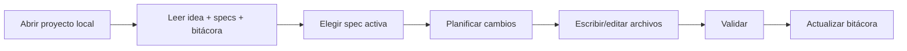

# 🖥️ Guía: herramientas de escritorio con acceso local

> 📌 **Inicio obligatorio:** antes de trabajar, clona (o abre) este repositorio y sigue esta documentación como fuente de verdad.
>
> ```bash
> git clone https://github.com/juanklagos/spec-driven-development-template.git
> cd spec-driven-development-template
> ```
>
> Si ya tienes el repositorio local, usa siempre su guía antes de pedir implementación.

> Esta guía explica cómo usar esta plantilla con asistentes de Inteligencia Artificial que pueden leer y escribir archivos locales.

## 🎯 Objetivo

Que cualquier persona pueda usar herramientas como:

- Codex en escritorio
- Claude en escritorio
- Otras herramientas con acceso a carpetas locales

sin perder orden, trazabilidad ni consistencia.

## 📦 Qué significa “acceso local”

Significa que la herramienta puede:

- Leer archivos de tu proyecto.
- Crear y editar documentos.
- Ejecutar comandos en terminal (si está habilitado).

## 🧭 Flujo recomendado (siempre)



## ✅ Checklist de inicio de sesión

- [ ] Abriste la carpeta raíz correcta.
- [ ] Confirmaste que existen `idea/`, `specs/`, `bitacora/`.
- [ ] Leíste `idea/IDEA_GENERAL.md`.
- [ ] Leíste `specs/INDEX.md`.
- [ ] Leíste el último archivo de `bitacora/handoffs/`.

## 🗣️ Prompt base para asistentes de escritorio

```text
Trabaja en modo local sobre esta carpeta.
No inventes archivos fuera de este estándar.
Sigue este orden:
1) idea/IDEA_GENERAL.md
2) specs/INDEX.md
3) último handoff en bitacora/handoffs/

Luego:
- selecciona una especificación activa,
- propón un plan corto,
- ejecuta cambios solo dentro de alcance,
- actualiza bitácora al cierre.

Formato de salida:
1) Objetivo
2) Archivos modificados
3) Validación
4) Riesgos
5) Próximo paso
```

## 🛠️ Configuración sugerida por tipo de herramienta

## 1) Codex en escritorio

Recomendación:

- Abrir la carpeta del proyecto como workspace.
- Ejecutar primero lectura de contexto (idea/specs/bitácora).
- Pedir acciones por bloques pequeños.

Prompt sugerido:

```text
Actúa como asistente de implementación local.
Primero resume contexto del proyecto desde idea/specs/bitácora.
Después ejecuta solo una tarea de la spec activa y reporta cambios con rutas de archivo.
```

## 2) Claude en escritorio

Recomendación:

- Trabajar por iteraciones cortas.
- Pedir resumen antes de cada ejecución.
- Exigir actualización de bitácora al finalizar.

Prompt sugerido:

```text
Antes de escribir archivos, explícame el plan en 3 pasos.
Después ejecuta cambios mínimos.
Al final, deja lista una entrada de bitácora global y una de bitácora diaria.
```

## 3) Otras herramientas de escritorio

Regla universal:

- Si la herramienta puede editar localmente, debe respetar exactamente la estructura del template.
- Si no puede editar, debe entregar contenido listo para pegar en rutas concretas.

Prompt sugerido:

```text
Usa este repositorio como fuente de verdad.
No cambies estructura base.
Si falta contexto, pregunta antes de editar.
Si cambias alcance, actualiza history.md y bitácora.
```

## 🔒 Buenas prácticas de seguridad y control

- Revisa rutas antes de confirmar cambios.
- Evita comandos destructivos en carpetas no relacionadas.
- Haz commit frecuente con mensajes claros.
- No subas secretos o credenciales al repositorio.

## 🧪 Validación mínima por sesión

| Validación | Resultado esperado |
|---|---|
| Estructura intacta | `idea/`, `specs/`, `bitacora/` siguen consistentes |
| Spec activa actualizada | `history.md` refleja cambios |
| Bitácora actualizada | Global + diaria + handoff (si aplica) |

## 🚨 Señales de alerta

Detén implementación y alinea primero si:

- Idea y spec se contradicen.
- Se detecta cambio de alcance no documentado.
- No existe criterio de aceptación claro.

## ✅ Cierre de sesión (obligatorio)

- [ ] Actualizar `bitacora/global/PROJECT_LOG.md`
- [ ] Actualizar `bitacora/diaria/AAAA-MM-DD.md`
- [ ] Crear handoff si quedan pendientes
- [ ] Verificar siguiente paso exacto
