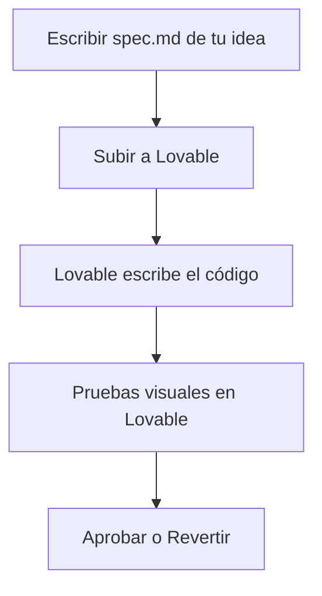
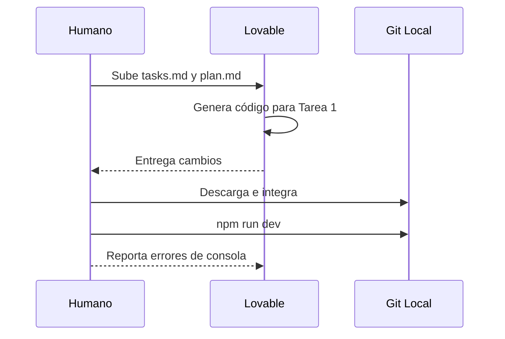
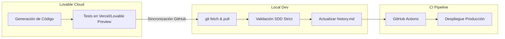

# 💜 Cómo trabajar con Lovable y Spec-Driven Development

<a href="../README.md"></a>
<a href="../../AI_START_HERE.md"></a>

---

> [!TIP]
> **Inicio recomendado (baja fricción):** no necesitas clonar este repositorio si ya estás trabajando en un proyecto. Lovable entiende perfectamente esta estructura si se la provees como contexto.

## 🎯 Objetivo de esta guía

El objetivo de esta guía es enseñarte cómo utilizar **Lovable** (o asistentes visuales similares) en conjunto con el **Spec-Driven Development**. Cuando combinas la capacidad de escritura de código de Lovable con el rigor de las especificaciones, obtienes aplicaciones de alta calidad, cero alucinaciones y mantenimiento real a largo plazo.

Hemos estructurado esta guía en **3 niveles de profundidad** para que la adoptes a tu propio ritmo.

---

## 🟢 Nivel 1: Principiante (El flujo básico)

Este nivel es ideal si nunca has usado la estructura de specs y quieres resultados rápidos con Lovable.

### 1. Preparar el terreno

Antes de darle órdenes a Lovable, necesitas tener los requisitos claros. No uses a Lovable para "pensar" el producto de cero sin dejar un rastro.

| Requisito | Archivo donde vive |
| :--- | :--- |
| **Idea clara** | `idea/IDEA_GENERAL.md` |
| **Especificación**| `specs/001-feature/spec.md` |

### 2. El Prompt Mágico para Lovable

Copia y pega este prompt inicial en tu chat de Lovable, adjuntando tus archivos `.md`:

```text
Actúa como desarrollador experto. Usa estos documentos adjuntos como tu fuente de la verdad para esta sesión:
- spec.md (Requerimientos de negocio)
- plan.md (Arquitectura técnica, si existe)

Reglas estrictas:
1. No implementes nada que no esté en la spec.
2. Si un requerimiento es ambiguo, detente y pregúntame.
3. Al finalizar, muéstrame exactamente qué archivos modificaste.
```

### 3. Flujo Visual Principiante



---

## 🟡 Nivel 2: Intermedio (Calidad y Control)

Aquí dejamos de ser operadores básicos y empezamos a comportarnos como ingenieros de software controlando una IA.

### 1. Requisitos Técnicos

Además de la `spec.md`, ahora requieres planificación técnica. Este nivel exige que tú o tu arquitecto (otra IA) redacten un `plan.md` y `tasks.md`.

| Herramienta | Acción requerida |
| :--- | :--- |
| **Control de versiones**| No hagas commits directo a `main`. Usa ramas: <kbd>git checkout -b feature/001</kbd> |
| **Tareas** | Sigue estrictamente el archivo `specs/001-feature/tasks.md` |

### 2. Flujo de Ejecución por Tareas

En lugar de pedirle a Lovable que haga "todo el feature", divídelo por tareas:

```text
Hoy implementaremos únicamente la [TAREA 1] descrita en tasks.md.
Asegúrate de ejecutar y mantener libre de errores de lint y pruebas antes de decir que terminaste. Pídeme que revise cuando estés en un estado estable.
```

### 3. Ejecutar y Validar Localmente

Lovable suele funcionar en la nube. **Descarga el código a tu máquina local** regularmente y ejecuta:

1. Instalación: <kbd>npm install</kbd>
2. Desarrollo: <kbd>npm run dev</kbd>
3. Validaciones: Pasa tu mouse visualmente, verifica logs de consola.

> [!CAUTION]
> **No te confíes de la vista previa de Lovable.** Siempre verifica que el código funciona en tu máquina local antes de dar la tarea por cerrada.



---

## 🔴 Nivel 3: Avanzado (Automatización y GitHub Spec Kit)

En este nivel integramos Lovable con herramientas de línea de comandos, CI/CD, y automatización estricta.

### 1. Sincronización con GitHub Spec Kit

No escribimos las specs a mano. Usamos Spec Kit para automatizar la carpeta y el estado:

<kbd>specify implement . --ai lovable</kbd>

### 2. Prompt Estratégico de Ingeniería

```text
Asume tu rol como Ingeniero de Software Principal.
Estamos operando bajo el estándar de Spec-Driven Development. 

Aquí está nuestro contexto:
[adjuntar/leer specs/002-feature/spec.md]
[adjuntar/leer specs/002-feature/contracts/]

Reglas de Calidad (Strict Mode):
- Todo componente nuevo debe estar tipado (TypeScript).
- Cobertura de tests requerida (Jest/Vitest) para lógicas de negocio.
- Si rompes el linter, no estás terminado.

Genera el código y entrega un reporte de "Handoff" al terminar detallando los riesgos técnicos.
```

### 3. Reporte Handoff y Cierre

Exige a Lovable que te entregue un reporte formal al terminar sus tareas, que deberás guardar en `bitacora/handoffs/YYYY-MM-DD.md`.

**Formato de Handoff a exigir:**
1. Archivos totales afectados (+ / -)
2. Librerías nuevas instaladas y justificación
3. Decisiones de arquitectura tomadas
4. Comandos a ejecutar en el entorno local (migraciones de BD, reconstrucción de dependencias)



---

## ⭐ Uso explícito del repositorio base

> [!NOTE]
> Siempre mantén este repositorio como tu brújula:  
> <kbd>https://github.com/juanklagos/spec-driven-development-template</kbd>

<details>
<summary>🆕 <b>Caso: Configurar proyecto para Lovable desde cero</b></summary>
<br>

Manda este prompt a tu IA favorita (local o ChatGPT) antes de entrar a Lovable:

```text
Usando https://github.com/juanklagos/spec-driven-development-template inicializa la estructura local para un proyecto nuevo de [REACT/VUE/ETC].
Solo crea los archivos; Lovable hará el código más adelante. Guíame paso a paso para definir la primera spec. No saltes pasos.
```

</details>

<details>
<summary>♻️ <b>Caso: Lovable rompió un proyecto existente</b></summary>
<br>

A veces Lovable "alucina" en proyectos grandes. Manda este prompt para detener el caos:

```text
Usando https://github.com/juanklagos/spec-driven-development-template y su guía, vamos a pausar la escritura de código.
Analiza nuestro código roto, integra la estructura idea/specs/bitacora, y ayúdame a crear una spec basada en lo que *debería* estar haciendo el código para arreglarlo de forma metódica.
```

</details>
