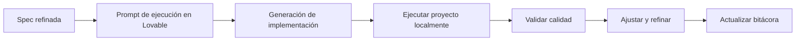

# 💜 Cómo trabajar con Lovable después de tener specs listas

<a href="../README.md"></a>

---

> [!TIP]
> **Inicio recomendado (baja fricción):** no necesitas clonar este repositorio si ya estás trabajando en un proyecto.
>
> **Regla obligatoria:** indica a la IA que debe trabajar usando este template y sus guías como referencia principal.
>
> Opciones:
> - Si ya tienes este repositorio en local, úsalo directamente.
> - Si trabajas en otro proyecto, pide a la IA adaptar ese proyecto usando esta guía.
> - Si no tienes este repositorio, puedes clonarlo como opción:
>
> ```bash
> git clone https://github.com/juanklagos/spec-driven-development-template.git
> cd spec-driven-development-template
> ```

## ⭐ Uso explícito del repositorio base

Usa siempre este repositorio como referencia principal:

- `https://github.com/juanklagos/spec-driven-development-template`

### 🆕 Caso 1: crear un proyecto nuevo desde esta base

Prompt sugerido para la IA:

```text
Usando https://github.com/juanklagos/spec-driven-development-template crea un proyecto nuevo para [OBJETIVO].
Si no tengo este repositorio disponible en local, indícame cómo obtenerlo; luego inicializa la estructura y guíame paso a paso para definir idea, primera spec y bitácora.
No saltes pasos.
```

### ♻️ Caso 2: adaptar un proyecto existente usando esta base

Prompt sugerido para la IA:

```text
Usando https://github.com/juanklagos/spec-driven-development-template y su guía, adapta este proyecto existente: [RUTA_DEL_PROYECTO].
Mantén el código actual, integra la estructura idea/specs/bitacora, crea la primera spec basada en lo que ya existe y deja trazabilidad completa.
```

### ✅ Resultado mínimo esperado

- Proyecto creado o adaptado con estructura estándar.
- Primera especificación creada.
- Bitácora inicial registrada.
- Próximo paso claro para continuar.

## 🎯 Objetivo de esta guía

Después de tener una especificación refinada y aprobada, usar Lovable para ejecutar implementación con calidad y sin perder trazabilidad.

## ✅ Requisitos previos (antes de usar Lovable)

| Requisito | Dónde validar |
|---|---|
| Idea clara | `idea/IDEA_GENERAL.md` |
| Spec activa completa | `specs/NNN-.../spec.md` |
| Plan técnico claro | `specs/NNN-.../plan.md` |
| Tareas ejecutables | `specs/NNN-.../tasks.md` |
| Historial actualizado | `specs/NNN-.../history.md` |

## 🧭 Flujo recomendado con Lovable



## 🗣️ Prompt base para Lovable (ejecución)

```text
Actúa como implementador siguiendo esta especificación activa:
- [RUTA_SPEC]
- [RUTA_PLAN]
- [RUTA_TASKS]

Reglas:
1) Ejecuta solo tareas dentro del alcance.
2) Si detectas contradicción, detén implementación y propón refinamiento.
3) Genera código limpio y mantenible.
4) Ejecuta el proyecto localmente y reporta resultado.
5) Al finalizar, entrega:
   - Archivos modificados
   - Validaciones ejecutadas
   - Riesgos abiertos
   - Próximo paso
```

## ▶️ Cómo pedirle que ejecute el proyecto

Usa un prompt explícito como este:

```text
Implementa la tarea [ID] y luego ejecuta el proyecto localmente.
Corre estos comandos y comparte resultado:
1) instalación de dependencias
2) ejecución en modo desarrollo
3) validación de calidad (lint, pruebas, build)
Si algo falla, corrige y vuelve a ejecutar hasta dejar estado estable.
```

## 🧪 Checklist de calidad mínimo

- [ ] El proyecto inicia correctamente.
- [ ] No hay errores de compilación.
- [ ] No hay errores de lint críticos.
- [ ] Las pruebas clave pasan (si existen).
- [ ] Se cumple criterio de aceptación de la spec.

## 📋 Formato de reporte que debes exigir a Lovable

1. Objetivo de la tarea ejecutada
2. Archivos modificados
3. Comandos ejecutados
4. Resultado de validaciones
5. Errores encontrados y solución
6. Riesgos pendientes
7. Siguiente paso recomendado

## 🔁 Ciclo de mejora para calidad alta

1. Ejecutar tarea.
2. Ejecutar proyecto.
3. Validar calidad.
4. Ajustar.
5. Registrar en `history.md` y `bitacora/`.

Si no hay registro, no hay cierre real de la sesión.
