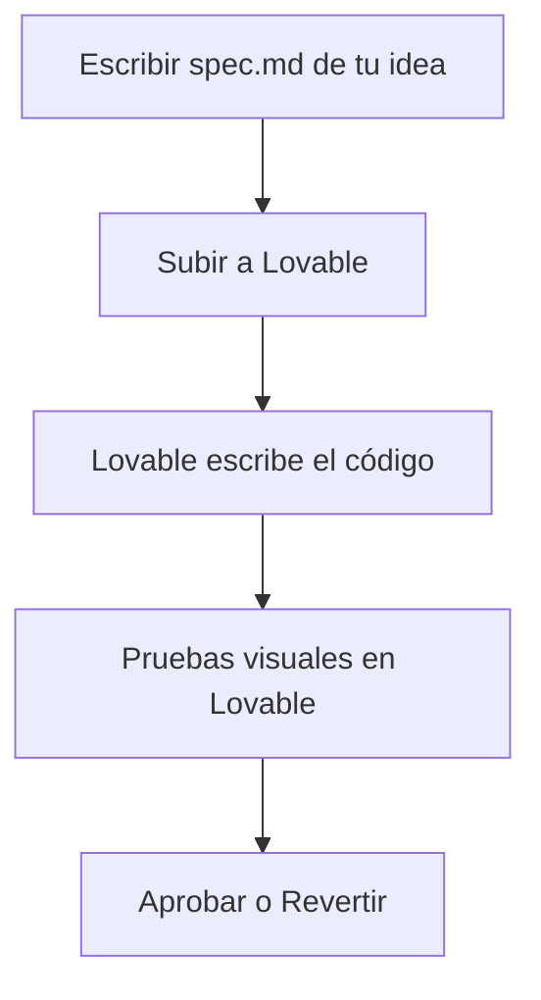
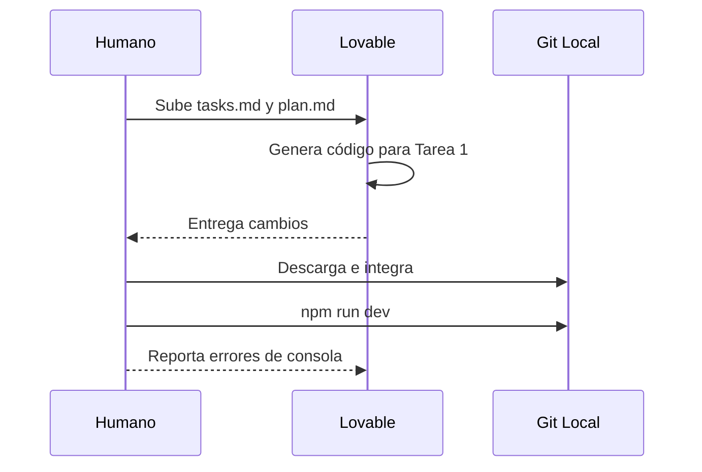
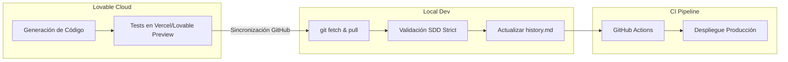

# 💜 Cómo trabajar con Lovable y Spec-Driven Development

<a href="../README.md"></a>
<a href="../../AI_START_HERE.md"></a>

---

## 🌍 Par de idioma / Language pair

- Español: **17-trabajar-con-lovable.md**
- English: [../en/17-working-with-lovable.md](../en/17-working-with-lovable.md)


## 🗣️ Prompt amigable (copiar y pegar)

Úsalo si no eres técnico y quieres que la IA lo integre todo y te vaya guiando:

```text
Usando https://github.com/juanklagos/spec-driven-development-template, crea todo lo necesario para llevar a cabo mi proyecto de principio a fin.
Mi proyecto es: [explica tu proyecto en lenguaje simple].

Si mi proyecto es nuevo, inicialízalo con este template y GitHub Spec Kit.
Si mi proyecto ya existe, adáptalo a idea/specs/bitacora sin romper el comportamiento actual.
Guíame paso a paso según mi nivel (principiante/intermedio/avanzado), con lenguaje claro.
No omitas especificación, plan, tareas, traza de refinamiento, bitácora y validación.
```


> [!TIP]
> **Inicio recomendado (baja fricción):** no necesitas clonar este repositorio si ya estás trabajando en un proyecto. Basta con pasarle la estructura a Lovable como contexto.

## 🎯 Objetivo de esta guía

Aquí verás cómo usar **Lovable** (o cualquier asistente visual parecido) sin renunciar al Spec-Driven Development. Lovable escribe código muy rápido; la spec es lo que evita que ese código se vaya por su cuenta. Con las dos cosas juntas el proyecto sigue siendo mantenible dentro de seis meses, que es cuando se nota la diferencia.

La guía va por niveles: empieza en el 1 y sube cuando el anterior te quede corto.

---

## 🟢 Nivel 1: Principiante (el flujo básico)

Empieza aquí si nunca has usado una estructura de specs y quieres ver resultados el mismo día.

### 1. Preparar el terreno

Antes de darle órdenes a Lovable, necesitas tener los requisitos claros. No uses a Lovable para "pensar" el producto de cero sin dejar un rastro.

| Requisito | Archivo donde vive |
| :--- | :--- |
| **Idea clara** | `idea/IDEA_GENERAL.md` |
| **Especificación**| `specs/001-feature/spec.md` |

### 2. El prompt de arranque

Copia y pega esto en tu chat de Lovable, adjuntando tus archivos `.md`:

```text
Actúa como desarrollador experto. Usa estos documentos adjuntos como tu fuente de la verdad para esta sesión:
- spec.md (Requerimientos de negocio)
- plan.md (Arquitectura técnica, si existe)

Reglas estrictas:
1. No implementes nada que no esté en la spec.
2. Si un requerimiento es ambiguo, detente y pregúntame.
3. Al finalizar, muéstrame exactamente qué archivos modificaste.
```

### 3. Cómo se ve el ciclo



---

## 🟡 Nivel 2: Intermedio (calidad y control)

A partir de aquí ya no le pides cosas a Lovable: lo diriges.

### 1. Requisitos técnicos

Además de la `spec.md` hace falta planificación técnica. Tú (o el arquitecto del equipo, que puede ser otra IA) redactan `plan.md` y `tasks.md` antes de abrir Lovable.

| Herramienta | Acción requerida |
| :--- | :--- |
| **Control de versiones**| No hagas commits directo a `main`. Usa ramas: <kbd>git checkout -b feature/001</kbd> |
| **Tareas** | Sigue estrictamente el archivo `specs/001-feature/tasks.md` |

### 2. Una tarea por vez

En lugar de pedirle a Lovable que haga "todo el feature", divídelo por tareas:

```text
Hoy implementaremos únicamente la [TAREA 1] descrita en tasks.md.
Asegúrate de ejecutar y mantener libre de errores de lint y pruebas antes de decir que terminaste. Pídeme que revise cuando estés en un estado estable.
```

### 3. Ejecutar y validar en tu máquina

Lovable corre en la nube. Baja el código a local con frecuencia y ejecuta:

1. Instalación: <kbd>npm install</kbd>
2. Desarrollo: <kbd>npm run dev</kbd>
3. Validación: recorre la interfaz a mano y revisa la consola del navegador.

> [!CAUTION]
> **No te confíes de la vista previa de Lovable.** Siempre verifica que el código funciona en tu máquina local antes de dar la tarea por cerrada.



---

## 🔴 Nivel 3: Avanzado (Automatización y GitHub Spec Kit)

Aquí Lovable deja de ser el centro y pasa a ser una pieza más: línea de comandos, CI/CD y reglas que no se negocian.

### 1. Sincronización con GitHub Spec Kit

Las specs dejan de escribirse a mano. Spec Kit se encarga de la carpeta y del estado:

<kbd>specify implement . --ai lovable</kbd>

### 2. Prompt de ingeniería

```text
Asume tu rol como Ingeniero de Software Principal.
Estamos operando bajo el estándar de Spec-Driven Development. 

Aquí está nuestro contexto:
[adjuntar/leer specs/002-feature/spec.md]
[adjuntar/leer specs/002-feature/contracts/]

Reglas de Calidad (Strict Mode):
- Todo componente nuevo debe estar tipado (TypeScript).
- Cobertura de tests requerida (Jest/Vitest) para lógicas de negocio.
- Si rompes el linter, no estás terminado.

Genera el código y entrega un reporte de "Handoff" al terminar detallando los riesgos técnicos.
```

### 3. Handoff y cierre

Pide a Lovable un reporte formal al terminar sus tareas y guárdalo en `bitacora/handoffs/YYYY-MM-DD.md`.

**Formato de handoff a exigir:**
1. Archivos totales afectados (+ / -)
2. Librerías nuevas instaladas y justificación
3. Decisiones de arquitectura tomadas
4. Comandos a ejecutar en el entorno local (migraciones de BD, reconstrucción de dependencias)



---

## ⭐ Uso explícito del repositorio base

> [!NOTE]
> Ten este repositorio siempre a mano como referencia:  
> <kbd>https://github.com/juanklagos/spec-driven-development-template</kbd>

<details>
<summary>🆕 <b>Caso: Configurar proyecto para Lovable desde cero</b></summary>
<br>

Manda este prompt a tu IA favorita (local o ChatGPT) antes de entrar a Lovable:

```text
Usando https://github.com/juanklagos/spec-driven-development-template inicializa la estructura local para un proyecto nuevo de [REACT/VUE/ETC].
Solo crea los archivos; Lovable hará el código más adelante. Guíame paso a paso para definir la primera spec. No saltes pasos.
```

</details>

<details>
<summary>♻️ <b>Caso: Lovable rompió un proyecto existente</b></summary>
<br>

A veces Lovable "alucina" en proyectos grandes. Manda este prompt para detener el caos:

```text
Usando https://github.com/juanklagos/spec-driven-development-template y su guía, vamos a pausar la escritura de código.
Analiza nuestro código roto, integra la estructura idea/specs/bitacora, y ayúdame a crear una spec basada en lo que *debería* estar haciendo el código para arreglarlo de forma metódica.
```

</details>
