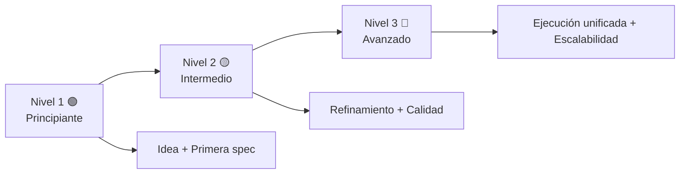

# 🧭 Ruta completa de aprendizaje en 3 niveles (todo el sistema)

> ✅ **Inicio recomendado (baja fricción):** no necesitas clonar este repositorio si ya estás trabajando dentro de un proyecto.
>
> **Regla obligatoria:** indica a la IA que debe trabajar con este template y sus guías como referencia principal.
>
> Clonado opcional:
> ```bash
> git clone https://github.com/juanklagos/spec-driven-development-template.git
> cd spec-driven-development-template
> ```

## 🌈 Mapa visual general



## 🧱 Qué significa cada nivel

| Nivel | Perfil | Objetivo principal |
|---|---|---|
| 🟢 Principiante | Persona nueva en programación | Entender y usar el flujo sin perderse |
| 🟡 Intermedio | Persona con experiencia básica | Mantener consistencia entre sesiones |
| 🔴 Avanzado | Equipo técnico exigente | Unificar resultados entre herramientas y escalar calidad |

## 🗺️ Ruta por temas (todo el sistema)

| Tema | 🟢 Principiante | 🟡 Intermedio | 🔴 Avanzado |
|---|---|---|---|
| Estructura base | Confirmar carpetas `idea/specs/bitacora` | Validar plantillas obligatorias | Automatizar validaciones de estructura |
| Idea del proyecto | Completar `IDEA_GENERAL.md` con guía IA | Refinar alcance y riesgos | Gestionar cambios de visión con protocolo |
| Especificaciones | Crear `001-...` desde plantilla | Mantener `history.md` al día | Separar specs por dominio y dependencias |
| Plan y tareas | Definir pasos simples | Priorizar y secuenciar tareas | Métricas de avance y riesgo por spec |
| Bitácora | Registrar cierre de sesión | Hacer handoff siempre que haya pendientes | Estandarizar reportes entre herramientas |
| Calidad (TDD/BDD) | Entender escenarios Dado/Cuando/Entonces | Conectar escenarios con tareas de prueba | Estrategia combinada y criterios estrictos |
| Ejecución con IA (incluye Lovable) | Usar prompt base | Exigir reporte estructurado | Contrato de salida unificado y control de alcance |
| Publicación GitHub | Push inicial | Checklist release | Versionado y gobernanza de contribuciones |

## 🟢 Nivel 1 - Principiante (paso a paso)

### Objetivo
Arrancar sin confusión y producir primera spec funcional.

### Secuencia
1. Completar `idea/IDEA_GENERAL.md`.
2. Crear `specs/001-mi-primera-spec/`.
3. Copiar plantillas.
4. Pedir a la IA completar contenido con lenguaje simple.
5. Registrar bitácora de la sesión.

### Prompt recomendado

```text
Usando https://github.com/juanklagos/spec-driven-development-template,
ayúdame como principiante a crear mi primer proyecto.
Guíame paso a paso en idea, primera spec y bitácora.
No avances al siguiente paso sin confirmar que entendí.
```

## 🟡 Nivel 2 - Intermedio (consistencia)

### Objetivo
Trabajar por iteraciones sin perder trazabilidad.

### Secuencia
1. Leer idea + index + último handoff.
2. Elegir spec activa.
3. Actualizar `plan.md` y `tasks.md`.
4. Ejecutar cambios dentro de alcance.
5. Actualizar `history.md` y bitácora.

### Prompt recomendado

```text
Usando https://github.com/juanklagos/spec-driven-development-template,
trabaja sobre la spec activa y mantén consistencia.
Antes de implementar, resume alcance y riesgos.
Después de implementar, actualiza history.md y bitácora.
Entrega salida en formato: objetivo, cambios, validación, riesgos, próximo paso.
```

## 🔴 Nivel 3 - Avanzado (calidad unificada)

### Objetivo
Controlar calidad y consistencia entre diferentes herramientas de IA.

### Secuencia
1. Aplicar protocolo de refinamiento en cada cambio de alcance.
2. Ejecutar flujo Spec Kit completo.
3. Aplicar TDD + BDD en specs y validaciones.
4. Ejecutar proyecto local y reportar resultados.
5. Consolidar métricas de calidad por spec.

### Prompt recomendado

```text
Usando https://github.com/juanklagos/spec-driven-development-template,
aplica flujo avanzado con control estricto de calidad.
Si hay cambio de alcance, bloquea implementación hasta actualizar spec/history/index.
Ejecuta validaciones técnicas y funcionales.
Entrega reporte unificado: objetivo, archivos, comandos, validaciones, riesgos, siguiente paso.
```

## 🎓 Qué guía leer según tu nivel

- 🟢 Principiante:
  - `docs/es/13-guia-rapida-no-programadores.md`
- 🟡 Intermedio:
  - `docs/es/14-guia-intermedia.md`
- 🔴 Avanzado:
  - `docs/es/15-guia-avanzada.md`

## 🔁 Regla final

Si no hay trazabilidad documental, el trabajo no se considera terminado.
