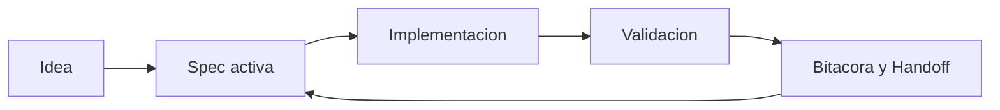

# Modo equipo y colaboración

## Roles recomendados

| Rol | Responsabilidad |
|---|---|
| Owner de spec | Mantener `spec.md`, `plan.md`, `tasks.md` |
| Revisor de calidad | Validar criterios y pruebas |
| Coordinador de bitácora | Garantizar handoffs y continuidad |

## Flujo visual

## Convenciones mínimas

- Una persona dueña por spec activa.
- Un handoff por sesión si hay pendientes.
- Revisión de calidad antes de merge.
