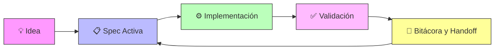
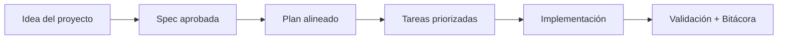

# Modo equipo y colaboración

<a href="../README.md"></a>

---

## 🌍 Par de idioma / Language pair

- Español: **22-modo-equipo-y-colaboracion.md**
- English: [../en/22-team-mode-and-collaboration.md](../en/22-team-mode-and-collaboration.md)


## 🗣️ Prompt amigable (copiar y pegar)

Usa esto cuando no eres técnico y quieres que la IA haga la integración + guía completa:

```text
Usando https://github.com/juanklagos/spec-driven-development-template, crea todo lo necesario para llevar a cabo mi proyecto de principio a fin.
Mi proyecto es: [explica tu proyecto en lenguaje simple].

Si mi proyecto es nuevo, inicialízalo con este template y GitHub Spec Kit.
Si mi proyecto ya existe, adáptalo a idea/specs/bitacora sin romper el comportamiento actual.
Guíame paso a paso según mi nivel (principiante/intermedio/avanzado), con lenguaje claro.
No omitas especificación, plan, tareas, traza de refinamiento, bitácora y validación.
```


> SDD funciona para desarrolladores solos y equipos por igual. Esta guía explica cómo escalar de 1 a N contribuidores.

## 🎭 Roles recomendados

| Rol | Responsabilidad | Quién lo llena típicamente |
|---|---|---|
| **Spec Owner** | Mantiene `spec.md`, `plan.md`, `tasks.md` de su spec asignada | Desarrollador o líder de producto |
| **Revisor de Calidad** | Valida criterios de aceptación, revisa tests, verifica consistencia | Dev senior o QA |
| **Coordinador de Bitácora** | Asegura que se envíen handoffs y que `PROJECT_LOG.md` esté al día | Tech lead o scrum master |
| **Piloto IA** | Gestiona contexto de herramientas IA, alimenta specs a la IA, valida output | Quien esté manejando la sesión IA |

> [!TIP]
> En proyectos individuales, una persona llena todos los roles. La disciplina se mantiene igual.

## 📐 Convenciones de equipo

### Propiedad de specs
- **Un owner por spec activa.** Varias personas pueden contribuir, pero una es responsable.
- La propiedad se registra en `specs/INDEX.md` en la columna "Owner".
- Transfiere propiedad explícitamente: actualiza INDEX + crea entrada en `bitacora/handoffs/`.

### Estrategia de branches
- Nombre de branch: `spec/001-nombre-feature` o `sdd/001-nombre-feature`
- Cada branch mapea a exactamente una spec. Nunca mezcles specs en un branch.
- La descripción del PR debe referenciar la carpeta spec: `Implements specs/001-feature/`

### Handoffs de sesión
- Cuando dejes de trabajar, siempre crea un handoff en `bitacora/handoffs/`
- Incluye: qué hiciste, qué queda pendiente, bloqueos, y quién debería continuar
- Aunque vayas a continuar mañana — el contexto se degrada más rápido de lo que crees

### Resolución de conflictos
- Si dos personas modifican la misma spec, el Spec Owner resuelve conflictos
- Cambios de spec deben pasar por `history.md` — sin ediciones silenciosas
- Decisiones arquitectónicas que afectan múltiples specs van en `bitacora/decisiones/`

## 🔄 Flujo visual



## 📋 Checklist de arranque para equipos

Al iniciar un proyecto de equipo con SDD:

1. [ ] Llenar `idea/IDEA_GENERAL.md` juntos (sesión de alineación)
2. [ ] Asignar Spec Owners para cada spec inicial
3. [ ] Definir cadencia de handoffs (fin de día, fin de sprint, etc.)
4. [ ] Acordar convención de nombres de branches
5. [ ] Ejecutar `./scripts/validate-sdd.sh . --strict` y corregir issues
6. [ ] Agendar sync semanal de 15 min: revisar INDEX, verificar bitácora, redistribuir specs

## 💬 Protocolo de comunicación

| Evento | Acción | Dónde registrar |
|---|---|---|
| Spec nueva creada | Notificar al equipo, actualizar INDEX | `specs/INDEX.md` + canal del equipo |
| Cambio de alcance | Discutir con el Spec Owner primero | `history.md` + `bitacora/decisiones/` |
| Bloqueo encontrado | Escalar inmediatamente, documentar | `bitacora/handoffs/` |
| Spec completada | Revisar y cerrar, actualizar INDEX | `specs/INDEX.md` status → `Done` |

## 💡 Tips rápidos

- Empieza con una descripción corta del proyecto en lenguaje simple.
- Pide a la IA confirmar la spec activa antes de programar.
- Cierra cada sesión con validación y próximo paso claro.

## 📊 Flujo visual


