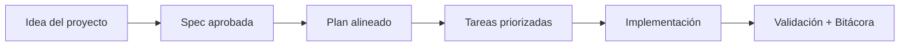

# Onboarding de 30 minutos

<a href="../README.md"></a>

---

## 🌍 Par de idioma / Language pair

- Español: **23-onboarding-30-minutos.md**
- English: [../en/23-30-minute-onboarding.md](../en/23-30-minute-onboarding.md)


## 🗣️ Prompt amigable (copiar y pegar)

Usa esto cuando no eres técnico y quieres que la IA haga la integración + guía completa:

```text
Usando https://github.com/juanklagos/spec-driven-development-template, crea todo lo necesario para llevar a cabo mi proyecto de principio a fin.
Mi proyecto es: [explica tu proyecto en lenguaje simple].

Si mi proyecto es nuevo, inicialízalo con este template y GitHub Spec Kit.
Si mi proyecto ya existe, adáptalo a idea/specs/bitacora sin romper el comportamiento actual.
Guíame paso a paso según mi nivel (principiante/intermedio/avanzado), con lenguaje claro.
No omitas especificación, plan, tareas, traza de refinamiento, bitácora y validación.
```


> Pasa de cero a un proyecto SDD validado en 30 minutos. Esta es tu carrera guiada.

## ⏱️ Plan minuto a minuto

### 🕐 Minutos 0–5: Orientación

1. Lee [`QUICKSTART.md`](../../QUICKSTART.md) — te da la visión completa en 1 página
2. Revisa [`AI_START_HERE.md`](../../AI_START_HERE.md) si vas a usar un asistente de IA
3. Decide tu modo:
   - **¿Proyecto nuevo?** → Continúa con el Paso 4 abajo
   - **¿Proyecto existente?** → Usa el prompt "adaptar proyecto" de `QUICKSTART.md`

### 🕐 Minutos 5–12: Define tu idea

4. Abre `idea/IDEA_GENERAL.md`
5. Llena estas secciones (no pienses demasiado — podrás refinar después):
   - **Project Name** — ¿cómo se llama?
   - **Problem to solve** — 2 oraciones máximo
   - **Main Goal** — el resultado más importante
   - **Initial Scope (MVP)** — 3–5 features como bullet points
   - **Out of Scope** — al menos 2 cosas que NO vas a construir

> [!TIP]
> **Atajo IA:** pega tu template de IDEA_GENERAL.md a ChatGPT/Claude con:
> *"Ayúdame a llenar esto para un proyecto que [describe tu idea en 1 oración]"*

### 🕐 Minutos 12–22: Crea la primera especificación

6. Ejecuta: `./scripts/new-spec.sh "mi-feature" "TuNombre"`
7. Abre el `specs/001-mi-feature/spec.md` generado y llena:
   - **Description** — ¿qué hace esta feature?
   - **Requirements** — lista numerada, sé específico
   - **Acceptance criteria** — "La feature está lista cuando..."
   - **Out of scope** — qué NO incluye esta spec específica
8. Abre `plan.md` y escribe 3–5 oraciones sobre tu enfoque técnico
9. Abre `tasks.md` y descompón el trabajo en 5–10 checkboxes

### 🕐 Minutos 22–27: Inicializa la bitácora

10. Abre `bitacora/global/PROJECT_LOG.md`
11. Agrega tu primera entrada de sesión:
    ```markdown
    ### [YYYY-MM-DD HH:MM] Sesión 1
    - Objetivo: Configurar estructura SDD y definir primera spec
    - Trabajo realizado: Llenado IDEA_GENERAL.md, creada spec 001
    - Decisiones: [lo que decidiste sobre el alcance]
    - Próximo paso: Revisar spec, iniciar implementación
    - Responsable: TuNombre
    ```

### 🕐 Minutos 27–30: Valida y celebra

12. Ejecuta: `./scripts/validate-sdd.sh . --strict`
13. Corrige cualquier error (no debería haber si seguiste los pasos)
14. Haz commit de tu trabajo:
    ```bash
    git add -A
    git commit -m "chore: inicializar estructura SDD con primera spec"
    ```

## 🎯 Tu resultado después de 30 minutos

| Lo que tienes | Dónde está |
|---|---|
| ✅ Visión clara del proyecto | `idea/IDEA_GENERAL.md` |
| ✅ Primera especificación | `specs/001-*/spec.md` |
| ✅ Plan técnico | `specs/001-*/plan.md` |
| ✅ Desglose de tareas | `specs/001-*/tasks.md` |
| ✅ Entrada de sesión | `bitacora/global/PROJECT_LOG.md` |
| ✅ Estructura validada | `validate-sdd.sh` pasa |

## 🤖 Prompt para onboarding asistido por IA

Si quieres que la IA te guíe interactivamente:

```text
Usando https://github.com/juanklagos/spec-driven-development-template como guía principal,
ayúdame a completar un onboarding de 30 minutos para mi proyecto: [DESCRIBE TU PROYECTO].
Guíame paso a paso: definición de idea, creación de primera spec, y configuración de bitácora.
Quiero outputs concretos en cada etapa. No saltes ningún paso.
```

## 💡 Tips rápidos

- Empieza con una descripción corta del proyecto en lenguaje simple.
- Pide a la IA confirmar la spec activa antes de programar.
- Cierra cada sesión con validación y próximo paso claro.

## 📊 Flujo visual


