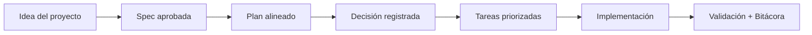

# Decisiones de arquitectura

<a href="../README.md"></a>

---

## 🌍 Par de idioma / Language pair

- Español: **24-decisiones-de-arquitectura.md**
- English: [../en/24-architecture-decisions.md](../en/24-architecture-decisions.md)


## 🗣️ Prompt amigable (copiar y pegar)

Úsalo si no eres técnico y quieres que la IA lo integre todo y te vaya guiando:

```text
Usando https://github.com/juanklagos/spec-driven-development-template, crea todo lo necesario para llevar a cabo mi proyecto de principio a fin.
Mi proyecto es: [explica tu proyecto en lenguaje simple].

Si mi proyecto es nuevo, inicialízalo con este template y GitHub Spec Kit.
Si mi proyecto ya existe, adáptalo a idea/specs/bitacora sin romper el comportamiento actual.
Guíame paso a paso según mi nivel (principiante/intermedio/avanzado), con lenguaje claro.
No omitas especificación, plan, tareas, traza de refinamiento, bitácora y validación.
```

---

> Una spec dice **qué** debe hacer el sistema. Un plan dice **cómo** lo vas a construir. Ninguno dice **por qué elegiste esto y no aquello otro que también estuvo sobre la mesa.** Para eso existe el registro de decisión.

## Qué es un ADR

Un **ADR** (Architecture Decision Record, registro de decisión de arquitectura) es un documento corto que captura **una** decisión en el momento en que se toma: el contexto, la elección, las alternativas descartadas, las consecuencias aceptadas y la señal que debería hacerte revisarla.

Se escribe **una vez**, cuando se decide, y no se reescribe después. Si la decisión cambia, escribes un registro nuevo y lo enlazas — no editas la historia. Una bitácora de decisiones es una serie de fotos, no una página de wiki.

Tres propiedades la hacen funcionar.

**Inmutable.** Un registro editado para que coincida con la opinión de hoy no dice nada de por qué se eligió entonces.

**Con fuente.** Cada justificación apunta a un commit, un `file:line`, un `history.md` de spec, una línea de `CHANGELOG.md` o un documento en `idea/`.

**Honesta.** Donde no hay justificación escrita, el registro lo dice. Una justificación inventada a posteriori es peor que un vacío.

Lo último no es decoración. Una bitácora que contiene una historia verosímil que nadie tuvo en realidad hace daño activo: quien la lea después va a confiar en ella y razonar desde una ficción.

## Cuándo escribir uno — y cuándo no

Escribe un registro cuando se cumpla **alguna** de estas:

1. **Eligió entre alternativas reales.** Otra cosa estuvo genuinamente sobre la mesa y perdió.
2. **Revertirla será caro.** Toca varias specs, una migración, un contrato, una licencia o una dependencia de la que ahora dependes.
3. **Alguien preguntará después "¿por qué es así?"** y el código solo no lo responde.

Si no se cumple ninguna, **no** lo escribas. Una bitácora inflada es una bitácora que nadie lee.

| Regístrala | No hace falta |
|---|---|
| Elegir tecnología de base de datos | Nombrar una variable |
| Decidir estrategia de autenticación | Elegir un color CSS |
| Seleccionar plataforma de despliegue | Una tarea planificada que acabas de terminar |
| Definir versionado de API | Agregar una función utilitaria |
| Cambiar la licencia | Corregir una errata |
| Revertir una decisión anterior | Cambios dentro del alcance de una sola spec |

**Regla práctica:** si cambiar esto después obligaría a tocar varias specs o a refactorizar en serio, regístralo.

## Dónde viven los registros y cómo se nombran

```
bitacora/decisiones/
├── README.md                                  # índice navegable, del más antiguo al más reciente
├── 2026-03-12-polyform-noncommercial-source-available.md
├── 2026-03-14-spec-kit-es-el-motor.md
└── 2026-07-21-no-app-escritorio.md
```

- **Una decisión por archivo.** Si estás escribiendo "y además", divídelo.
- **`YYYY-MM-DD-<slug>.md`** — la fecha es el día en que se decidió, tomada de git, nunca de memoria. El nombre con fecha delante ordena la carpeta cronológicamente sin esfuerzo.
- **El slug nombra la decisión, no la funcionalidad.** `no-app-escritorio`, no `escritorio`.
- En un proyecto con sidecar la carpeta es `./spec/bitacora/decisiones/`.

## 📝 La plantilla

Copia `bitacora/templates/DECISION_TEMPLATE.md` (espejo en `templates/bitacora/decision.template.md`). Cada sección es bilingüe y trae una pista en línea:

```markdown
# Key decision - Title / Decisión importante - Título

## Date / Fecha
## Context / Contexto
## Decision / Decisión
## Alternatives considered / Alternativas consideradas
## Consequences / Consecuencias
## When to revisit / Cuándo revisar esta decisión
## Related records / Registros relacionados
```

- **Contexto** — qué problema obligó a elegir, qué era cierto en ese momento, qué te restringía.
- **Decisión** — una frase, y luego el detalle. Sin ambigüedad. Cita el commit o archivo donde aterrizó.
- **Alternativas consideradas** — qué estuvo realmente sobre la mesa y por qué perdió cada una. *"No se consideraron alternativas"* es una respuesta válida y honesta; un espantapájaros no lo es.
- **Consecuencias** — qué mejora, qué trade-off aceptas, qué specs se ven afectadas, qué se vuelve más difícil.
- **Registros relacionados** — qué extiende, acota o reemplaza. Los registros reemplazados se quedan en disco para siempre.

## Por qué "Cuándo revisar" es la sección que importa

Casi todas las bitácoras de decisiones se pudren igual. Una elección tomada bajo restricciones reales — un presupuesto, una API en beta, un equipo de dos personas — se lee dos años después, fuera de contexto, como una ley permanente del sistema. Nadie recuerda la restricción, así que nadie nota cuándo desaparece.

**"Cuándo revisar" es la condición de caducidad que escribes mientras todavía la recuerdas.** Que sea una señal, no una sensación:

- ✅ *"Si el spike de 1 hora falla y `ui://sdd/board.html` no renderiza como `.mcpb`."*
- ✅ *"Si Flathub revierte su política del 2026-05-29, o aparece firma de código asequible sin exigir licencia aprobada por OSI."*
- ✅ *"Si el proyecto deja de ser mantenido por una sola persona."*
- ❌ *"Si deja de funcionar bien."*
- ❌ *"Revisar en el futuro."*

Un registro sin esta sección no es una decisión. Es dogma con fecha.

## Cómo funciona `/sdd:decision`

```
/sdd:decision no vamos a construir app de escritorio por ahora
```

El comando:

1. **Verifica primero el listón.** Si no se cumple ninguno de los tres criterios, lo dice y se detiene en vez de inflar la bitácora.
2. **Te entrevista de a una pregunta** — qué se decidió, contexto, alternativas, consecuencias, cuándo revisar — y luego te devuelve un resumen en cinco viñetas y espera un sí antes de escribir nada.
3. **Exige fuente para cada afirmación.** Hash y fecha de commit desde `git log`, `file:line`, historia de la spec, `CHANGELOG.md`, un documento en `idea/`, o tus propias palabras en la sesión. Donde una justificación no se pueda respaldar, lo escribe así en vez de inventarla.
4. **Escribe** `bitacora/decisiones/YYYY-MM-DD-<slug>.md` desde la plantilla, con la fecha real.
5. **Lo enlaza de vuelta** desde el `history.md` de la spec activa, `bitacora/global/PROJECT_LOG.md` y el índice de la carpeta.

Responde en tu idioma (ES/EN). El espejo para Copilot es `.github/prompts/sdd-decision.prompt.md`.

## Integración con el flujo SDD

- **Durante `plan.md`** — el momento natural: estás eligiendo un enfoque, así que las alternativas siguen frescas.
- **Al cerrar la sesión** — `/sdd:close` pregunta si la sesión contuvo una decisión que valga la pena registrar, pero solo cuando alguno de los tres criterios se cumple de forma plausible. No molesta en sesiones triviales. El contrato de cierre lleva un ítem **Decisión registrada**; *"ninguna esta sesión"* es una respuesta válida, el silencio no.
- **En validación estricta** — `./scripts/validate-sdd.sh . --strict` emite un **warning** (nunca un error, nunca salida distinta de cero) cuando el proyecto tiene specs aprobadas y `bitacora/decisiones/` está vacía. Es un empujón, no una compuerta.
- **Cómo referenciar** — desde `spec.md` o `plan.md`, enlaza el archivo: *"ver `2026-07-20-logica-en-sdd-core-transportes-finos.md` para por qué los transportes son finos."*
- **Reemplazar** — nunca borres. Agrega un registro nuevo y anota la relación en ambos.

La regla canónica vive en `template-context/core-instructions/AGENT_OPERATING_SYSTEM.md` (§3 Flujo obligatorio y §4 Contrato de salida) y en `sdd.policy.yaml` bajo `decision_log`.

## Un ejemplo real: la bitácora de este template

`bitacora/decisiones/` en este repositorio tiene 14 registros reconstruidos desde el historial de git, las historias de spec, el changelog y documentos de investigación en `idea/`. Lee [`bitacora/decisiones/README.md`](../../bitacora/decisiones/README.md) para el índice completo. Tres valen como modelo:

**[`2026-07-21-no-app-escritorio.md`](../../bitacora/decisiones/2026-07-21-no-app-escritorio.md) — una decisión que reencuadró su propia pregunta.**
La petición era "construyamos una app de escritorio, es mejor que correr comandos". El registro muestra que la investigación encontró el dolor real en otro lado: el builder no viajaba en el paquete npm (`"files": ["dist"]`), así que había que clonar el repositorio. Descarta Tauri, Electron, app de bandeja, PWA, extensión de VS Code y versión hospedada — cada una con su razón concreta — y aterriza en un lanzador de un comando. Su "cuándo revisar" nombra un spike de una hora cuyo fracaso devuelve Electron a la mesa.

**[`2026-03-18-www-recomendado-no-obligatorio.md`](../../bitacora/decisiones/2026-03-18-www-recomendado-no-obligatorio.md) — un registro con un hueco declarado.**
`www/` dejó de ser una restricción dura. No hay nota en bitácora, ni entrada de spec, ni línea de changelog que explique por qué. El registro dice exactamente eso y reconstruye el cambio desde el diff de doctrina. Así se ve la honestidad en la práctica: el vacío queda documentado como vacío.

**[`2026-07-20-mcp-app-postergada-y-luego-con-sdk-oficial.md`](../../bitacora/decisiones/2026-07-20-mcp-app-postergada-y-luego-con-sdk-oficial.md) — una decisión revertida 12 horas después.**
La MCP App se pospuso porque "el estándar sigue moviéndose". Antes de escribir código se verificó esa premisa y resultó falsa. La postergación y su reversión están en un mismo registro, con las fechas. Las reversiones no son un fracaso de la bitácora: son la bitácora haciendo su trabajo.

**La lección de este repositorio, dicha sin adornos:** `bitacora/decisiones/` estuvo vacía durante toda la construcción. Once specs, cuatro meses, un framework completo — y el "por qué" de cada elección vivía solo en mensajes de commit y en la memoria de una persona. Aquí se pudo recuperar porque el historial de git era detallado. Normalmente no lo es.

## 💡 Tips rápidos

- Escríbelo en el momento de decidir. Reconstruirlo después cuesta horas y pierde las alternativas que descartaste solo en tu cabeza.
- Si no puedes nombrar una alternativa real, pregúntate si de verdad fue una decisión.
- Prefiere una frase honesta antes que tres párrafos verosímiles.

## Flujo visual


