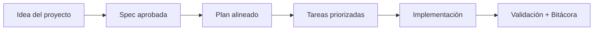

# Playbooks por tipo de proyecto

<a href="../README.md"></a>

---

## 🌍 Par de idioma / Language pair

- Español: **27-playbooks-por-tipo-de-proyecto.md**
- English: [../en/27-project-type-playbooks.md](../en/27-project-type-playbooks.md)


## 🗣️ Prompt amigable (copiar y pegar)

Usa esto cuando no eres técnico y quieres que la IA haga la integración + guía completa:

```text
Usando https://github.com/juanklagos/spec-driven-development-template, crea todo lo necesario para llevar a cabo mi proyecto de principio a fin.
Mi proyecto es: [explica tu proyecto en lenguaje simple].

Si mi proyecto es nuevo, inicialízalo con este template y GitHub Spec Kit.
Si mi proyecto ya existe, adáptalo a idea/specs/bitacora sin romper el comportamiento actual.
Guíame paso a paso según mi nivel (principiante/intermedio/avanzado), con lenguaje claro.
No omitas especificación, plan, tareas, traza de refinamiento, bitácora y validación.
```


> Los playbooks son puntos de partida SDD pre-configurados para tipos de proyecto comunes. Te dan ventaja en el encuadre de idea, estructura de specs y planificación de implementación.

## 📦 Packs disponibles

### 🌐 SaaS (`playbooks/saas/`)

**Ideal para:** Productos multi-tenant con cuentas de usuario, suscripciones, dashboards o paneles de admin.

**Partición típica de specs:**
| Spec | Área de enfoque |
|---|---|
| 001-auth | Registro de usuarios, login, gestión de sesiones |
| 002-tenant | Aislamiento multi-tenancy, gestión de organizaciones |
| 003-billing | Planes de suscripción, integración de pagos |
| 004-dashboard | Interfaz principal, visualización de métricas |
| 005-admin | Panel de administración, gestión de usuarios, configuración |

**Consideraciones clave:** Estrategia de aislamiento de tenants, ciclo de vida de suscripciones, control de acceso por roles.

---

### 🛒 E-commerce (`playbooks/ecommerce/`)

**Ideal para:** Tiendas online con catálogo, carrito, checkout y flujos de pago.

**Partición típica de specs:**
| Spec | Área de enfoque |
|---|---|
| 001-catalog | Listado de productos, categorías, búsqueda, filtros |
| 002-cart | Carrito de compras, gestión de cantidades, persistencia |
| 003-checkout | Creación de orden, dirección, opciones de envío |
| 004-payment | Integración con pasarela de pago, confirmación |
| 005-orders | Historial de órdenes, seguimiento, actualizaciones de estado |

**Consideraciones clave:** Gestión de inventario, fallbacks de proveedor de pago, checkout invitado vs. autenticado.

---

### 📱 App Móvil (`playbooks/mobile-app/`)

**Ideal para:** Apps iOS/Android con navegación, comportamiento offline y sincronización de datos.

**Partición típica de specs:**
| Spec | Área de enfoque |
|---|---|
| 001-navigation | Flujo de pantallas, tabs, deep linking |
| 002-auth | Login, biométricos, refresh de tokens |
| 003-data-sync | Almacenamiento offline, resolución de conflictos, sync en background |
| 004-notifications | Push notifications, alertas in-app |
| 005-core-feature | La feature principal de tu app específica |

**Consideraciones clave:** Estrategia offline-first vs. online-first, comportamientos específicos por plataforma, requisitos de app store.

---

### ⚙️ Backend API (`playbooks/backend-api/`)

**Ideal para:** APIs REST o GraphQL que sirven frontends, apps móviles o terceros.

**Partición típica de specs:**
| Spec | Área de enfoque |
|---|---|
| 001-data-model | Esquema de base de datos, relaciones, migraciones |
| 002-endpoints | Diseño de rutas, validación de input, formato de respuesta |
| 003-auth-security | Autenticación, autorización, rate limiting |
| 004-integration | Conexiones con APIs de terceros, webhooks |
| 005-observability | Logging, monitoreo, tracking de errores, health checks |

**Consideraciones clave:** Estrategia de versionado de API, mecanismo de autenticación (JWT vs. OAuth2 vs. API keys), estandarización de respuestas de error.

---

## 🚀 Cómo activar un playbook

### Con asistencia de IA:

```text
Usando https://github.com/juanklagos/spec-driven-development-template y el playbook [NOMBRE_DEL_PACK],
ayúdame a configurar un proyecto nuevo para [MI OBJETIVO].
Usa la partición típica de specs del playbook como punto de partida.
Propón el encuadre inicial de la idea y la estructura de specs adaptada a mis necesidades específicas.
No implementes código hasta que acordemos la partición de specs.
```

### Manualmente:

1. Copia la estructura de specs sugerida del playbook a tu carpeta `specs/`
2. Llena `idea/IDEA_GENERAL.md` usando las áreas de enfoque del playbook como guía
3. Crea cada carpeta de spec usando `./scripts/new-spec.sh "nombre-feature" "Owner"`
4. Personaliza requisitos y criterios de aceptación para tu caso específico

## 💡 Crear tu propio playbook

Si tu tipo de proyecto no está cubierto, crea un nuevo playbook:

1. Crea `playbooks/tu-tipo/README.md`
2. Define: partición típica de specs, consideraciones clave, prompts específicos del dominio
3. Incluye al menos 5 specs sugeridas con áreas de enfoque
4. Agrega un prompt de IA recomendado para inicialización

## 💡 Tips rápidos

- Empieza con una descripción corta del proyecto en lenguaje simple.
- Pide a la IA confirmar la spec activa antes de programar.
- Cierra cada sesión con validación y próximo paso claro.

## 📊 Flujo visual


