# Modo migración legado avanzado

<a href="../README.md"></a>

---

> Transforma un codebase existente en un proyecto SDD bien estructurado sin romper nada.

## 🎯 Cuándo usar esto

- Tienes una aplicación existente sin especificaciones formales
- Quieres agregar trazabilidad y estructura sin reescribir
- Necesitas hacer onboarding de nuevos miembros a un sistema legado
- Quieres que las herramientas de IA entiendan tu código existente correctamente

## 📋 Flujo de migración

### Fase 1: Descubrimiento (no destructivo)

```bash
./scripts/legacy-discovery.sh /ruta/al/proyecto-legado
```

Este script escanea tu proyecto y genera un reporte en `analysis/legacy-discovery/` con:
- Análisis de estructura de archivos y carpetas
- Detección de stack tecnológico
- Identificación de puntos de entrada
- Mapeo de dependencias

> [!IMPORTANT]
> Esta fase es **solo lectura**. No se modifica ningún archivo del proyecto legado.

### Fase 2: Documentación baseline

1. **Crea `idea/IDEA_GENERAL.md`** — Documenta el propósito actual del sistema
   - No describas lo que *debería* ser; describe lo que *es*
   - Llena Problema, Objetivo y Alcance basado en el comportamiento actual

2. **Crea `specs/001-baseline/`** — Ingeniería inversa del estado actual
   - `spec.md`: Features actuales como requisitos (documentados tal cual)
   - `plan.md`: Descripción de la arquitectura existente
   - `tasks.md`: Áreas que necesitan documentación o testing
   - `research.md`: Deuda técnica conocida, pain points, comportamientos no documentados

3. **Inicializa bitácora** — Registra la sesión de descubrimiento
   - Entrada en `bitacora/global/PROJECT_LOG.md`
   - Decisión en `bitacora/decisiones/001-enfoque-migracion.md`

### Fase 3: Descomposición por dominio

Una vez documentado el baseline:

1. Identifica dominios funcionales independientes en el código existente
2. Crea nuevas specs numeradas para cada dominio (002, 003, ...)
3. Define límites: qué archivos/módulos pertenecen a qué spec
4. Establece orden de dependencia: qué specs pueden refactorizarse independientemente

```mermaid
flowchart TD
  A["Codebase Legado"] --> B["Reporte de Descubrimiento"]
  B --> C["Spec Baseline (001)"]
  C --> D["Análisis de Dominios"]
  D --> E["Spec 002: Auth"]
  D --> F["Spec 003: Datos"]
  D --> G["Spec 004: UI"]
  E --> H["Refactoreo Independiente"]
  F --> H
  G --> H
```



### Fase 4: Modernización progresiva

Para cada spec de dominio:
1. Escribe criterios de aceptación que coincidan con el comportamiento **actual** primero
2. Agrega tests que verifiquen el comportamiento existente (protección contra regresiones)
3. Entonces — y solo entonces — crea una nueva spec para mejoras
4. Mantén la spec baseline como punto de referencia

## 🤖 Prompts de migración asistidos por IA

### Prompt de descubrimiento inicial:

```text
Usando https://github.com/juanklagos/spec-driven-development-template como guía principal,
analiza el proyecto legado en [RUTA_DEL_PROYECTO] sin cambiar ningún comportamiento.

1. Mapea la arquitectura actual: frameworks, patrones, dependencias.
2. Crea idea/IDEA_GENERAL.md basado en lo que el sistema hace actualmente.
3. Crea specs/001-baseline/ documentando el comportamiento actual tal cual.
4. Identifica dominios independientes y sugiere división de specs.
5. Crea una entrada inicial en bitácora documentando este descubrimiento.
6. Recomienda áreas de riesgo que necesitan cobertura de tests antes de cambios.
```

### Prompt de migración continua:

```text
Estoy migrando la spec [NÚMERO] de mi proyecto legado. El baseline está en specs/001-baseline/.
Dominio actual: [NOMBRE_DEL_DOMINIO]

Ayúdame a:
1. Escribir criterios de aceptación que coincidan con el comportamiento existente
2. Identificar brechas de cobertura de tests
3. Proponer un plan de modernización seguro que no rompa nada
4. Actualizar history.md con el progreso de migración
```

## ⚠️ Errores comunes de migración

| Error | Por qué es peligroso | Prevención |
|---|---|---|
| Reescribir antes de entender | Rompe comportamiento existente | Completa Fase 1-2 primero |
| No testear comportamiento actual | No puedes verificar que siga funcionando | Agrega tests de regresión antes de tocar código |
| Migrar todo al mismo tiempo | Overwhelm, conflictos de merge | Un dominio/spec a la vez |
| Saltarse la spec baseline | Sin punto de referencia para el "antes" | 001-baseline es obligatorio |
