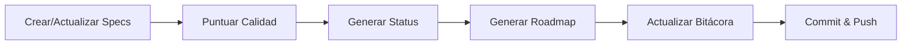
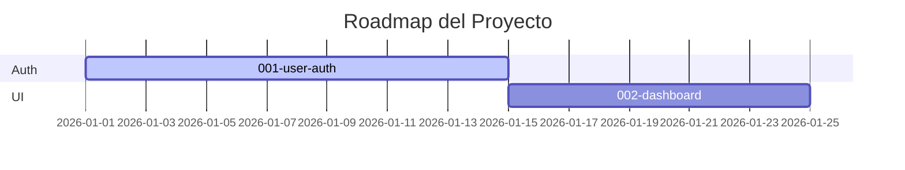

# Dashboard de status y roadmap automático

<a href="../README.md"></a>

---

> Herramientas automatizadas para visualizar el progreso de tu proyecto y generar roadmaps desde tus specs.

## 🛠️ Scripts disponibles

### `./scripts/generate-status.sh`

**Qué hace:** Escanea todas las specs en `specs/` y genera `STATUS.md` — un tablero mostrando:
- Specs activas con status, prioridad y responsable
- Progreso de tareas (pendientes vs. completadas en todas las specs)
- Extractos recientes de la bitácora de `bitacora/global/PROJECT_LOG.md`

**Cómo usar:**
```bash
./scripts/generate-status.sh
```

**Output:** Actualiza `STATUS.md` en la raíz del proyecto.

**Cuándo ejecutar:** Después de cada sesión donde actualices specs o completes tareas.

---

### `./scripts/generate-roadmap.sh`

**Qué hace:** Lee `specs/INDEX.md` y genera un roadmap visual en Mermaid.

**Cómo usar:**
```bash
./scripts/generate-roadmap.sh
```

**Output:** Crea dos archivos:
- `docs/roadmap.mmd` — Fuente del diagrama Mermaid
- `docs/roadmap.md` — Archivo Markdown con Mermaid embebido para renderizado en GitHub

**Cuándo ejecutar:** Después de crear nuevas specs o cambiar prioridades en INDEX.

---

### `./scripts/score-spec.sh`

**Qué hace:** Evalúa la calidad y completitud de tus especificaciones.

**Cómo usar:**
```bash
# Puntuar todas las specs
./scripts/score-spec.sh --all

# Puntuar una spec específica
./scripts/score-spec.sh specs/001-mi-feature
```

**Qué verifica:**
| Criterio | Qué busca |
|---|---|
| Completitud de archivos | Los 5 archivos requeridos presentes (spec, plan, tasks, research, history) |
| Profundidad de contenido | Archivos con contenido significativo, no solo templates |
| Criterios de aceptación | spec.md tiene criterios claros y testeables |
| Desglose de tareas | tasks.md tiene checkboxes con acciones específicas |
| Seguimiento de historial | history.md tiene al menos una entrada |

---

### `./scripts/new-spec.sh`

**Qué hace:** Crea una nueva carpeta de spec numerada con todos los archivos template requeridos.

**Cómo usar:**
```bash
./scripts/new-spec.sh "nombre-feature" "NombreOwner"
```

**Output:** Crea `specs/NNN-nombre-feature/` con templates pre-llenados.

---

## 📊 Flujo de trabajo recomendado



### Rutina por sesión:
1. Trabaja en tus specs e implementación
2. Ejecuta `./scripts/score-spec.sh --all` para verificar calidad
3. Ejecuta `./scripts/generate-status.sh` para actualizar el tablero
4. Ejecuta `./scripts/generate-roadmap.sh` si cambiaron las specs
5. Actualiza la bitácora y haz commit

### Ejemplo de output: STATUS.md

```markdown
## Specs activas
| Número | Nombre      | Status      | Prioridad | Owner |
|--------|-------------|-------------|-----------|-------|
| 001    | user-auth   | In Progress | High      | Juan  |
| 002    | dashboard   | Draft       | Medium    | Maria |

## Progreso de tareas
- Pendientes: 12
- Completadas: 8
```

### Ejemplo de output: roadmap.mmd


