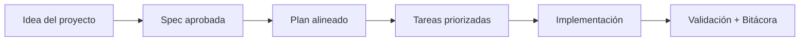

# Auditoría de documentación (2026-03-14)

## 🌍 Par de idioma / Language pair

- Español: **32-auditoria-documentacion-2026-03-14.md**
- English: [../en/32-documentation-audit-2026-03-14.md](../en/32-documentation-audit-2026-03-14.md)


## Alcance

Se revisó:
- Starters: `README.md`, `README.es.md`, `QUICKSTART.md`, `AI_START_HERE.md`, `docs/README.md`
- Guías por niveles: `docs/en|es/13`, `14`, `15`
- Referencias de consistencia: `02`, `08`, `10`, `11`, `19`, `21`, `26`

## Problemas principales detectados

1. Preambulos largos repetidos en muchas guías.
2. Flujo de inicio poco lineal para usuarios nuevos.
3. Mezcla de enlaces EN/ES que reducía claridad.
4. Referencias antiguas a archivos de instrucciones IA ya no vigentes.

## Acciones aplicadas

1. Reescritura de `docs/README.md` como hub de navegación compacto.
2. Reescritura de `QUICKSTART.md` con flujo lineal y Spec Kit-first.
3. Reescritura de `AI_START_HERE.md` con contexto obligatorio + compuerta dura + enlaces a prompts.
4. Reescritura de guías por nivel EN/ES (`13`, `14`, `15`) con estructura didáctica uniforme.
5. Alineación de matriz de reglas IA al archivo canónico.

## Resultado

- Mejor lectura para usuarios principiante/intermedio/avanzado.
- Progresión más clara y menos duplicación de instrucciones.
- Mayor coherencia con Spec Kit y la compuerta SDD.

## Siguiente pasada recomendada

1. Aplicar la misma estructura concisa a docs `00-12` y `16-31`.
2. Agregar validación de links y estilo en CI para documentación.
3. Agregar validación UX cronometrada (encontrar Quickstart/ruta de inicio en <10 segundos).

## Actualización pasada 2 (2026-03-14)

- Se compactaron bloques repetidos de inicio/prompts en guías core `00-12` y `16` en EN/ES.
- Se reemplazaron secciones largas duplicadas por enlaces cortos a `AI_START_HERE.md`, matriz de prompts y banco validado.
- Se mantuvo el contenido específico de cada tema reduciendo ruido de onboarding.

## 🗣️ Prompt amigable (copiar y pegar)

```text
Usando https://github.com/juanklagos/spec-driven-development-template, guíame con este template de principio a fin para mi proyecto.
Mi proyecto es: [explica tu proyecto en lenguaje simple].
Si es nuevo, inicialízalo desde este template.
Si ya existe, adáptalo sin romper el comportamiento actual.
Mantenme en flujo SDD (idea -> spec -> plan -> tasks -> implementación), con lenguaje claro.
```

## 💡 Tips rápidos

- Empieza con una descripción corta del proyecto en lenguaje simple.
- Pide a la IA confirmar la spec activa antes de programar.
- Cierra cada sesión con validación y próximo paso claro.

## 📊 Flujo visual


