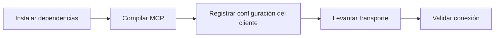

# Guía del servidor MCP

## Propósito

Esta guía es solo para setup y conectividad MCP.

Si quieres la referencia funcional completa, empieza aquí:
- [Referencia completa de MCP](./41-referencia-completa-mcp.md)

## Flujo de setup



Separación del producto:
- raíz del repositorio: framework SDD canónico
- `packages/sdd-core`: lógica reusable de SDD
- `packages/sdd-mcp`: tools, resources, prompts y transportes MCP

## Lo que ya está implementado

Resumen de alto nivel solamente:

Transportes:
- `stdio`
- `Streamable HTTP`

Tools:
- `sdd_create_workspace`
- `sdd_create_spec`
- `sdd_validate`
- `sdd_check_gate`
- `sdd_record_user_consent`
- `sdd_list_specs`
- `sdd_generate_status`
- `sdd_generate_roadmap`
- `sdd_append_project_log`
- `sdd_write_daily_log`
- `sdd_write_handoff`
- `sdd_write_decision`

Salida estructurada:
- cada tool expone `outputSchema`
- los handlers devuelven `structuredContent` y salida textual

Resources estáticos:
- `sdd-policy`
- `sdd-ai-start`
- `sdd-quickstart`
- `sdd-spec-template`

Resource templates del proyecto:
- `sdd-project-index`
- `sdd-project-log`
- `sdd-project-latest-handoff`
- `sdd-project-idea`
- `sdd-spec-document`

Prompts:
- `start_new_sdd_project`
- `adapt_existing_project_to_sdd`
- `close_sdd_session`

## Configuración local

```bash
npm install
npm run typecheck
npm run build
npm run mcp:smoke
npm run mcp:http:smoke
```

Levanta los servidores:

```bash
npm run mcp:start
npm run mcp:http:start
```

Entrypoints:
- stdio: `packages/sdd-mcp/dist/index.js`
- HTTP: `http://127.0.0.1:3334/mcp`

## Contrato operativo

- abre este repositorio como raíz del workspace
- prefiere `./www/<nombre-proyecto>/` como espacio de trabajo recomendado por defecto
- también se soportan rutas externas para los tools basados en `projectRoot`
- crea primero la base SDD
- no implementes código antes de tener spec aprobada y plan consistente
- solicita consentimiento explícito solo cuando la implementación vaya a comenzar

Referencias relacionadas:
- [Referencia completa de MCP](./41-referencia-completa-mcp.md)
- [Referencia de resultados por comando](./40-referencia-resultados-comandos.md)

## Ejemplos listos para copiar

Archivos de referencia:
- `packages/sdd-mcp/examples/.cursor/mcp.json`
- `packages/sdd-mcp/examples/.mcp.json`
- `packages/sdd-mcp/examples/codex.config.toml`

### Cursor

Ruta oficial de configuración en macOS/Linux:
- `~/.cursor/mcp.json`

Alternativa por proyecto:
- `mcp.json` dentro del workspace, si prefieres registro local al proyecto

Ejemplo:

```json
{
  "mcpServers": {
    "sdd": {
      "type": "stdio",
      "command": "node",
      "args": [
        "/RUTA/ABSOLUTA/A/spec-driven-development-template/packages/sdd-mcp/dist/index.js"
      ]
    }
  }
}
```

### Codex

Ruta oficial de configuración compartida:
- `~/.codex/config.toml`

Ejemplo:

```toml
[mcp_servers.sdd]
command = "node"
args = ["/RUTA/ABSOLUTA/A/spec-driven-development-template/packages/sdd-mcp/dist/index.js"]
```

### Claude Code

Configuración oficial por proyecto:
- `.mcp.json` en la raíz del repositorio

Configuración oficial por usuario:
- `~/.claude.json`

Ejemplo por proyecto:

```json
{
  "mcpServers": {
    "sdd": {
      "command": "node",
      "args": [
        "/RUTA/ABSOLUTA/A/spec-driven-development-template/packages/sdd-mcp/dist/index.js"
      ],
      "env": {}
    }
  }
}
```

### Clientes con HTTP

Si el cliente soporta MCP remoto vía Streamable HTTP:

```text
http://127.0.0.1:3334/mcp
```

Usa:

```bash
npm run mcp:http:start
```

## Primer mensaje recomendado para la IA

```text
Usa el servidor MCP sdd conectado para este repositorio.
Crea primero la base SDD.
Si el proyecto es ejecutable dentro de este template, mantenlo en ./www/<nombre-proyecto>; también se soportan rutas externas.
Lee primero los resources de policy y quickstart.
No implementes código antes de spec aprobada y plan consistente.
Pide consentimiento explícito solo cuando la implementación vaya a comenzar.
```

## Checklist de verificación

- `npm run typecheck`
- `npm run build`
- `npm run mcp:smoke`
- `npm run mcp:http:smoke`
- `./scripts/validate-sdd.sh . --strict`
- `./scripts/check-sdd-policy.sh .`
- `./scripts/check-sdd-gate.sh .`
