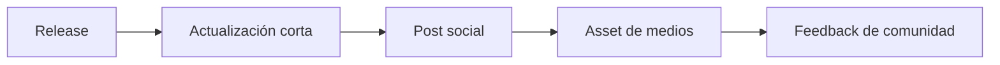

# Kit de lanzamiento

## Propósito

Esta página guarda copy corto y reutilizable para la difusión del framework.

## Flujo de lanzamiento



## Actualización corta

```text
Spec-Driven Development Template ahora incluye un servidor MCP real.

Nuevo en v1.3.0:
- servidor local `sdd-mcp`
- stdio + Streamable HTTP
- configuraciones copy/paste para Cursor, Claude Code y Codex
- resources del proyecto activo para idea, specs, bitácora y handoffs

Repositorio:
https://github.com/juanklagos/spec-driven-development-template
```

## Post para LinkedIn

```text
Acabo de publicar la versión v1.3.0 de mi Spec-Driven Development Template.

Este repositorio está evolucionando hacia un framework operativo de SDD, no solo un starter de documentación.

Ahora incluye:
- GitHub Spec Kit como flujo de referencia principal
- reglas operativas multi-agente
- trabajo ejecutable con ./www/<nombre-proyecto> como default limpio, manteniendo soporte para rutas externas
- servidor MCP local (`sdd-mcp`)
- stdio + Streamable HTTP
- core SDD tipado
- CI y tests de integración MCP
- configuraciones copy/paste para Cursor, Claude Code y Codex

Repositorio:
https://github.com/juanklagos/spec-driven-development-template

El objetivo es reducir fricción de idea -> spec -> plan -> tasks -> validación y hacer que distintas IA trabajen de forma más consistente en proyectos reales.
```

## Nota corta de release

```text
v1.3.0 fortalece el framework como sistema operativo de SDD más fácil de adoptar: guías easy MCP, modelo de onboarding alojado, ejemplos visuales por cliente, alineación de versiones internas y una ruta más clara para usuarios no técnicos.
```
