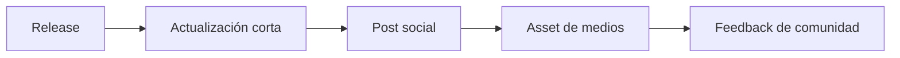

# Kit de lanzamiento

## Propósito

Esta página guarda copy corto y reutilizable para la difusión del framework.

## Flujo de lanzamiento



## Actualización corta

```text
Spec-Driven Development Template ahora deja `spec/` como arquitectura sidecar por defecto para proyectos reales.

Nuevo en v1.4.0:
- prompts exactos para que las IA usen el sidecar `spec/`
- layout más limpio para proyectos avanzados o existentes
- contratos MCP alineados con proyectos sidecar
- fixes de CI para el nuevo modelo

Repositorio:
https://github.com/juanklagos/spec-driven-development-template
```

## Post para LinkedIn

```text
Acabo de publicar la versión v1.4.0 de mi Spec-Driven Development Template.

Este repositorio está evolucionando hacia un framework operativo de SDD, no solo un starter de documentación.

Ahora incluye:
- GitHub Spec Kit como flujo de referencia principal
- sidecar `spec/` como default profesional para proyectos reales
- reglas operativas multi-agente
- soporte de contenedor limpio en ./www/<nombre-proyecto> cuando el proyecto vive dentro del template
- servidor MCP local (`sdd-mcp`)
- stdio + Streamable HTTP
- core SDD tipado
- CI y tests de integración MCP
- prompts copy/paste para que las IA no copien todo el repositorio dentro de proyectos avanzados

Repositorio:
https://github.com/juanklagos/spec-driven-development-template

El objetivo es reducir fricción de idea -> spec -> plan -> tasks -> validación y hacer que distintas IA trabajen de forma más consistente en proyectos reales.
```

## Nota corta de release

```text
v1.4.0 vuelve el framework más limpio para proyectos reales: sidecar `spec/` por defecto, GitHub Spec Kit como referencia base del flujo, comportamiento MCP alineado con proyectos sidecar y prompts exactos para evitar que las IA copien todo el repositorio dentro de codebases avanzados.
```
