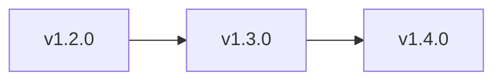

# Roadmap público

## Propósito

Este roadmap hace explícitos los siguientes pasos del producto para que los usuarios sepan hacia dónde va el framework.

## Línea del roadmap

## Estado actual

Release publicada:
- `v1.2.0`

Disponible hoy:
- framework SDD con política multi-agente
- espacio de trabajo recomendado por defecto en `./www/<nombre-proyecto>/`, con soporte para rutas externas
- `sdd-core` tipado
- `sdd-mcp` local
- `stdio` + `Streamable HTTP`
- tools, resources, prompts, smoke tests y tests de integración MCP
- recetas de setup por cliente y alineación de versiones internas

## v1.3.0

Enfoque: experiencia del operador, onboarding visual y ergonomía MCP más estricta.

Planeado:
- guías validadas con capturas para Cursor, Claude Code y Codex
- resources MCP más ricos para insight del proyecto activo
- documentación más clara del resultado por comando y tool
- automatización de releases y guía de empaquetado más fuerte
- assets visuales de onboarding para README y difusión

## v1.4.0

Enfoque: estandarización del framework y empaquetado MCP publicable.

Planeado:
- estrategia de empaquetado/versionado más clara para `@sdd/sdd-core` y `@sdd/sdd-mcp`
- flujo opcional para publicar el paquete MCP
- modelo de gobernanza para contribuciones de comunidad
- showcase de proyectos reales usando el framework

## Notas

- GitHub Spec Kit sigue siendo la referencia externa y guía operativa principal.
- Las nuevas features deben seguir reduciendo fricción al usuario, no aumentar complejidad de setup.
